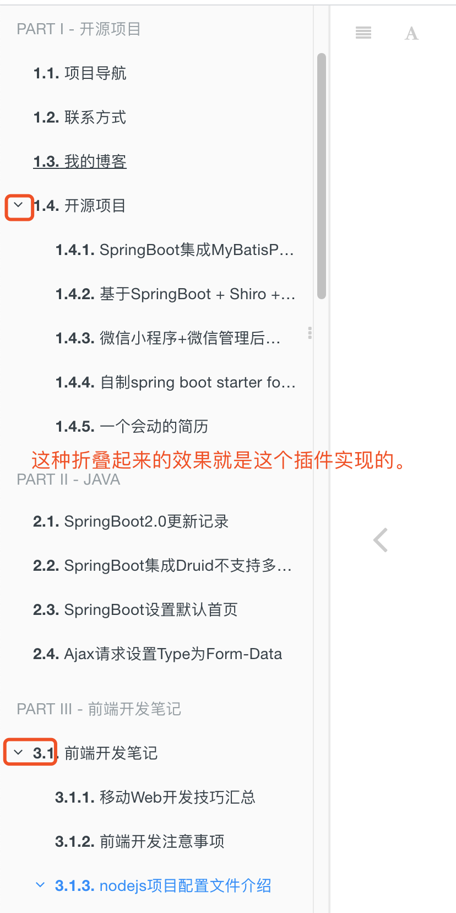
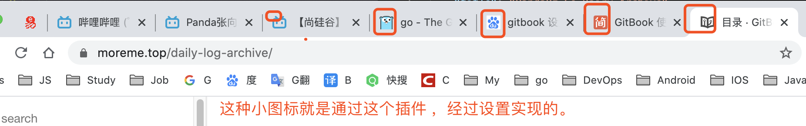

# gitbook 使用


## 1. 概述

### 安装Gitbook


`npm install -g gitbook`


`npm uninstall -g gitbook`

```
You need to install "gitbook-cli" to have access to the gitbook command anywhere on your system.
If you've installed this package globally, you need to uninstall it.
>> Run "npm uninstall -g gitbook" then "npm install -g gitbook-cli"
```


`npm install -g gitbook-cli`


### 帮助信息

```
% gitbook help   
    build [book] [output]       build a book
        --log                   Minimum log level to display (Default is info; Values are debug, info, warn, error, disabled)
        --format                Format to build to (Default is website; Values are website, json, ebook)
        --[no-]timing           Print timing debug information (Default is false)

    serve [book] [output]       serve the book as a website for testing
        --port                  Port for server to listen on (Default is 4000)
        --lrport                Port for livereload server to listen on (Default is 35729)
        --[no-]watch            Enable file watcher and live reloading (Default is true)
        --[no-]live             Enable live reloading (Default is true)
        --[no-]open             Enable opening book in browser (Default is false)
        --browser               Specify browser for opening book (Default is )
        --log                   Minimum log level to display (Default is info; Values are debug, info, warn, error, disabled)
        --format                Format to build to (Default is website; Values are website, json, ebook)

    install [book]              install all plugins dependencies
        --log                   Minimum log level to display (Default is info; Values are debug, info, warn, error, disabled)

    parse [book]                parse and print debug information about a book
        --log                   Minimum log level to display (Default is info; Values are debug, info, warn, error, disabled)

    init [book]                 setup and create files for chapters
        --log                   Minimum log level to display (Default is info; Values are debug, info, warn, error, disabled)

    pdf [book] [output]         build a book into an ebook file
        --log                   Minimum log level to display (Default is info; Values are debug, info, warn, error, disabled)

    epub [book] [output]        build a book into an ebook file
        --log                   Minimum log level to display (Default is info; Values are debug, info, warn, error, disabled)

    mobi [book] [output]        build a book into an ebook file
        --log                   Minimum log level to display (Default is info; Values are debug, info, warn, error, disabled)
```

## 2. gitbook使用 

[GitBook 使用教程 - 简书](https://www.jianshu.com/p/421cc442f06c)

讲解了book.json的一些配置


#### 另一个可以借鉴的项目

使用GitBook记录的技术开发笔记：https://zhousiwei.gitee.io/myBook/
[JoeyBling/myBook: 使用GitBook记录开发笔记](https://github.com/JoeyBling/myBook/)

- 包含了`开源项目介绍`、`Java笔记`、`前端开发笔记`、`Hexo博客笔记`、`日记本`、`Linux笔记`、`ELK日志分析`

1. [开源项目介绍](https://zhousiwei.gitee.io/myBook/)
2. [Java笔记](https://zhousiwei.gitee.io/myBook/java/springboot2.html)
3. [前端开发笔记](https://zhousiwei.gitee.io/myBook/web/)
4. [Hexo博客笔记](https://zhousiwei.gitee.io/myBook/hexo/hexo_music.html)
5. [日记本](https://zhousiwei.gitee.io/myBook/notes/git_branch.html)
6. [Linux笔记](https://zhousiwei.gitee.io/myBook/linux/glibc.html)
7. [ELK日志分析](https://zhousiwei.gitee.io/myBook/elk/linux_es5.html)

## 3. 插件


配置好 book.json 后插件安装命令 `gitbook install`

例如： 

```bash
$ gitbook install
info: installing 2 plugins using npm@3.9.2 
info:  
info: installing plugin "expandable-chapters-small" 
info: install plugin "expandable-chapters-small" (*) from NPM with version 0.1.7 
/Users/zcj/panda/git4me/daily-log-archive
└── gitbook-plugin-expandable-chapters-small@0.1.7 

info: >> plugin "expandable-chapters-small" installed with success 
info:  
info: installing plugin "favicon" 
runTopLevelLifecycles → 2 ▄ ╢██████████████████████████████████████████████████████████████████████████████████████████████████████████████████████████████████████████████████████████░░░░░╟
/Users/zcj/panda/git4me/daily-log-archive
├── gitbook-plugin-expandable-chapters-small@0.1.7 
└── gitbook-plugin-favicon@0.0.2 

info: >> plugin "favicon" installed with success 

```


### 3.1  "expandable-chapters-small" 目录可以折叠




### 3.2 "favicon" 给网页标题添加小图标




