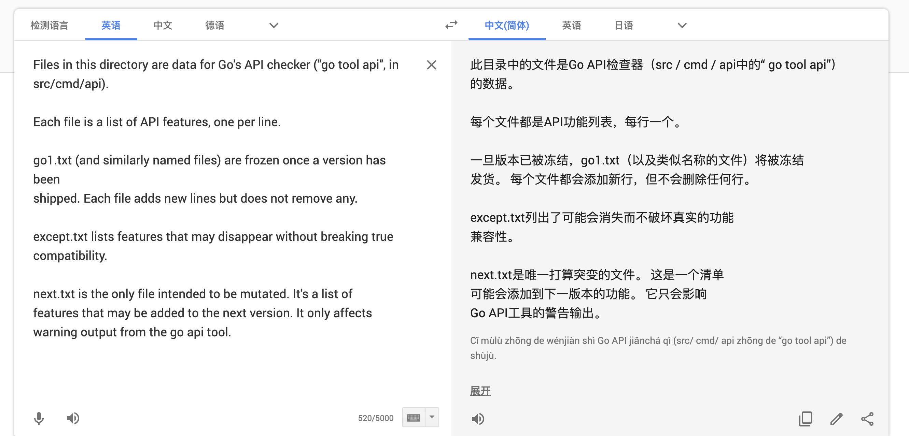

# Go源码完全截图Day01-

> version: go1.14.1

### 一、Go 1.14.1 src 源码结构

```go
.
├── AUTHORS
├── CONTRIBUTING.md
├── CONTRIBUTORS
├── LICENSE
├── PATENTS
├── README.md
├── SECURITY.md
├── VERSION
├── api
│   ├── README
│   ├── except.txt
│   ├── go1.1.txt
│   ├── go1.10.txt
│   ├── go1.11.txt
│   ├── go1.12.txt
│   ├── go1.13.txt
│   ├── go1.14.txt
│   ├── go1.2.txt
│   ├── go1.3.txt
│   ├── go1.4.txt
│   ├── go1.5.txt
│   ├── go1.6.txt
│   ├── go1.7.txt
│   ├── go1.8.txt
│   ├── go1.9.txt
│   ├── go1.txt
│   └── next.txt
├── doc
│   ├── articles
│   ├── asm.html
│   ├── cmd.html
│   ├── codewalk
│   ├── contrib.html
│   ├── contribute.html
│   ├── debugging_with_gdb.html
│   ├── diagnostics.html
│   ├── editors.html
│   ├── effective_go.html
│   ├── gccgo_contribute.html
│   ├── gccgo_install.html
│   ├── go-logo-black.png
│   ├── go-logo-blue.png
│   ├── go-logo-white.png
│   ├── go1.1.html
│   ├── go1.10.html
│   ├── go1.11.html
│   ├── go1.12.html
│   ├── go1.13.html
│   ├── go1.14.html
│   ├── go1.2.html
│   ├── go1.3.html
│   ├── go1.4.html
│   ├── go1.5.html
│   ├── go1.6.html
│   ├── go1.7.html
│   ├── go1.8.html
│   ├── go1.9.html
│   ├── go1.html
│   ├── go1compat.html
│   ├── go_faq.html
│   ├── go_mem.html
│   ├── go_spec.html
│   ├── gopher
│   ├── help.html
│   ├── ie.css
│   ├── install-source.html
│   ├── install.html
│   ├── play
│   ├── progs
│   ├── share.png
│   └── tos.html
├── favicon.ico
├── lib
│   └── time
├── misc
│   ├── android
│   ├── arm
│   ├── cgo
│   ├── chrome
│   ├── editors
│   ├── go.mod
│   ├── ios
│   ├── linkcheck
│   ├── reboot
│   ├── swig
│   ├── trace
│   └── wasm
├── robots.txt
├── src
│   ├── Make.dist
│   ├── README.vendor
│   ├── all.bash
│   ├── all.bat
│   ├── all.rc
│   ├── archive
│   ├── bootstrap.bash
│   ├── bufio
│   ├── buildall.bash
│   ├── builtin
│   ├── bytes
│   ├── clean.bash
│   ├── clean.bat
│   ├── clean.rc
│   ├── cmd
│   ├── cmp.bash
│   ├── compress
│   ├── container
│   ├── context
│   ├── crypto
│   ├── database
│   ├── debug
│   ├── encoding
│   ├── errors
│   ├── expvar
│   ├── flag
│   ├── fmt
│   ├── go
│   ├── go.mod
│   ├── go.sum
│   ├── hash
│   ├── html
│   ├── image
│   ├── index
│   ├── internal
│   ├── io
│   ├── iostest.bash
│   ├── log
│   ├── make.bash
│   ├── make.bat
│   ├── make.rc
│   ├── math
│   ├── mime
│   ├── net
│   ├── os
│   ├── path
│   ├── plugin
│   ├── race.bash
│   ├── race.bat
│   ├── reflect
│   ├── regexp
│   ├── run.bash
│   ├── run.bat
│   ├── run.rc
│   ├── runtime
│   ├── sort
│   ├── strconv
│   ├── strings
│   ├── sync
│   ├── syscall
│   ├── testdata
│   ├── testing
│   ├── text
│   ├── time
│   ├── unicode
│   ├── unsafe
│   └── vendor
└── test
    ├── 235.go
    ├── 64bit.go
    ├── README.md
    ├── alg.go
    ├── alias.go
    ├── alias1.go
    ├── alias2.go
    ├── alias3.dir
    ├── alias3.go
    ├── align.go
    ├── append.go
    ├── append1.go
    ├── args.go
    ├── armimm.go
    ├── assign.go
    ├── assign1.go
    ├── atomicload.go
    ├── bench
    ├── bigalg.go
    ├── bigmap.go
    ├── blank.go
    ├── blank1.go
    ├── bom.go
    ├── bombad.go
    ├── bounds.go
    ├── chan
    ├── chancap.go
    ├── chanlinear.go
    ├── char_lit.go
    ├── char_lit1.go
    ├── checkbce.go
    ├── clearfat.go
    ├── closedchan.go
    ├── closure.go
    ├── closure1.go
    ├── closure2.go
    ├── closure3.dir
    ├── closure3.go
    ├── closure4.go
    ├── cmp.go
    ├── cmp6.go
    ├── cmplx.go
    ├── cmplxdivide.c
    ├── cmplxdivide.go
    ├── cmplxdivide1.go
    ├── codegen
    ├── complit.go
    ├── complit1.go
    ├── compos.go
    ├── const.go
    ├── const1.go
    ├── const2.go
    ├── const3.go
    ├── const4.go
    ├── const5.go
    ├── const6.go
    ├── convT2X.go
    ├── convert.go
    ├── convert1.go
    ├── convert2.go
    ├── convert3.go
    ├── convlit.go
    ├── convlit1.go
    ├── copy.go
    ├── copy1.go
    ├── crlf.go
    ├── ddd.go
    ├── ddd1.go
    ├── ddd2.dir
    ├── ddd2.go
    ├── decl.go
    ├── declbad.go
    ├── defer.go
    ├── defererrcheck.go
    ├── deferfin.go
    ├── defernil.go
    ├── deferprint.go
    ├── deferprint.out
    ├── devirt.go
    ├── divide.go
    ├── divmod.go
    ├── dwarf
    ├── empty.go
    ├── env.go
    ├── eof.go
    ├── eof1.go
    ├── escape.go
    ├── escape2.go
    ├── escape2n.go
    ├── escape3.go
    ├── escape4.go
    ├── escape5.go
    ├── escape_array.go
    ├── escape_calls.go
    ├── escape_closure.go
    ├── escape_field.go
    ├── escape_goto.go
    ├── escape_hash_maphash.go
    ├── escape_iface.go
    ├── escape_indir.go
    ├── escape_level.go
    ├── escape_map.go
    ├── escape_param.go
    ├── escape_runtime_atomic.go
    ├── escape_selfassign.go
    ├── escape_slice.go
    ├── escape_struct_param1.go
    ├── escape_struct_param2.go
    ├── escape_struct_return.go
    ├── escape_sync_atomic.go
    ├── escape_unsafe.go
    ├── fibo.go
    ├── finprofiled.go
    ├── fixedbugs
    ├── float_lit.go
    ├── float_lit2.go
    ├── float_lit3.go
    ├── floatcmp.go
    ├── for.go
    ├── func.go
    ├── func1.go
    ├── func2.go
    ├── func3.go
    ├── func4.go
    ├── func5.go
    ├── func6.go
    ├── func7.go
    ├── func8.go
    ├── funcdup.go
    ├── funcdup2.go
    ├── gc.go
    ├── gc1.go
    ├── gc2.go
    ├── gcgort.go
    ├── gcstring.go
    ├── goprint.go
    ├── goprint.out
    ├── goto.go
    ├── heapsampling.go
    ├── helloworld.go
    ├── helloworld.out
    ├── if.go
    ├── import.go
    ├── import1.go
    ├── import2.dir
    ├── import2.go
    ├── import4.dir
    ├── import4.go
    ├── import5.go
    ├── import6.go
    ├── index.go
    ├── index0.go
    ├── index1.go
    ├── index2.go
    ├── indirect.go
    ├── indirect1.go
    ├── init.go
    ├── init1.go
    ├── initcomma.go
    ├── initempty.go
    ├── initialize.go
    ├── initializerr.go
    ├── initloop.go
    ├── inline.go
    ├── inline_big.go
    ├── inline_caller.go
    ├── inline_callers.go
    ├── inline_literal.go
    ├── inline_math_bits_rotate.go
    ├── inline_sync.go
    ├── inline_variadic.go
    ├── int_lit.go
    ├── intcvt.go
    ├── interface
    ├── intrinsic.dir
    ├── intrinsic.go
    ├── intrinsic_atomic.go
    ├── iota.go
    ├── ken
    ├── label.go
    ├── label1.go
    ├── linkmain.go
    ├── linkmain_run.go
    ├── linkname.dir
    ├── linkname.go
    ├── linkobj.go
    ├── linkx.go
    ├── linkx_run.go
    ├── literal.go
    ├── literal2.go
    ├── live.go
    ├── live1.go
    ├── live2.go
    ├── live_syscall.go
    ├── locklinear.go
    ├── loopbce.go
    ├── makechan.go
    ├── makemap.go
    ├── makenew.go
    ├── mallocfin.go
    ├── map.go
    ├── map1.go
    ├── mapclear.go
    ├── maplinear.go
    ├── mergemul.go
    ├── method.go
    ├── method1.go
    ├── method2.go
    ├── method3.go
    ├── method4.dir
    ├── method4.go
    ├── method5.go
    ├── method6.go
    ├── method7.go
    ├── named.go
    ├── named1.go
    ├── nil.go
    ├── nilcheck.go
    ├── nilptr.go
    ├── nilptr2.go
    ├── nilptr3.go
    ├── nilptr4.go
    ├── nilptr5.go
    ├── nilptr5_aix.go
    ├── nilptr5_wasm.go
    ├── nilptr_aix.go
    ├── nosplit.go
    ├── notinheap.go
    ├── notinheap2.go
    ├── notinheap3.go
    ├── nowritebarrier.go
    ├── nul1.go
    ├── oldescape_linkname.dir
    ├── opt_branchlikely.go
    ├── parentype.go
    ├── peano.go
    ├── phiopt.go
    ├── print.go
    ├── print.out
    ├── printbig.go
    ├── printbig.out
    ├── prove.go
    ├── range.go
    ├── recover.go
    ├── recover1.go
    ├── recover2.go
    ├── recover3.go
    ├── recover4.go
    ├── recover5.go
    ├── reflectmethod1.go
    ├── reflectmethod2.go
    ├── reflectmethod3.go
    ├── reflectmethod4.go
    ├── rename.go
    ├── rename1.go
    ├── reorder.go
    ├── reorder2.go
    ├── retjmp.dir
    ├── retjmp.go
    ├── return.go
    ├── rotate.go
    ├── rotate0.go
    ├── rotate1.go
    ├── rotate2.go
    ├── rotate3.go
    ├── run.go
    ├── rune.go
    ├── runtime
    ├── runtime.go
    ├── shift1.go
    ├── shift2.go
    ├── sieve.go
    ├── sigchld.go
    ├── sigchld.out
    ├── simassign.go
    ├── sinit.go
    ├── sinit_run.go
    ├── sizeof.go
    ├── slice3.go
    ├── slice3err.go
    ├── slicecap.go
    ├── sliceopt.go
    ├── solitaire.go
    ├── stack.go
    ├── stackobj.go
    ├── stackobj2.go
    ├── stackobj3.go
    ├── strcopy.go
    ├── strength.go
    ├── stress
    ├── string_lit.go
    ├── stringrange.go
    ├── struct0.go
    ├── switch.go
    ├── switch2.go
    ├── switch3.go
    ├── switch4.go
    ├── switch5.go
    ├── switch6.go
    ├── switch7.go
    ├── syntax
    ├── tinyfin.go
    ├── torture.go
    ├── turing.go
    ├── typecheck.go
    ├── typecheckloop.go
    ├── typeswitch.go
    ├── typeswitch1.go
    ├── typeswitch2.go
    ├── typeswitch2b.go
    ├── typeswitch3.go
    ├── uintptrescapes.dir
    ├── uintptrescapes.go
    ├── uintptrescapes2.go
    ├── uintptrescapes3.go
    ├── undef.go
    ├── utf.go
    ├── varerr.go
    ├── varinit.go
    ├── writebarrier.go
    └── zerodivide.go

88 directories, 390 files
```

#### 总结： 

* 不懂 PATENTS 文件是干什么的。
* 关于 api 文件夹下的文件的解释。
  * 

* doc 文件夹下保存着关于源码一些组件的文档
* misc 文件夹保存着特定构建模块和平台的测试和二进制文件。
  * 

* lib/time 文件夹是时区相关的 ，目前我不清楚这个东西的实际作用但感觉很必要。
* src 文件夹是 go 语言的所有源码
* src/README.vendor 文件的翻译如下
  * 


* 对 src/race.bash 文件的阅读，找到了[Data Race Detector - The Go Programming Language](https://golang.google.cn/doc/articles/race_detector.html)这篇文档：数据竞争检测器


### src/make.bash 


```bash

#!/usr/bin/env bash
# Copyright 2009 The Go Authors. All rights reserved.
# Use of this source code is governed by a BSD-style
# license that can be found in the LICENSE file.
# 证书声明
# See golang.org/s/go15bootstrap for an overview of the build process.
# 去看 golang.org/s/go15bootstrap 了解 build process（编译流程） 的概览介绍

# Environment variables that control make.bash:
# 控制 make.bash 文件的各个环境变量：
#
# GOROOT_FINAL: The expected final Go root, baked into binaries.
# The default is the location of the Go tree during the build.
# 期望的 Go 根目录，最终保存二进制的地方。
# 默认是编译时 Go 代码树所在的位置。
#
# GOHOSTARCH: The architecture for host tools (compilers and
# binaries).  Binaries of this type must be executable on the current
# system, so the only common reason to set this is to set
# GOHOSTARCH=386 on an amd64 machine.
# 宿主的架构工具（编译器和二进制）二进制文件必须是能在当前宿主系统执行的二进制，
# 所以唯一的统一意见是在 amd64机器上设置为 GOHOSTARCH=386
#
# GOARCH: The target architecture for installed packages and tools.
# 已经安装的包和工具的目标架构
#
# GOOS: The target operating system for installed packages and tools.
# 已经安装的包和工具的目标操作系统
#
# GO_GCFLAGS: Additional go tool compile arguments to use when
# building the packages and commands.
# 当编译包和命令的时候使用的附加的 go 工具编译参数。
#
# GO_LDFLAGS: Additional go tool link arguments to use when
# building the commands.
# 当编译包和命令的时候使用的附加的 go 工具链接参数。
#
# CGO_ENABLED: Controls cgo usage during the build. Set it to 1
# to include all cgo related files, .c and .go file with "cgo"
# build directive, in the build. Set it to 0 to ignore them.
# 编译过程中是否使用 cgo 的使能标志。 1表示编译时使用 cgo 命令，0表示忽略.c文件
#
# GO_EXTLINK_ENABLED: Set to 1 to invoke the host linker when building
# packages that use cgo.  Set to 0 to do all linking internally.  This
# controls the default behavior of the linker's -linkmode option.  The
# default value depends on the system.
# 设置1表示在使用cgo编译包的时候调用宿主的链接器。设置0表示所有链接都使用内部链接器

#
# GO_LDSO: Sets the default dynamic linker/loader (ld.so) to be used
# by the internal linker.
#
# CC: Command line to run to compile C code for GOHOSTARCH.
# Default is "gcc". Also supported: "clang".
#
# CC_FOR_TARGET: Command line to run to compile C code for GOARCH.
# This is used by cgo.  Default is CC.
#
# CXX_FOR_TARGET: Command line to run to compile C++ code for GOARCH.
# This is used by cgo. Default is CXX, or, if that is not set,
# "g++" or "clang++".
#
# FC: Command line to run to compile Fortran code for GOARCH.
# This is used by cgo. Default is "gfortran".
#
# PKG_CONFIG: Path to pkg-config tool. Default is "pkg-config".
#
# GO_DISTFLAGS: extra flags to provide to "dist bootstrap".
# (Or just pass them to the make.bash command line.)
#
# GOBUILDTIMELOGFILE: If set, make.bash and all.bash write
# timing information to this file. Useful for profiling where the
# time goes when these scripts run.
#
# GOROOT_BOOTSTRAP: A working Go tree >= Go 1.4 for bootstrap.
# If $GOROOT_BOOTSTRAP/bin/go is missing, $(go env GOROOT) is
# tried for all "go" in $PATH. $HOME/go1.4 by default.

set -e

export GOENV=off
unset GOBIN # Issue 14340
unset GOFLAGS
unset GO111MODULE

if [ ! -f run.bash ]; then
	echo 'make.bash must be run from $GOROOT/src' 1>&2
	exit 1
fi

if [ "$GOBUILDTIMELOGFILE" != "" ]; then
	echo $(LC_TIME=C date) start make.bash >"$GOBUILDTIMELOGFILE"
fi

# Test for Windows.
case "$(uname)" in
*MINGW* | *WIN32* | *CYGWIN*)
	echo 'ERROR: Do not use make.bash to build on Windows.'
	echo 'Use make.bat instead.'
	echo
	exit 1
	;;
esac

# Test for bad ld.
if ld --version 2>&1 | grep 'gold.* 2\.20' >/dev/null; then
	echo 'ERROR: Your system has gold 2.20 installed.'
	echo 'This version is shipped by Ubuntu even though'
	echo 'it is known not to work on Ubuntu.'
	echo 'Binaries built with this linker are likely to fail in mysterious ways.'
	echo
	echo 'Run sudo apt-get remove binutils-gold.'
	echo
	exit 1
fi

# Test for bad SELinux.
# On Fedora 16 the selinux filesystem is mounted at /sys/fs/selinux,
# so loop through the possible selinux mount points.
for se_mount in /selinux /sys/fs/selinux
do
	if [ -d $se_mount -a -f $se_mount/booleans/allow_execstack -a -x /usr/sbin/selinuxenabled ] && /usr/sbin/selinuxenabled; then
		if ! cat $se_mount/booleans/allow_execstack | grep -c '^1 1$' >> /dev/null ; then
			echo "WARNING: the default SELinux policy on, at least, Fedora 12 breaks "
			echo "Go. You can enable the features that Go needs via the following "
			echo "command (as root):"
			echo "  # setsebool -P allow_execstack 1"
			echo
			echo "Note that this affects your system globally! "
			echo
			echo "The build will continue in five seconds in case we "
			echo "misdiagnosed the issue..."

			sleep 5
		fi
	fi
done

# Test for debian/kFreeBSD.
# cmd/dist will detect kFreeBSD as freebsd/$GOARCH, but we need to
# disable cgo manually.
if [ "$(uname -s)" = "GNU/kFreeBSD" ]; then
	export CGO_ENABLED=0
fi

# On Alpine Linux, use the musl dynamic linker/loader
if [ -f "/etc/alpine-release" ]; then
	if type readelf >/dev/null 2>&1; then
		echo "int main() { return 0; }" | ${CC:-gcc} -o ./test-alpine-ldso -x c -
		export GO_LDSO=$(readelf -l ./test-alpine-ldso | grep 'interpreter:' | sed -e 's/^.*interpreter: \(.*\)[]]/\1/')
		rm -f ./test-alpine-ldso
	fi
fi

# Clean old generated file that will cause problems in the build.
rm -f ./runtime/runtime_defs.go

# Finally!  Run the build.

verbose=false
vflag=""
if [ "$1" = "-v" ]; then
	verbose=true
	vflag=-v
	shift
fi

export GOROOT_BOOTSTRAP=${GOROOT_BOOTSTRAP:-$HOME/go1.4}
export GOROOT="$(cd .. && pwd)"
IFS=$'\n'; for go_exe in $(type -ap go); do
	if [ ! -x "$GOROOT_BOOTSTRAP/bin/go" ]; then
		goroot=$(GOROOT='' GOOS='' GOARCH='' "$go_exe" env GOROOT)
		if [ "$goroot" != "$GOROOT" ]; then
			GOROOT_BOOTSTRAP=$goroot
		fi
	fi
done; unset IFS
GOROOT_BOOTSTRAP_VERSION=$($GOROOT_BOOTSTRAP/bin/go version | sed 's/go version //')
echo "Building Go cmd/dist using $GOROOT_BOOTSTRAP. ($GOROOT_BOOTSTRAP_VERSION)"
if $verbose; then
	echo cmd/dist
fi
if [ ! -x "$GOROOT_BOOTSTRAP/bin/go" ]; then
	echo "ERROR: Cannot find $GOROOT_BOOTSTRAP/bin/go." >&2
	echo "Set \$GOROOT_BOOTSTRAP to a working Go tree >= Go 1.4." >&2
	exit 1
fi
if [ "$GOROOT_BOOTSTRAP" = "$GOROOT" ]; then
	echo "ERROR: \$GOROOT_BOOTSTRAP must not be set to \$GOROOT" >&2
	echo "Set \$GOROOT_BOOTSTRAP to a working Go tree >= Go 1.4." >&2
	exit 1
fi
rm -f cmd/dist/dist
GOROOT="$GOROOT_BOOTSTRAP" GOOS="" GOARCH="" GO111MODULE=off "$GOROOT_BOOTSTRAP/bin/go" build -o cmd/dist/dist ./cmd/dist

# -e doesn't propagate out of eval, so check success by hand.
eval $(./cmd/dist/dist env -p || echo FAIL=true)
if [ "$FAIL" = true ]; then
	exit 1
fi

if $verbose; then
	echo
fi

if [ "$1" = "--dist-tool" ]; then
	# Stop after building dist tool.
	mkdir -p "$GOTOOLDIR"
	if [ "$2" != "" ]; then
		cp cmd/dist/dist "$2"
	fi
	mv cmd/dist/dist "$GOTOOLDIR"/dist
	exit 0
fi

buildall="-a"
if [ "$1" = "--no-clean" ]; then
	buildall=""
	shift
fi

# Run dist bootstrap to complete make.bash.
# Bootstrap installs a proper cmd/dist, built with the new toolchain.
# Throw ours, built with Go 1.4, away after bootstrap.
./cmd/dist/dist bootstrap $buildall $vflag $GO_DISTFLAGS "$@"
rm -f ./cmd/dist/dist

# DO NOT ADD ANY NEW CODE HERE.
# The bootstrap+rm above are the final step of make.bash.
# If something must be added, add it to cmd/dist's cmdbootstrap,
# to avoid needing three copies in three different shell languages
# (make.bash, make.bat, make.rc).

```

