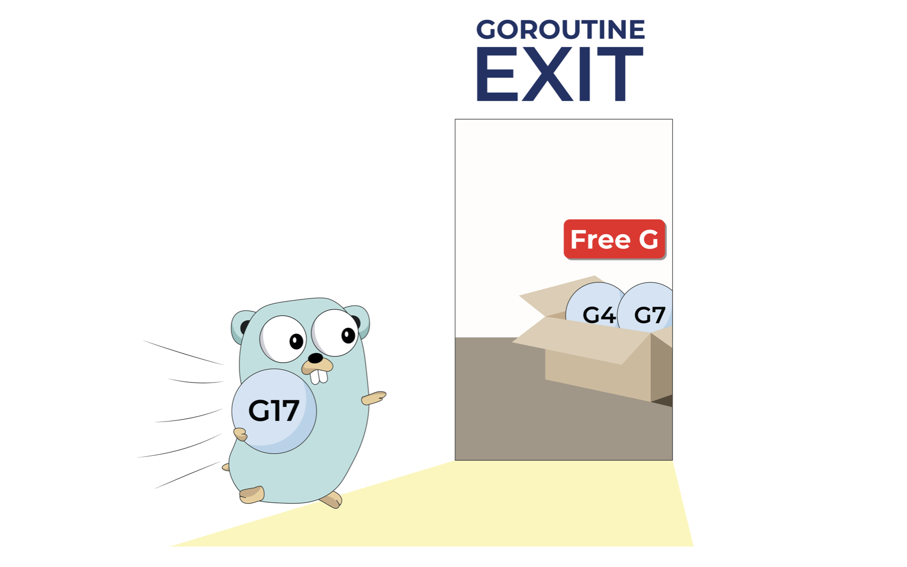
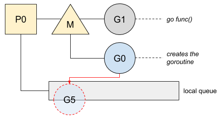
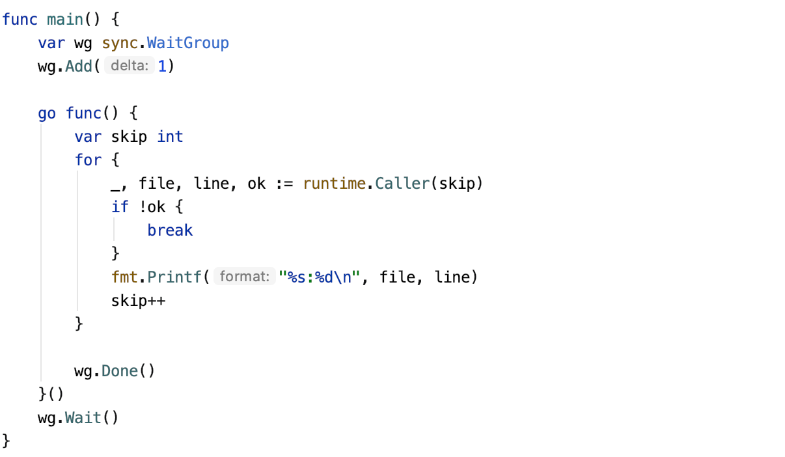
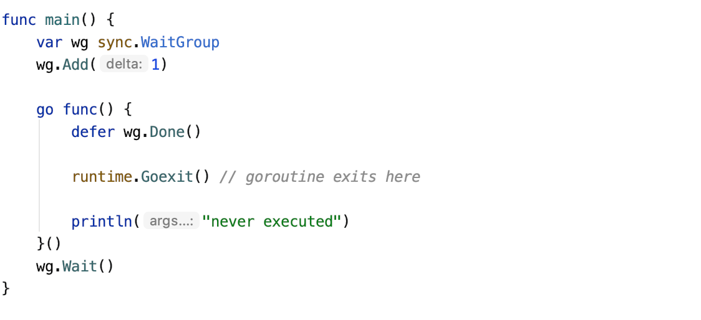
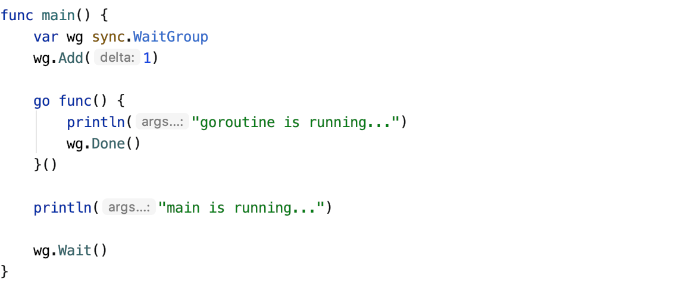

# Go: Goroutine是怎么开始和结束的？

原文：[Go: How Does a Goroutine Start and Exit? - A Journey With Go - Medium](https://medium.com/a-journey-with-go/go-how-does-a-goroutine-start-and-exit-2b3303890452)




原文打印的PDF：[Go-How Does a Goroutine Start and Exit_ - A Journey With Go - Medium](./Go_ How Does a Goroutine Start and Exit_ - A Journey With Go - Medium.pdf)


ℹ️ *This article is based on Go 1.14.*

In Go, a goroutine is nothing but a Go structure containing information regarding the running program, such as stack, program counter, or its current OS thread. The Go scheduler deals with that information to give them running time. The scheduler also has to pay attention at the start and the exit of the goroutines, two phases that need to be managed carefully.

*For more information about the stack and the program counter, I suggest you read my article “*[*Go: What a Goroutine Switch Actually Involve?*](https://medium.com/a-journey-with-go/go-what-a-goroutine-switch-actually-involve-394c202dddb7)*”*

### Start

The `main` function starts a goroutine before printing a message. Since the goroutine will have its own running time, Go notifies the runtime to set up a new goroutine, meaning:

- Creating the stack.
- Collecting information about the current program counter or caller’s data.
- Updating internal data of the goroutine such as ID or status.

However, the goroutine does not get any runtime immediately. The newly created goroutine will be enqueued at the beginning of the local queue and will run at the next round of the Go scheduler. Here is a diagram of the current state:



Putting the goroutine at the head of the queue makes it the first to run after the current goroutine. It will run either on the same thread or on another one if any work-stealing happens.

*For more information about the work-stealing, I suggest you read my article “*[*Go: Work-Stealing in Go Scheduler*](https://medium.com/a-journey-with-go/go-work-stealing-in-go-scheduler-d439231be64d)*.”*

The goroutine creation also can be seen in the assembly instructions:


Once the goroutine is created and pushed onto the local queue of goroutines, it goes directly to the next instructions of the main function.


# Exit

When a goroutine ends, Go must schedule another goroutine to not waste the CPU time. It will also keep the goroutine to reuse it later.

*You can find more information about the recycling of the goroutine in my article “*[*Go: How Does Go Recycle Goroutines?*](https://medium.com/a-journey-with-go/go-how-does-go-recycle-goroutines-f047a79ab352)*”*

However, Go needs a way to be aware of the end of the goroutine. This control is during the creation of the goroutine. While creating the goroutine, Go sets the stack to a function named `goexit` before setting the program counter to the real function called by the goroutine. This trick forces the goroutine to call the function `goexit` after ending its work. The following program allows us to visualize it:



The output will complete the stack trace:

```
/path/to/src/main.go:16
/usr/local/go/src/runtime/asm_amd64.s:1373
```

The file `asm_amd64` written in assembly contains this function:


Then, Go will switch to `g0` to schedule another goroutine.

It is also possible to stop the goroutine manually by calling `runtime.Goexit()`:



This function will run the deferred functions first, then will call the same function seen previously when a goroutine exits.


---


ℹ️ 这篇文章依据 Go 1.14

在 Go 中，goroutine 只是 Go 结构，其中包含有关正在运行的程序的信息，例如**堆栈**，**程序计数器**或其当前的**OS线程**。 Go**调度程序**会处理该信息，以提供运行时间。 **调度程序**还必须注意 goroutine 的*开始*和*退出*，这两个阶段需要仔细管理。
另外，有关堆栈和程序计数器的更多信息，建议您阅读我的文章 “ Go：Goroutine开关实际上涉及什么？“*[Go：Goroutine开关实际上涉及什么？](https://medium.com/a-journey-with-go/go-what-a-goroutine-switch-actually-involve-394c202dddb7)*”*

### 开始

一个进程可以轻松地开始一个 gotoutine 。看下面的代码示例。



main 函数在打印消息之前启动 goroutine 。 由于 goroutine 具有自己的运行时间，因此 Go 会通知**运行时**设置新的 goroutine，这意味着：

* 创建堆栈。
* 收集有关当前**程序计数器**或调用者数据的信息。
* 更新goroutine的内部数据，例如ID或状态。

但是，goroutine 不会立即获得任何运行时。 新创建的 goroutine 将在本地队列的开始处排队，并将在 Go **调度程序**的下一轮运行。 下面👇是当前状态的图表📈：


将 goroutine 放在队列的最前面，使其在当前 goroutine 之后第一个运行。 如果发生任何[工作窃取](https://blog.csdn.net/pange1991/article/details/80944797)，它将在同一线程或另一线程上运行。
*有关工作窃取的更多信息，建议您阅读我的文章“ [Go：Go Scheduler中的工作窃取](https://medium.com/a-journey-with-go/go-work-stealing-in-go-scheduler-d439231be64d)”。*

goroutine 的创建也可以在汇编代码中看到：


一旦创建了 goroutine，并将其推入 goroutine 的本地队列中，它将直接进入主函数的下一条指令。


### 退出

当 goroutine 结束时，Go必须安排并执行另一个 goroutine，以免浪费CPU时间。它还将保留 goroutine 以便以后重用。

*你可以在我的文章“[ Go：Go如何回收Goroutines？](https://medium.com/a-journey-with-go/go-how-does-go-recycle-goroutines-f047a79ab352)”中找到有关goroutine回收的更多信息。*

但是，Go需要一种方法来知道 goroutine 的结束。此控制是在 goroutine 的创建过程中进行的。创建 goroutine 时，Go会将堆栈设置为名为 `goexit` 的函数，然后再将**程序计数器**设置为 goroutine 调用的实函数。这个技巧迫使 goroutine 在结束工作后调用函数 `goexit`。以下程序使这个过程可视化：


输出将完成堆栈跟踪：

```bash
/path/to/src/main.go:16
/usr/local/go/src/runtime/asm_amd64.s:1373
```

用汇编语言编写的文件 `asm_amd64` 包含以下功能：


然后，Go 将切换到 g0 安排另一个 goroutine。
也可以通过调用 `runtime.Goexit()` 来手动停止 goroutine：


此函数将首先运行延迟的函数，然后在 goroutine 退出时调用先前看到的相同函数。


#### 完整代码：


###### Demo01: 创建一个 goroutine


```go
package main

import (
	"sync"
	"fmt"
)
func main()  {
	var wg sync.WaitGroup
	wg.Add(1)
	go func(){
		fmt.Println("goroutine is running...")
		wg.Done()
	}()
	fmt.Println("main is running...")
	wg.Wait()
}
```


###### Demo02: 打印 调用者数据

```go
package main

import (
	"fmt"
	"runtime"
	"sync"
)

func main() {
	var wg sync.WaitGroup
	wg.Add(1)
	go func() {

		var skip int
		for {
			_, file, line, ok := runtime.Caller(skip)
			if !ok {
				break
			}
			fmt.Printf("%s%d\n", file, line)
			skip++
		}
		wg.Done()
	}()
	wg.Wait()
}

/* output:

/Users/zcj/panda/git4me/daily-log-archive/2020-04-05/demo01/main.go16
/usr/local/go/src/runtime/asm_amd64.s1373

*/
```


###### Demo03: 手动调用 runtime.Goexit() 退出 goroutine


```go
package main

import (
	"fmt"
	"runtime"
	"sync"
)

func main() {
	var wg sync.WaitGroup
	wg.Add(1)
	go func() {
		defer wg.Done()
		runtime.Goexit() // goroutine exits here
		fmt.Println("this line code never executed")
	}()
	wg.Wait()
}
```

