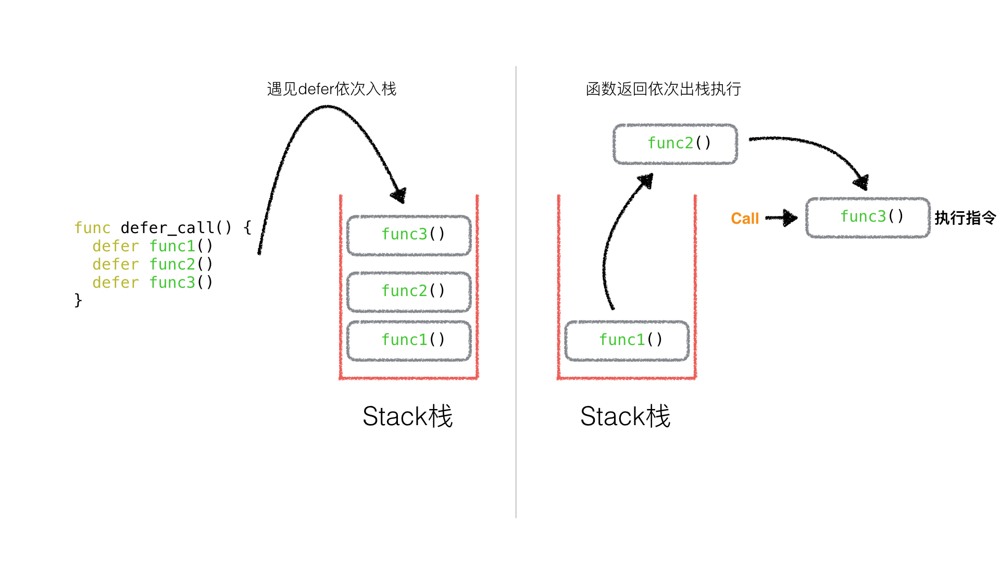
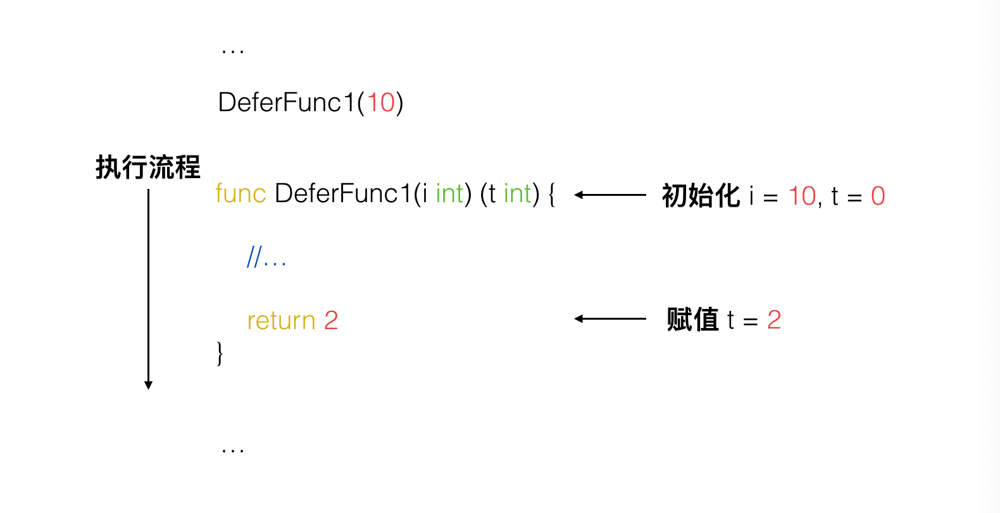
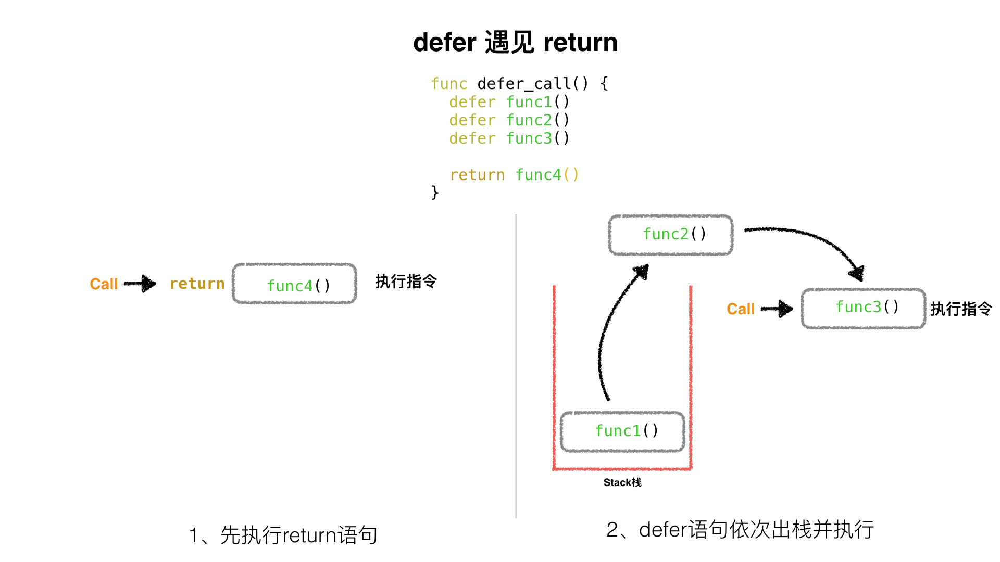
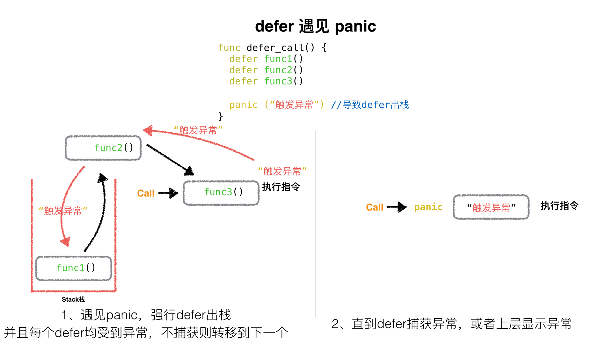

# [原创分享](https://gocn.vip/topics/node3) Golang 中的 Defer 必掌握的 7 知识点

[author ： aceld](https://gocn.vip/aceld) 

 本帖已被设为精华帖！

 目录

> 本文作者:刘丹冰 Aceld, 公众号同名

在用 Golang 开发的时候，`defer`这个语法也是必备的知识，但是我们除了知道他是在一个函数退出之前执行，对于`defer`是否还有其他地方需要注意的呢。

本文整理的`defer`的全场景使用情况，部分场景源自网络，加上自己的额外观点和分析，完成了这份`defer`的 7 个隐性必备知识点。

提纲如下：

- 知识点 1： defer 的执行顺序
- 知识点 2：defer 与 return 谁先谁后
- 知识点 3：函数的返回值初始化与 defer 间接影响
- 知识点 4：有名函数返回值遇见 defer 情况
- 知识点 5：defer 遇见 panic
- 知识点 6：defer 中包含 panic
- 知识点 7：defer 下的函数参数包含子函数

------

#### 知识点 1：defer 的执行顺序

多个 defer 出现的时候，**它是一个 “栈” 的关系，也就是先进后出**。一个函数中，写在前面的 defer 会比写在后面的 defer 调用的晚。

> 示例代码

```
package main

import "fmt"

func main() {
    defer func1()
    defer func2()
    defer func3()
}

func func1() {
    fmt.Println("A")
}

func func2() {
    fmt.Println("B")
}

func func3() {
    fmt.Println("C")
}
```


[](https://static.gocn.vip/photo/2020/cf904f1f-271e-4ab3-a9a6-9390ecf93132.jpeg?x-oss-process=image/resize,w_1920)


输出结果：

```
C
B
A
```

------

#### 知识点 2: defer 与 return 谁先谁后

> 示例代码

```
package main

import "fmt"

func deferFunc() int {
    fmt.Println("defer func called")
    return 0
}

func returnFunc() int {
    fmt.Println("return func called")
    return 0
}

func returnAndDefer() int {

    defer deferFunc()

    return returnFunc()
}

func main() {
    returnAndDefer()
}
```

执行结果为：

```
return func called
defer func called
```

结论为：**return 之后的语句先执行，defer 后的语句后执行**

------

#### 知识点 3：函数的返回值初始化

该知识点不属于 defer 本身，但是调用的场景却与 defer 有联系，所以也算是 defer 必备了解的知识点之一。

如 ： `func DeferFunc1(i int) (t int) {}` 其中返回值`t int`，这个`t`会在函数起始处被初始化为对应类型的零值并且作用域为整个函数。


[](https://static.gocn.vip/photo/2020/612d977d-34ff-48de-9c0b-725079a82042.png?x-oss-process=image/resize,w_1920)


> 示例代码

```
package main

import "fmt"

func DeferFunc(i int) (t int) {

    fmt.Println("t = ", t)

    return 2
}

func main() {
    DeferFunc(10)
}
```

结果

```
t =  0
```

证明，**只要声明函数的返回值变量名称，就会在函数初始化时候为之赋值为 0，而且在函数体作用域可见**。

------

#### 知识点 4: 有名函数返回值遇见 defer 情况

在没有 defer 的情况下，其实函数的返回就是与 return 一致的，但是有了 defer 就不一样了。

 我们通过**知识点 2**得知，先 return，再 defer，所以在执行完 return 之后，还要再执行 defer 里的语句，依然可以修改本应该返回的结果。

```
package main

import "fmt"

func returnButDefer() (t int) {  //t初始化0， 并且作用域为该函数全域

    defer func() {
        t = t * 10
    }()

    return 1
}

func main() {
    fmt.Println(returnButDefer())
}
```

 该`returnButDefer()`本应的返回值是`1`，但是在 return 之后，又被 defer 的匿名 func 函数执行，所以`t=t*10`被执行，最后`returnButDefer()`返回给上层`main()`的结果为`10`

```
$ go run test.go
10
```

------

#### 知识点 5: defer 遇见 panic

 我们知道，能够触发 defer 的是遇见 return(或函数体到末尾) 和遇见 panic。

 根据**知识点 2**，我们知道，defer 遇见 return 情况如下：


[](https://static.gocn.vip/photo/2020/245136e0-9382-41af-9d9d-f80b1585c456.jpeg?x-oss-process=image/resize,w_1920)


那么，遇到 panic 时，遍历本协程的 defer 链表，并执行 defer。在执行 defer 过程中:遇到 recover 则停止 panic，返回 recover 处继续往下执行。如果没有遇到 recover，遍历完本协程的 defer 链表后，向 stderr 抛出 panic 信息。


[](https://static.gocn.vip/photo/2020/b467edf0-4ff9-49fb-8bf2-bdf0f2d14a66.jpeg?x-oss-process=image/resize,w_1920)


##### A. defer 遇见 panic，但是并不捕获异常的情况

> test10.go

```
package main

import (
    "fmt"
)

func main() {
    defer_call()

    fmt.Println("main 正常结束")
}

func defer_call() {
    defer func() { fmt.Println("defer: panic 之前1") }()
    defer func() { fmt.Println("defer: panic 之前2") }()

    panic("异常内容")  //触发defer出栈

    defer func() { fmt.Println("defer: panic 之后，永远执行不到") }()
}
```

**结果**

```
defer: panic 之前2
defer: panic 之前1
panic: 异常内容
//... 异常堆栈信息
```

##### B. defer 遇见 panic，并捕获异常

```
package main

import (
    "fmt"
)

func main() {
    defer_call()

    fmt.Println("main 正常结束")
}

func defer_call() {

    defer func() {
        fmt.Println("defer: panic 之前1, 捕获异常")
        if err := recover(); err != nil {
            fmt.Println(err)
        }
    }()

    defer func() { fmt.Println("defer: panic 之前2, 不捕获") }()

    panic("异常内容")  //触发defer出栈

    defer func() { fmt.Println("defer: panic 之后, 永远执行不到") }()
}
```

**结果**

```
defer: panic 之前2, 不捕获
defer: panic 之前1, 捕获异常
异常内容
main 正常结束
```

**defer 最大的功能是 panic 后依然有效** 所以 defer 可以保证你的一些资源一定会被关闭，从而避免一些异常出现的问题。

------

#### 知识点 6: defer 中包含 panic

> 编译执行下面代码会出现什么?
>
>  
>
> test16.go

```
package main

import (
    "fmt"
)

func main()  {

    defer func() {
       if err := recover(); err != nil{
           fmt.Println(err)
       }else {
           fmt.Println("fatal")
       }
    }()

    defer func() {
        panic("defer panic")
    }()

    panic("panic")
}
```

**结果**

```
defer panic
```

**分析**

**panic 仅有最后一个可以被 revover 捕获**。

触发`panic("panic")`后 defer 顺序出栈执行，第一个被执行的 defer 中 会有`panic("defer panic")`异常语句，这个异常将会覆盖掉 main 中的异常`panic("panic")`，最后这个异常被第二个执行的 defer 捕获到。

------

#### 知识点 7: defer 下的函数参数包含子函数

```
package main

import "fmt"

func function(index int, value int) int {

    fmt.Println(index)

    return index
}

func main() {
    defer function(1, function(3, 0))
    defer function(2, function(4, 0))
}
```

 这里，有 4 个函数，他们的 index 序号分别为 1，2，3，4。

那么这 4 个函数的先后执行顺序是什么呢？这里面有两个 defer， 所以 defer 一共会压栈两次，先进栈 1，后进栈 2。 那么在压栈 function1 的时候，需要连同函数地址、函数形参一同进栈，那么为了得到 function1 的第二个参数的结果，所以就需要先执行 function3 将第二个参数算出，那么 function3 就被第一个执行。同理压栈 function2，就需要执行 function4 算出 function2 第二个参数的值。然后函数结束，先出栈 fuction2、再出栈 function1.

 所以顺序如下：

- defer 压栈 function1，压栈函数地址、形参 1、形参 2(调用 function3) --> 打印 3
- defer 压栈 function2，压栈函数地址、形参 1、形参 2(调用 function4) --> 打印 4
- defer 出栈 function2, 调用 function2 --> 打印 2
- defer 出栈 function1, 调用 function1--> 打印 1

```
3
4
2
1
```

------

#### 练习：defer 面试真题

了解以上 6 个 defer 的知识点，我们来验证一下网上的真题吧。

下面代码输出什么？

> test11.go

```
package main

import "fmt"

func DeferFunc1(i int) (t int) {
    t = i
    defer func() {
        t += 3
    }()
    return t
}

func DeferFunc2(i int) int {
    t := i
    defer func() {
        t += 3
    }()
    return t
}

func DeferFunc3(i int) (t int) {
    defer func() {
        t += i
    }()
    return 2
}

func DeferFunc4() (t int) {
    defer func(i int) {
        fmt.Println(i)
        fmt.Println(t)
    }(t)
    t = 1
    return 2
}

func main() {
    fmt.Println(DeferFunc1(1))
    fmt.Println(DeferFunc2(1))
    fmt.Println(DeferFunc3(1))
    DeferFunc4()
}
```

------

#### 练习题分析

##### DeferFunc1

```
func DeferFunc1(i int) (t int) {
    t = i
    defer func() {
        t += 3
    }()
    return t
}
```

1. 将返回值 t 赋值为传入的 i，此时 t 为 1
2. 执行 return 语句将 t 赋值给 t（等于啥也没做）
3. 执行 defer 方法，将 t + 3 = 4
4. 函数返回 4 因为 t 的作用域为整个函数所以修改有效。

##### DeferFunc2

```
func DeferFunc2(i int) int {
    t := i
    defer func() {
        t += 3
    }()
    return t
}
```

1. 创建变量 t 并赋值为 1
2. 执行 return 语句，注意这里是将 t 赋值给返回值，此时返回值为 1（这个返回值并不是 t）
3. 执行 defer 方法，将 t + 3 = 4
4. 函数返回返回值 1

也可以按照如下代码理解

```go
func DeferFunc2(i int) (result int) {
    t := i
    defer func() {
        t += 3
    }()
    return t
}
```

上面的代码 return 的时候相当于将 t 赋值给了 result，当 defer 修改了 t 的值之后，对 result 是不会造成影响的。

##### DeferFunc3

```go
func DeferFunc3(i int) (t int) {
    defer func() {
        t += i
    }()
    return 2
}
```

1. 首先执行 return 将返回值 t 赋值为 2
2. 执行 defer 方法将 t + 1
3. 最后返回 3

##### DeferFunc4

```
func DeferFunc4() (t int) {
    defer func(i int) {
        fmt.Println(i)
        fmt.Println(t)
    }(t)
    t = 1
    return 2
}
```

1. 初始化返回值 t 为零值 0
2. 首先执行 defer 的第一步，赋值 defer 中的 func 入参 t 为 0
3. 执行 defer 的第二步，将 defer 压栈
4. 将 t 赋值为 1
5. 执行 return 语句，将返回值 t 赋值为 2
6. 执行 defer 的第三步，出栈并执行 因为在入栈时 defer 执行的 func 的入参已经赋值了，此时它作为的是一个形式参数，所以打印为 0；相对应的因为最后已经将 t 的值修改为 2，所以再打印一个 2

##### **结果**

```
4
1
3
0
2
```

------

------

\### 关于作者：

mail: [danbing.at@gmail.com](mailto:danbing.at@gmail.com) github: https://github.com/aceld 原创书籍 gitbook: http://legacy.gitbook.com/@aceld

## 创作不易, 共同学习进步, 欢迎关注作者, 回复"zinx"有好礼


[](https://static.gocn.vip/photo/2020/5f97af72-b1d5-4e64-8be0-c5ad5a57b153.jpg?x-oss-process=image/resize,w_1920)