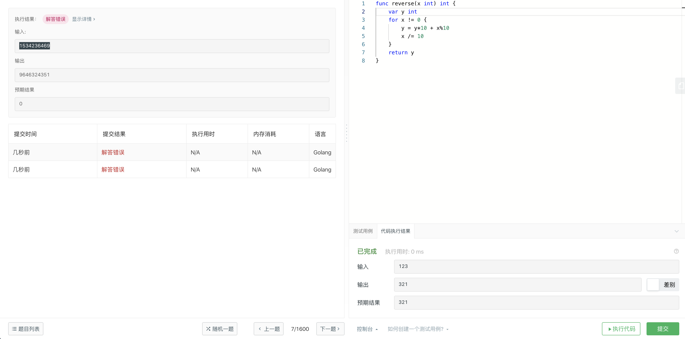

## [1. 两数之和](https://leetcode-cn.com/problems/two-sum/)

难度简单8044收藏分享切换为英文关注反馈

给定一个整数数组 `nums` 和一个目标值 `target`，请你在该数组中找出和为目标值的那 **两个** 整数，并返回他们的数组下标。

你可以假设每种输入只会对应一个答案。但是，你不能重复利用这个数组中同样的元素。

**示例:**

```
给定 nums = [2, 7, 11, 15], target = 9

因为 nums[0] + nums[1] = 2 + 7 = 9
所以返回 [0, 1]
```

#### 解法2。看了别人的模仿的，

使用map的key存item，value存index，这个方式很容易使用map这个内置结构自己的特性：根据键查找值。

```go
func twoSum(nums []int, target int) []int {
   m := map[int]int{}
   for i, v := range nums {
       if k, ok := m[target-v]; ok {
           return []int{k, i}
       }
       m[v] = i
   }
   return nil
}
```


#### 解法1 第一次想到的这种

```go
func twoSum(nums []int, target int) []int {
    for index,item := range nums {
        for i, a := range nums {
            if i != index && (item + a) == target {
                return []int{index, i}
            }
        }
    }
    return nil
}
```


## [2. 两数相加](https://leetcode-cn.com/problems/add-two-numbers/)

难度中等4187

给出两个 **非空** 的链表用来表示两个非负的整数。其中，它们各自的位数是按照 **逆序** 的方式存储的，并且它们的每个节点只能存储 **一位** 数字。

如果，我们将这两个数相加起来，则会返回一个新的链表来表示它们的和。

您可以假设除了数字 0 之外，这两个数都不会以 0 开头。

**示例：**

```
输入：(2 -> 4 -> 3) + (5 -> 6 -> 4)
输出：7 -> 0 -> 8
原因：342 + 465 = 807
```


#### Golang解法+题解+思路+源码+注释

[叶落山城](https://leetcode-cn.com/u/iphpt/)发布于 7 个月前1.2kGo

#### 题解:

- 两数相加其实是两链表相加
- 根据示例可以看出,是把两链表从最后的节点往前算,凑成一个整数,然后两个整数相加,得出的结果 从 个位数开始拆成一个链表
- 不过一定要注意! 如果真的当成 整数来算,可能会超出 整型的最大范围!!!!

#### 思路:

- 一开始我是先把两链表转换成两个整数,然后相加,再把结果的整数拆分成 一个链表! 但是可能会超长的!!!!!
- 后来发现了一个简单的方法
- 比如例子吧,仔细看,链表1从值等于2的开始,链表2从值等于5开始,根据示例里的`原因`,是`342 + 465`,正常的两数相加也是从各位开始的,仔细看,个位数是不是就是`2`和`5`
- 再看示例结果,个位数是在结果的链表的头节点的! 也就是说 `7` 是在排在最前面的

```
1->0->0->0->0->1
2->3->4

结果是

3->3->4->0->0->1
```

- 看上面的两个链表相加,明显了吧,只要依次正常遍历链表,然后按照对应位置两数相加, 如果超过`10`,则取结果的`个位数(结果-10)`,下一位就`+1`
- 注意,如果一个链表比较短,那么 长链表可以 `+ 0`
- 另外注意 如果最后一位相加之和`大于10`,那么,最后还要再加一个`1`的节点 (比如 `9->9->9` + `9->9->9`)

#### 代码:

```
func addTwoNumbers(l1 *ListNode, l2 *ListNode) *ListNode {

	// 定义一个 i 表示 两数相加是否大于10, 定义一个s表示两数两加之和
	var i,s int
	// 定义一个头节点
	res := &ListNode{Val:0}
	// 定义一个当前节点
	now := res

	// 无限循环,内部加条件跳出
	for true {
		// 如果 i >0 表示前面的数之和大于10了,所以当前的和要加1,否则不加
		if i > 0 {
			s = l1.Val + l2.Val + 1
		} else {
			s = l1.Val + l2.Val
		}
		// 如果 两数之和大于10,那么该位的值应该是 s - 10 ,否则就是 和 本身,并设置 i 标记
		if s >= 10 {
			now.Next = &ListNode{Val:s - 10}
			i = 1
		} else {
			now.Next = &ListNode{Val:s}
			i = 0
		}
		// 将 当前节点移动到下一指针
		now = now.Next

		// 当l1 和 l2 都移动到最后了,准备跳出循环
		if l1.Next == nil && l2.Next == nil {
			// 如果l1 和 l2 最后的和大于10,即 i == 1, 那么后面还需要添加一个 1 (小学数学问题,不用解释为什么是1吧)
			if i == 1 {
				now.Next = &ListNode{Val:1}
			}
			// 跳出循环
			break
		}
		// 如果 l1走到了最后,可能l2 还没结束,所以把l1的当前节点值设置成0,继续跟l2相加,否则移动到下一指针
		if l1.Next == nil {
			l1.Val = 0
		} else {
			l1 = l1.Next
		}
		// 如果 l2走到了最后,可能l1 还没结束,所以把l2的当前节点值设置成0,继续跟l1相加,否则移动到下一指针
		if l2.Next == nil {
			l2.Val = 0
		} else {
			l2 = l2.Next
		}
	}

	// 返回头节点的下一个节点指针,因为头节点是我设置成0的
	return res.Next
}
```


© 著作权归作者所有


## [7. 整数反转](https://leetcode-cn.com/problems/reverse-integer/)

难度简单1822收藏分享切换为英文关注反馈

给出一个 32 位的有符号整数，你需要将这个整数中每位上的数字进行反转。

**示例 1:**

```
输入: 123
输出: 321
```

 **示例 2:**

```
输入: -123
输出: -321
```

**示例 3:**

```
输入: 120
输出: 21
```

**注意:**


#### 解法1，我是没什么想法看了别人的才想起来。

```go
package main

import (
	"fmt"
)

func reverse(x int) int {
	var y int
	for x != 0 {
		y = y*10 + x%10
		if y <= -(1<<31) || y >= (1<<31)-1 {
			return 0
		}
		x /= 10
	}
	return y
}

func main() {

	fmt.Println(reverse(2340))
	fmt.Println(reverse(1534236469))
	fmt.Println(reverse(-2340))
}

```




感觉还要处理进位问题。