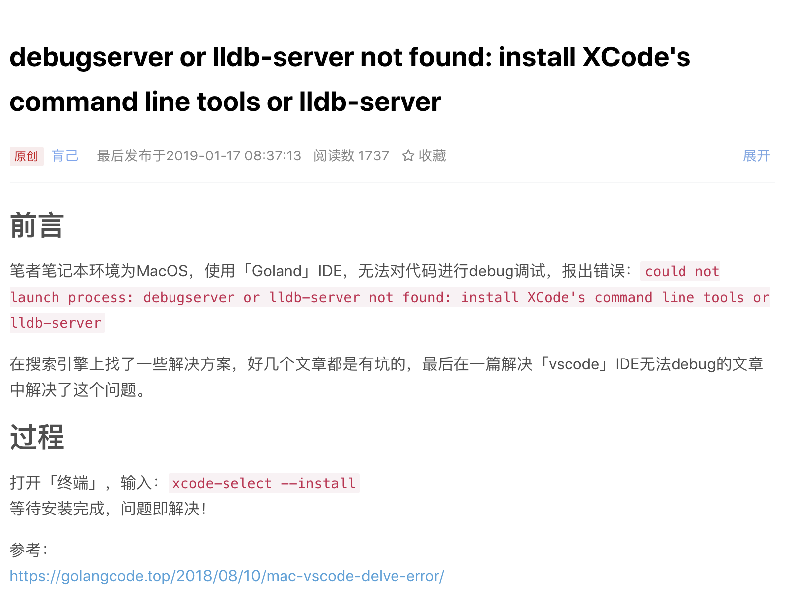

# 使用VSCode调试Go程序-Vscode debug go programe

### 参考资料

[在vscode中怎样debug调试go程序 - 龙须子 - 博客园](https://www.cnblogs.com/ljhoracle/p/11047083.html)

### 需要的问题

[debugserver or lldb-server not found: install XCodes command line tools or lldb-server_开发工具_肓己CSDN-CSDN博客](https://blog.csdn.net/bacteriumX/article/details/86517136)

