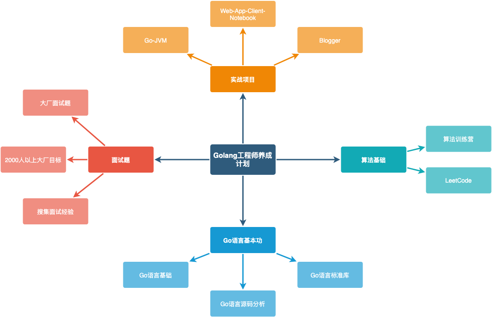
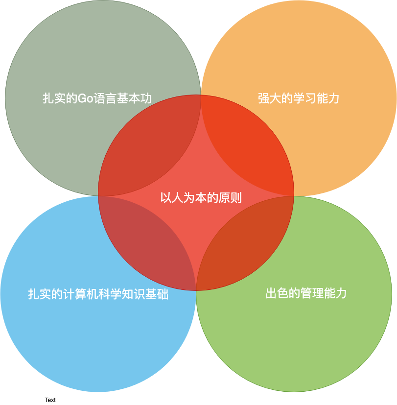

# 今日任务📒

## 1. Go语言基础-上-Day01-Go命令行

## 2. 算法训练营-Day01

## 3. Go-JVM-Day01

## 4. Go-Blogger-Day01

## 5. 面试准备-Day01

## 6. PandaDaily-Go

1. [Alikhll/golang-developer-roadmap: Roadmap to becoming a Go developer in 2019](https://github.com/Alikhll/golang-developer-roadmap) 2019年Go语言开发者路线图
2. 2019年Go语言开发者路线图，中文版：[Quorafind/golang-developer-roadmap-cn: 在 2019 成为一名 Go 开发者的路线图。为学习 Go 的人而准备。](https://github.com/Quorafind/golang-developer-roadmap-cn)
3. 公众号文章：[Go语言之父：发明过航天望远镜，想用Go语言解放程序员！](https://mp.weixin.qq.com/s/FXUQScO67KFQTZJk8moCKg)
4. 公众号文章：[Go 并发编程中的经验教训 | Linux 中国](https://mp.weixin.qq.com/s/5YaZr3ljv4INIOQprqKZyw)
5. 公众号文章：[Go 大败！Google 宣布 Fuchsia 终端开发只支持 C/C++/Dart](https://mp.weixin.qq.com/s/snL8V2x4XfYDKV4boSsBCw)
6. 公众号文章：[Go刷LeetCode系列：二叉树（5）右视图](https://mp.weixin.qq.com/s/68gMHsGHxxecObC6m1Ug4w)
7. 公众号文章：[如何优雅的使用GDB调试Go](https://mp.weixin.qq.com/s/h-OBLoyyuC4oDUkYnKGg0w)
8. 公众号文章：[Go每日一库：使用sqlx批量插入数据](https://mp.weixin.qq.com/s/izZTySv4_1Uz6n3Yo2FHYA)
9. 公众号文章：[Go 中的高级测试模式：集成测试如何做？](https://mp.weixin.qq.com/s/o71M9SU_fh8suuRdOaZ0Bw)

# 今日完成✅

- Golang工程师路线图确定
- 确定Go工程师训练目标

* 确定2000人以上的目标公司
* [Go语言基础-上-Day01-Go命令行](../Golang工程师养成计划/Go语言基础/Go-基础-上-Day01-命令行.md)

#### 1. Golang工程师路线图确定

#### 2. 确定Go工程师训练目标

- 扎实的Go语言基本功 
- 扎实的计算机科学知识基础 
- 强大的学习能力 
- 出色的协作管理能力 
- 以人为本的原则                       

#### 3. 确定2000人以上的目标公司

1. 腾讯
2. 字节跳动
3. Shopee
4. 明源云
5. 金蝶
6. 金证股份
7. 穆迪

# 今日总结🉐

- [Mac 怎样快捷地输入 Emoji 表情和颜文字？这里有 3 种方法](https://baijiahao.baidu.com/s?id=1617085926806823969&wfr=spider&for=pc)