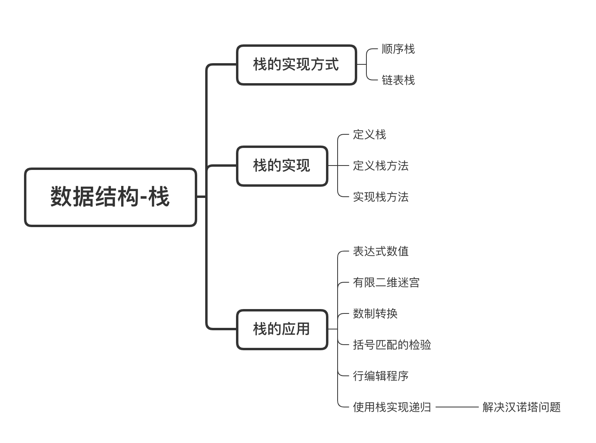

# 2020-04-23-笔记📒

## 今日任务

### 1. 数据结构

- 严蔚敏
  - 第三章，栈，看完了，没有看汉诺塔具体实现
  - 第六章，树，二叉树，看了几页
- 邓俊辉-学堂在线-数据结构上
  - 第零章，作业系统的使用
  - 第一章，绪论
  - 第二章，向量

### 2. Go标准库-container/heap

详细整理 container/heap 的使用

读懂 example 程序

查看 container/heap源码 heap.go

## 今日完成✅

1. 数据结构
2. 邓俊辉-学堂在线-数据结构上
3. [Go标准库-container/heap](Golang工程师养成计划/Go语言标准库/container-heap.md)

## PandaDaily-Go

- 公众号文章：[使用Docker部署Go Web应用](https://mp.weixin.qq.com/s/F6FlkcIFsrEatnY1DCNFhw)