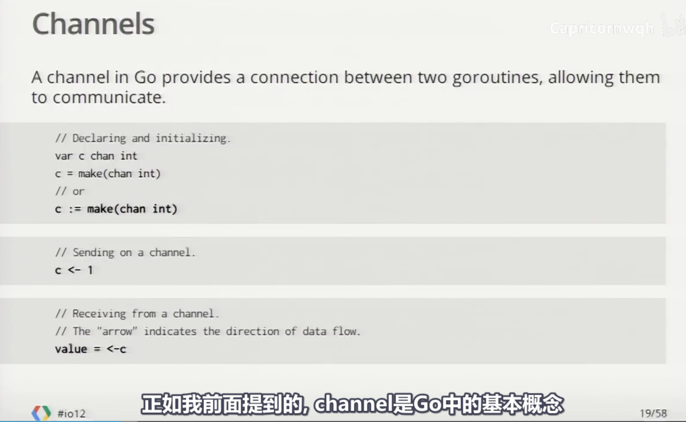
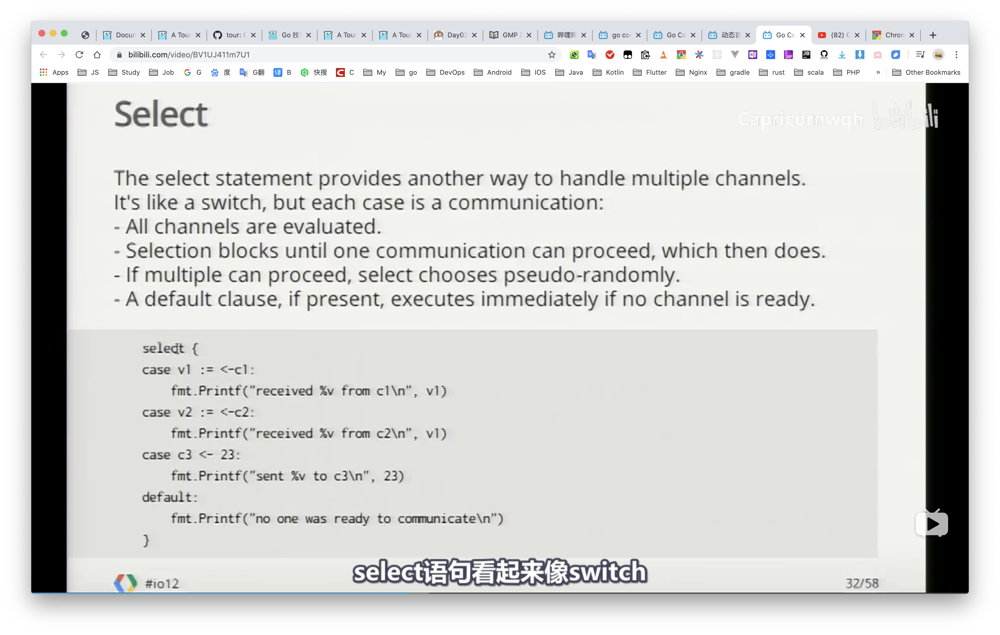
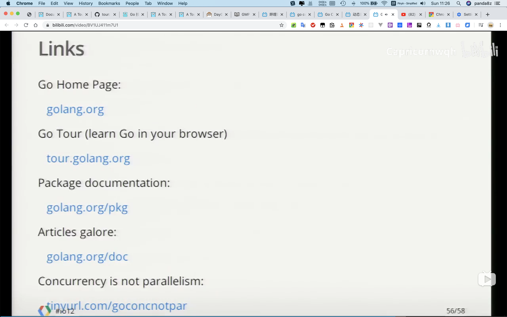

## 今日任务

## 今日完成

## 看了一个 2012年的 Go团队的视频

https://www.bilibili.com/video/BV1UJ411m7U1

[Go Concurrency Patterns 中文字幕 bilibili](https://www.bilibili.com/video/BV1UJ411m7U1)

### 原视频 ： [Google I/O 2012 - Go Concurrency Patterns - YouTube](https://www.youtube.com/watch?v=f6kdp27TYZs)

### 原视频： [Google I/O 2012 - Meet the Go Team - YouTube](https://www.youtube.com/watch?v=sln-gJaURzk&t=136s)

