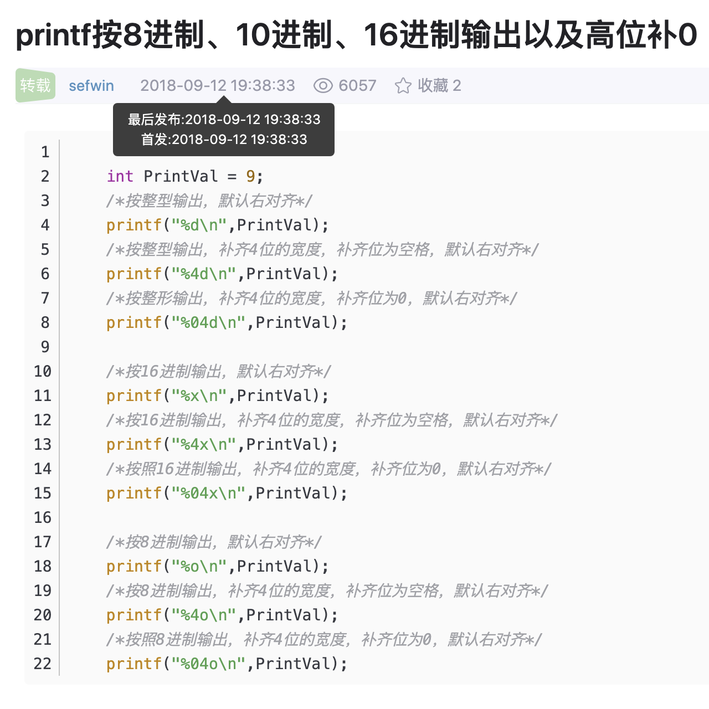

# 2020-05-06-笔记


## 今日完成

### 2.1 奇怪的知识增加了

[printf按8进制、10进制、16进制输出以及高位补0_C/C++_sefwin的博客-CSDN博客](https://blog.csdn.net/sefwin/article/details/82667000)



```c

 
    int PrintVal = 9;
    /*按整型输出，默认右对齐*/
    printf("%d\n",PrintVal);
    /*按整型输出，补齐4位的宽度，补齐位为空格，默认右对齐*/
    printf("%4d\n",PrintVal);
    /*按整形输出，补齐4位的宽度，补齐位为0，默认右对齐*/
    printf("%04d\n",PrintVal);
 
    /*按16进制输出，默认右对齐*/   
    printf("%x\n",PrintVal);
    /*按16进制输出，补齐4位的宽度，补齐位为空格，默认右对齐*/
    printf("%4x\n",PrintVal);
    /*按照16进制输出，补齐4位的宽度，补齐位为0，默认右对齐*/
    printf("%04x\n",PrintVal);
 
    /*按8进制输出，默认右对齐*/
    printf("%o\n",PrintVal);
    /*按8进制输出，补齐4位的宽度，补齐位为空格，默认右对齐*/
    printf("%4o\n",PrintVal);
    /*按照8进制输出，补齐4位的宽度，补齐位为0，默认右对齐*/

```

