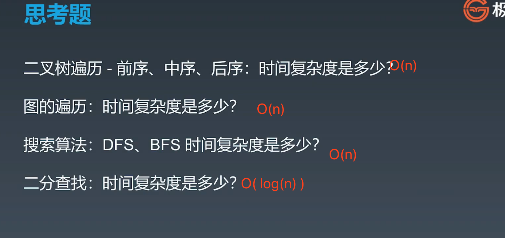
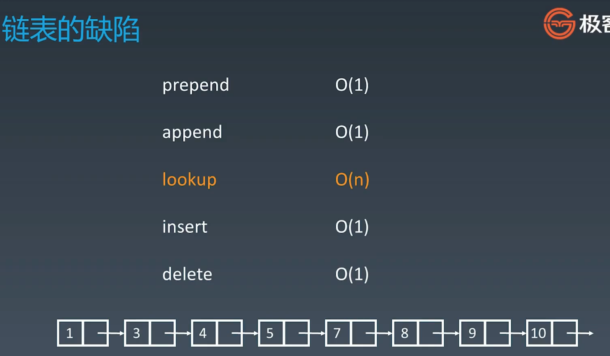

## 解决 mysql 8.0.19连接问题： 2059 - Authentication plugin 'caching_sha2_password' cannot be loaded: dlope

在使用Navicat Premium 12连接MySQL8.0.19数据库时会出现 **2059 - Authentication plugin 'caching_sha2_password' cannot be loaded: dlope**

出现这个原因是mysql8 之前的版本中加密规则是mysql_native_password,

而在mysql8之后,加密规则是caching_sha2_password, 

**解决问题方法有两种**,

- 一种是升级navicat驱动,

- 一种是把mysql用户登录密码加密规则还原成mysql_native_password. 

这里用第二种方式 ，解决方法如下

### \1. 管理员权限运行命令提示符，登陆MySQL（记得添加环境变量）

  mysql -u root -p

  password:                                     #登入mysql

### \2. 修改账户密码加密规则并更新用户密码

  ALTER USER 'root'@'localhost' IDENTIFIED BY 'password' PASSWORD EXPIRE NEVER;  #修改加密规则 

  ALTER USER 'root'@'localhost' IDENTIFIED WITH mysql_native_password BY 'password';  #更新一下用户的密码 

 

### \3. 刷新权限并重置密码

  FLUSH PRIVILEGES;  #刷新权限 

单独重置密码命令：alter user 'root'@'localhost' identified by '123456';

