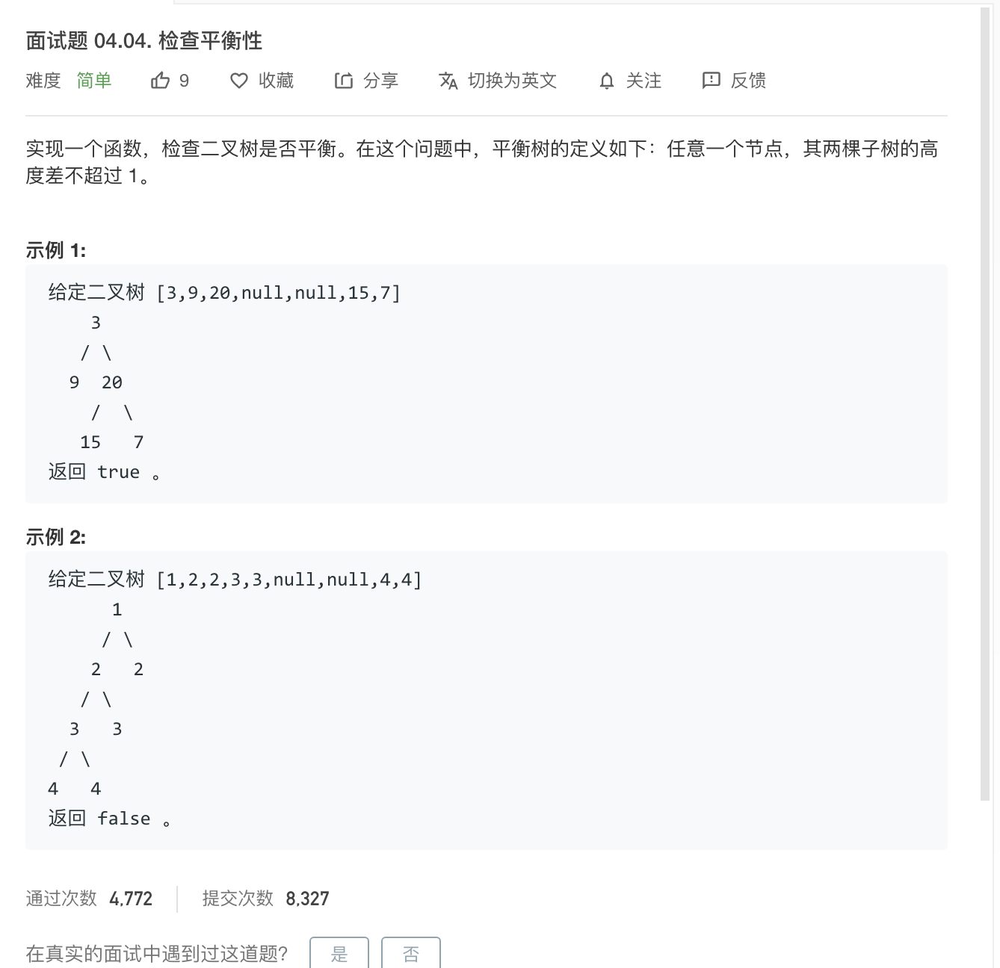

# 2020-05-08-笔记


## 入门blog-os


[A Minimal Rust Kernel | Writing an OS in Rust](https://os.phil-opp.com/minimal-rust-kernel/)

```bash
cargo install cargo-xbuild
cargo install bootimage --version "^0.7.7"
brew install qemu
```

## [面试题 04.04. 检查平衡性 - 力扣（LeetCode）](https://leetcode-cn.com/problems/check-balance-lcci/)



### 解题思路


#### 1. 首先理解二叉树是什么

[深入学习二叉树(一) 二叉树基础 - 简书](https://www.jianshu.com/p/bf73c8d50dc2)


[二叉树_百度百科](https://baike.baidu.com/item/%E4%BA%8C%E5%8F%89%E6%A0%91/1602879?fr=aladdin)

#### 2. 其次理解 什么平衡树

1. 获取二叉树深度（层数）
2. 递归每一个节点，判断其每个子树都是否平衡。

由以上两个前提得知，一定有：`平衡树 = 左平衡 && 右平衡` 对每一个节点都成立。

判断平衡的代码逻辑是： `｜左深度 - 右深度｜ <= 1`

由此就得出了下面👇的代码。

### 代码

```go
/**
 * Definition for a binary tree node.
 * type TreeNode struct {
 *     Val int
 *     Left *TreeNode
 *     Right *TreeNode
 * }
 */
func isBalanced(root *TreeNode) bool {

    if root == nil {
        // 叶子节点的节点肯定是符合要求的。
        return true
    }

    if math.Abs(depth(root.Left) - depth(root.Right)) <= 1 {
        // 任意个节点的两棵子树都要平衡。
        return isBalanced(root.Left) && isBalanced(root.Right)
    }

    return false

}

// 获取 二叉树深度
func depth(root *TreeNode) float64{
    if root == nil {
        // 递归到叶子节点的子的时候就会遇到nil
        return 0
    }
    // 递归到叶子节点的时候正好是 0 + 1 ，之后每上一层就 +1
    return math.Max(depth(root.Left), depth(root.Right)) + 1
}
```


