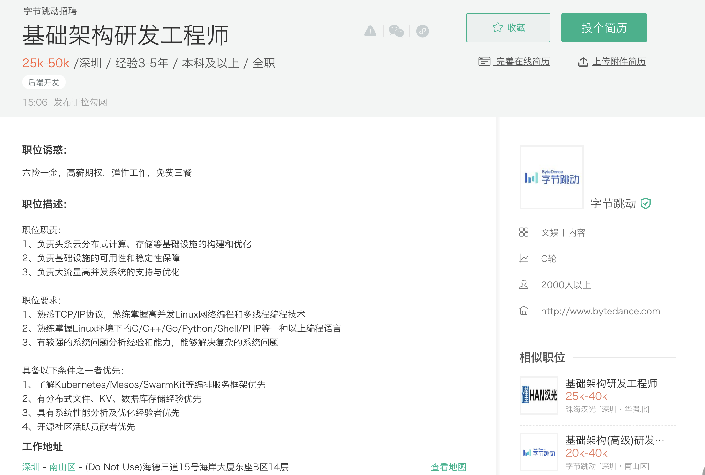
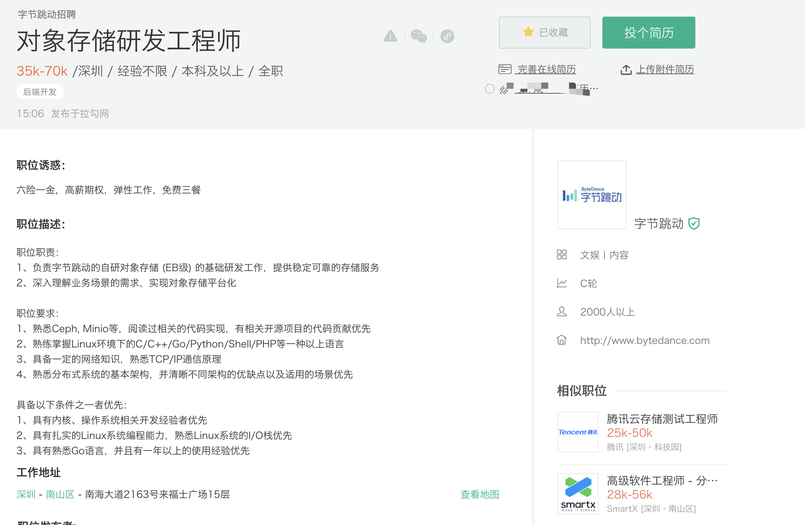
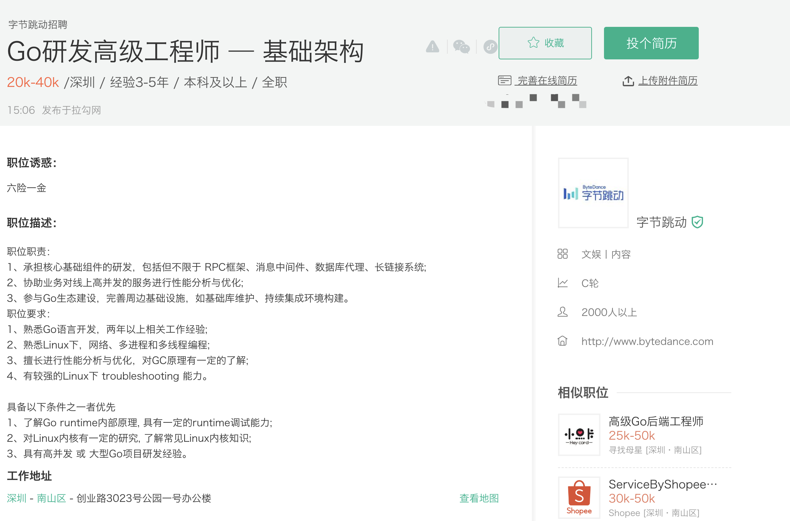

# 2020-05-09-笔记📒

## 一、看招聘网站

### 1.1 资深GOlang开发 50-100K 坐标北京 weixin 18650196973

[Nicole123](https://studygolang.com/user/Nicole123) · 1天之前 · 232 次点击 · 不到1分钟之前 开始浏览  [置顶](https://studygolang.com/topics/set_top?tid=11454)

职位描述：

 1、负责好课核心业务的服务端研发工作，参与微服务架构的设计和落地； 

2、对学生购课、上课、评价和售后等场景进行不断优化，向更好的产品体验不断冲锋。 岗位职责： 

1、负责系统的优化和重构； 

2、进行新技术预研、应用；

 3、负责团队技术规范，单元测试; 

4、负责团队的业务架构；

 任职要求： 

1、本科及以上学历，计算机及相关专业，3年及以上服务端开发经验，有2年及以上Go后端开发经验； 

2、对代码质量有追求，并具备良好的编程风格； 

3、熟悉开源框架、HTTP协议、RPC协议，网络编程等技术； 

4、掌握性能分析和调优手段，对系统扩展性，稳定性有思考; 

5、对高可用高并发系统有经验，思考，或者感兴趣；

 6、精通Docker, Kubernetes等主流容器技术，熟悉DevOps流程设计和相关工具链优先； 

6、具有良好的沟通能力，思路清晰，善于思考，能独立分析和解决问题； 

7、有责任感，对技术有执着追求 35岁以内 学历本科硬性

### 1.2 基础架构研发工程师

##### **职位诱惑：**

六险一金，高薪期权，弹性工作，免费三餐

##### 职位描述：

职位职责：
1、负责头条云分布式计算、存储等基础设施的构建和优化
2、负责基础设施的可用性和稳定性保障
3、负责大流量高并发系统的支持与优化

职位要求：
1、熟悉TCP/IP协议，熟练掌握高并发Linux网络编程和多线程编程技术
2、熟练掌握Linux环境下的C/C++/Go/Python/Shell/PHP等一种以上编程语言
3、有较强的系统问题分析经验和能力，能够解决复杂的系统问题

具备以下条件之一者优先：
1、了解Kubernetes/Mesos/SwarmKit等编排服务框架优先
2、有分布式文件、KV、数据库存储经验优先
3、具有系统性能分析及优化经验者优先
4、开源社区活跃贡献者优先

##### 工作地址

[深圳](https://www.lagou.com/jobs/list_?city=深圳#filterBox) - [南山区](https://www.lagou.com/jobs/list_?city=深圳&district=南山区#filterBox) - (Do Not Use)海德三道15号海岸大厦东座B区14层

### 1.3 对象存储研发工程师

**职位诱惑：**

六险一金，高薪期权，弹性工作，免费三餐

#### 职位描述：

#### 职位职责：

1、负责字节跳动的自研对象存储 (EB级) 的基础研发工作，提供稳定可靠的存储服务
2、深入理解业务场景的需求，实现对象存储平台化

#### 职位要求：

1、熟悉Ceph, Minio等，阅读过相关的代码实现，有相关开源项目的代码贡献优先
2、熟练掌握Linux环境下的C/C++/Go/Python/Shell/PHP等一种以上语言
3、具备一定的网络知识，熟悉TCP/IP通信原理
4、熟悉分布式系统的基本架构，并清晰不同架构的优缺点以及适用的场景优先

具备以下条件之一者优先：
1、具有内核、操作系统相关开发经验者优先
2、具有扎实的Linux系统编程能力，熟悉Linux系统的I/O栈优先
3、具有熟悉Go语言，并且有一年以上的使用经验优先

#### 工作地址

[深圳](https://www.lagou.com/jobs/list_?city=深圳#filterBox) - [南山区](https://www.lagou.com/jobs/list_?city=深圳&district=南山区#filterBox) - 南海大道2163号来福士广场15层 

### 1.4 Go研发高级工程师 — 基础架构

 

#### **职位诱惑：**

六险一金

#### 职位描述：

职位职责：
1、承担核心基础组件的研发，包括但不限于 RPC框架、消息中间件、数据库代理、长链接系统;
2、协助业务对线上高并发的服务进行性能分析与优化;
3、参与Go生态建设，完善周边基础设施，如基础库维护、持续集成环境构建。
职位要求：
1、熟悉Go语言开发，两年以上相关工作经验;
2、熟悉Linux下，网络、多进程和多线程编程;
3、擅长进行性能分析与优化，对GC原理有一定的了解;
4、有较强的Linux下 troubleshooting 能力。

具备以下条件之一者优先
1、了解Go runtime内部原理, 具有一定的runtime调试能力;
2、对Linux内核有一定的研究, 了解常见Linux内核知识;
3、具有高并发 或 大型Go项目研发经验。

#### 工作地址

[深圳](https://www.lagou.com/jobs/list_?city=深圳#filterBox) - [南山区](https://www.lagou.com/jobs/list_?city=深圳&district=南山区#filterBox) - 创业路3023号公园一号办公楼

