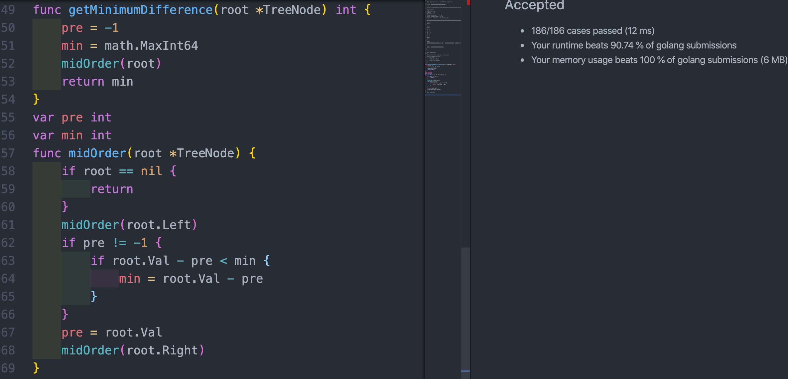

## [530.二叉搜索树的最小绝对差](https://leetcode-cn.com/problems/minimum-absolute-difference-in-bst/)

### 1. 资料搜集

wx

其实也没有什么特别的，只是第一份GO的题解，
提交后，只击败了90%。 看了用时最少的提交之后，我内心是不服的，最小的思路是先中序遍历，把所有的值记录到一个数组，然后在遍历数组，计算最小值。
而我的思路只需中序遍历，在中序遍历的同时计算最小值，理论上少了数组遍历的过程，应该更快的，而且没有额外的空间开销。

作者：xiaoma_nmg
链接：https://leetcode-cn.com/problems/minimum-absolute-difference-in-bst/solution/ben-ti-goyu-yan-di-yi-fen-ti-jie-by-xiaoma_nmg/
来源：力扣（LeetCode）
著作权归作者所有。商业转载请联系作者获得授权，非商业转载请注明出处。


### 解题思路

##### 1、要明白 **二叉搜索树** 是什么概念，这个很重要。

[二叉搜索树_百度百科](https://baike.baidu.com/item/%E4%BA%8C%E5%8F%89%E6%90%9C%E7%B4%A2%E6%A0%91/7077855?fr=aladdin)

[二叉排序树（二叉查找树、二叉搜索树）_Java_rodman177的博客-CSDN博客](https://blog.csdn.net/rodman177/article/details/89771156)

##### 2、要明白二叉树的中序遍历。

这里贴一段代码是二叉树的前中后序三种遍历：

```go
package main

import (
	"fmt"
	"math"
)

/**
 * Definition for a binary tree node.
 * type TreeNode struct {
 *     Val int
 *     Left *TreeNode
 *     Right *TreeNode
 * }
 */
type TreeNode struct {
	Val   int
	Left  *TreeNode
	Right *TreeNode
}

func main() {
	// [3,9,20,null,null,15,7]  
	//  [1,2,2,3,3,null,null,4,4] 
	treeT := &TreeNode{
		Val: 3,
		Left: &TreeNode{
			Val:   9,
			Left:  nil,
			Right: nil,
		},
		Right: &TreeNode{
			Val: 20,
			Left: &TreeNode{
				Val:   15,
				Left:  nil,
				Right: nil,
			},
			Right: &TreeNode{
				Val:   7,
				Left:  nil,
				Right: nil,
			},
		},
	}

	treeF := &TreeNode{
		Val: 1,
		Left: &TreeNode{
			Val: 2,
			Left: &TreeNode{
				Val: 3,
				Left: &TreeNode{
					Val:   4,
					Left:  nil,
					Right: nil,
				},
				Right: &TreeNode{
					Val:   4,
					Left:  nil,
					Right: nil,
				},
			},
			Right: &TreeNode{
				Val:   3,
				Left:  nil,
				Right: nil,
			},
		},
		Right: &TreeNode{
			Val:   2,
			Left:  nil,
			Right: nil,
		},
	}

	// 测试打印下前序遍历这两个二叉树
	fmt.Println("\nPreOrder treeT : ")
	PreOrder(treeT)
	fmt.Println("\nPreOrder treeF : ")
	PreOrder(treeF)
  
  // 测试打印下中序遍历这两个二叉树
  fmt.Println("\nInfixOrder treeT : ")
	InfixOrder(treeT)
	fmt.Println("\nInfixOrder treeF : ")
	InfixOrder(treeF)
  
  // 测试打印下后序遍历这两个二叉树
  fmt.Println("\nPostOrder treeT : ")
	PostOrder(treeT)
	fmt.Println("\nPostOrder treeF : ")
	PostOrder(treeF)

}

// PreOrder 先序遍历
func PreOrder(root *TreeNode) {
	if root == nil {
		return
	}

	fmt.Printf("%v; ", root.Val)
	PreOrder(root.Left)
	PreOrder(root.Right)
}

// InfixOrder 中序遍历
func InfixOrder(root *TreeNode) {
	if root == nil {
		return
	}

	InfixOrder(root.Left)
	fmt.Printf("%v; ", root.Val)
	InfixOrder(root.Right)
}

// PostOrder 后序遍历
func PostOrder(root *TreeNode) {
	if root == nil {
		return
	}

	PostOrder(root.Left)
	PostOrder(root.Right)
	fmt.Printf("%v; ", root.Val)
}

```

**OutPut：**

```bash
PreOrder treeT : 
3; 9; 20; 15; 7; 
PreOrder treeF : 
1; 2; 3; 4; 4; 3; 2; 
InfixOrder treeT : 
9; 3; 15; 20; 7; 
InfixOrder treeF : 
4; 3; 4; 2; 3; 1; 2; 
PostOrder treeT : 
9; 15; 7; 20; 3; 
PostOrder treeF : 
4; 4; 3; 3; 2; 2; 1; 
```

**根据以上两个知识点就有了以下代码，中序遍历过程中记录 父节点的值、最小值。**

### 代码

```go
/**
 * Definition for a binary tree node.
 * type TreeNode struct {
 *     Val int
 *     Left *TreeNode
 *     Right *TreeNode
 * }
 */

var (
    pre int // 记录每次遍历后，父节点的值
    min int // 记录遍历过程中的最小值
)
func getMinimumDifference(root *TreeNode) int {
    pre = -1 // 初始化pre为 -1 
    min = math.MaxInt64 // 初始化 min 为64位最大整数值
    InfixOrder(root)
    return min
}


// InfixOrder 中序遍历全树，每次记录pre 和 min
func InfixOrder(root *TreeNode) {
    if root != nil {
       InfixOrder(root.Left)
        i := root.Val  - pre
        if pre != -1 {
            if i  < min {
                min = i
            }
        }
        pre = root.Val
       InfixOrder(root.Right)
    }
}
```