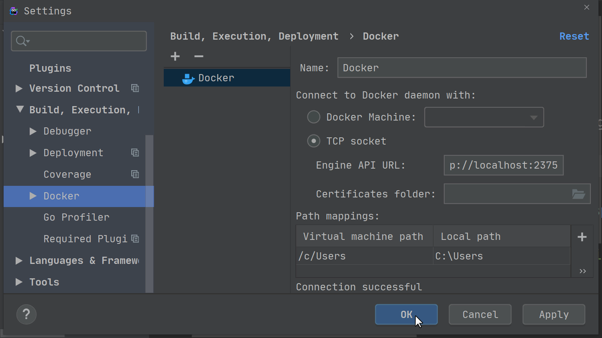
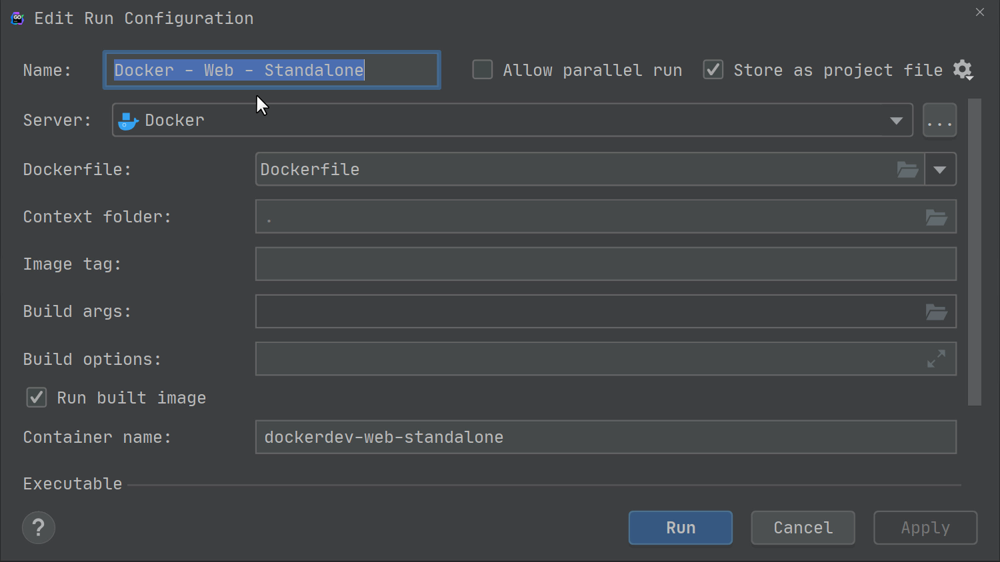
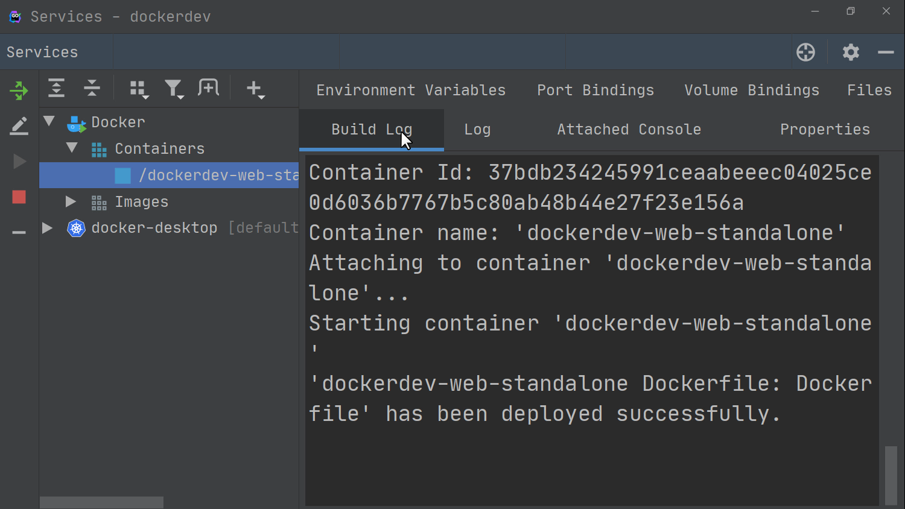
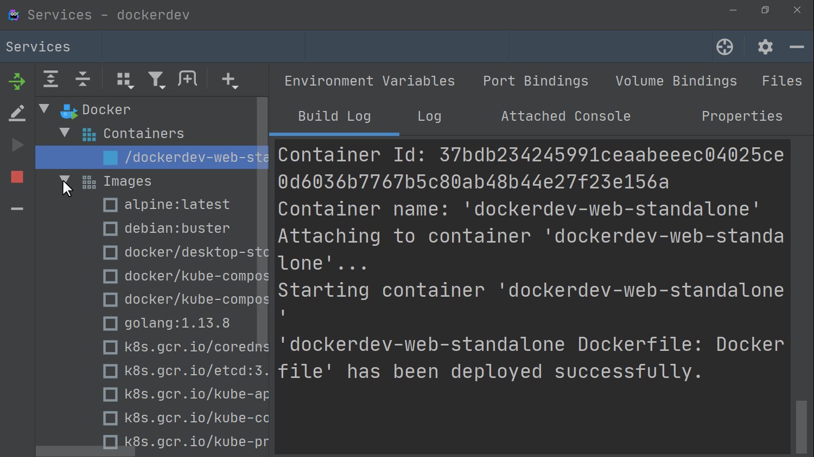
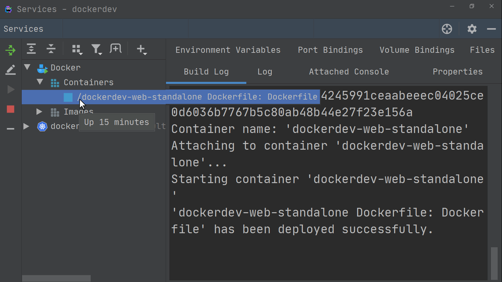

# 2020-05-11-笔记

使用Docker容器进行Go语言开发：[Go development with Docker Containers | GoLand Blog](https://blog.jetbrains.com/go/2020/05/04/go-development-with-docker-containers/)

# Go development with Docker Containers

Posted on [May 4, 2020](https://blog.jetbrains.com/go/2020/05/04/go-development-with-docker-containers/) *by* [Florin Pățan](https://blog.jetbrains.com/go/author/florin-patanjetbrains-com/)

Today we start a miniseries of articles about the support inside GoLand for *Docker*, *Docker Compose*, and *Kubernetes* and how it can help us write (micro-)services in Go.

We’ll look at how to configure the project in the IDE, how to use either *Docker* or *Kubernetes* to run or debug our project, and how to connect the project to our database of choice, *PostgreSQL.*

Let’s start with a presentation of the normal *Docker* workflow, then we’ll build our container and run it.

Before we continue, we’ll need GoLand *2020.1.1* or newer, which ships with the latest Docker plugin. We’ll also need a reasonably modern version of *Docker*, such as *17.06* or newer.
**Note:** While older versions of the IDE will work to a certain degree, this article makes use of new features, and the appearance of the IDE may be different.

## Project setup

Let’s start by setting up our project.

We can create a new *Go Modules* project or use an existing one.

The project structure should be similar to the one found at this repository: https://github.com/dlsniper/dockerdev

This tutorial won’t cover how to install and configure *Docker* for your system.

Instead, we’ll start by configuring a *Docker* server so that we can run our application. Once *Docker* is installed in your system, go to *Settings/Preferences | Build, Execution, Deployment | Docker*, and click on the *+* button to add a new *Docker* server connection.

By default, the plugin will create a connection to the local machine *Docker* server, which is good enough for our tutorial. Click the *OK* button to create a server configuration.

## Working with a Dockerfile

First, let’s open the *Dockerfile* in the root of the project.

| 1234567891011121314151617 | # Compile stageFROM golang:1.13.8 **AS** build-env ADD . /dockerdevWORKDIR /dockerdev RUN go build -o /server # Final stageFROM debian:buster EXPOSE 8000 WORKDIR /COPY --from=build-env /server / CMD ["/server"] |
| ------------------------- | ------------------------------------------------------------ |
|                           |                                                              |

This *Dockerfile* uses a multi-stage build process that allows us to produce the smallest *Docker* image because the *Compile stage*, when the binary for our application is built, is separate from the *Final stage* when the container is built.

Once we paste the above code into the *Dockerfile*, a green arrow appears next to the first `FROM [...]` directive. This is the quickest way to run the container.

However, we’ll need to do some editing before we can run it, as we need to expose the correct port for the container to receive connections.

## Creating a new Run Configuration for our container

We can either create a new *Run Configuration* or edit the one present in the repository. For the sake of simplicity, let’s use the existing one, as it has prefilled all the values we need. To edit it, click on the *Edit ‘Docker – Web – Standalone’* option at the bottom of the options list.

Here, we can set all the options needed to run the *Docker* container. Our *Run Configuration* is already populated with the important things, like the configuration name: “Docker – Web Dev – Standalone”. The Container name is set to docker-web-dev-standalone. And finally, in the Bind ports field, we set both the Host port and the Container port to 8000 so we can access the application.

Now we can click the *Run* button at the bottom of the dialog, which will start our container.

## Understanding the Services Tool Window

After *Docker* finishes the build process, we can take a look at the *Services Tool Window* and see the newly created container in the *Containers* section. We’ll also see the image that was used in the *Images* section.

For each container, the following tabs will be available:

- *Build Log*, which displays the log for building the container
- *Log*, which displays the output of the container
- *Attached console*, which allows us to interact with the application/shell of the container, if one is available
- *Properties*, which will display more information about the container, such as the *Image ID* or the *Container ID*
- *Environment variables*, which show the environment variables used by the container
- *Port bindings*, which show any ports that are exposed to the host by the container
- *Volume bindings*, which show the volumes that are mounted for the container
- *Files*, which allows us to browse the files in a container if it supports running the ls command. For *Alpine* based containers like ours, we can add the `RUN apk add --no-cache coreutils` directive to enable this functionality.

On the left-hand side, we can see various buttons. First, there’s the *Redeploy* button, which allows us to run the container’s build configuration again.
Then we have the *Edit Configuration* button, which is for making any adjustments to the container’s *Run Configuration*.
Finally, we have the *Start/Stop* buttons, which start or stop containers, and the *Delete* button for removing a container.

There are a few more useful features that can be accessed by using the right-click action on the container. We can see the list of running processes with *List Processes* or we can use *Exec* to execute commands inside the running container. Finally, *Inspect* will provide even more information about the container and what its current configuration is.

**Pro tip:** You can see the container’s uptime if you hover over the container name.

**Pro tip:** To speed up the building of containers, you use vendoring mode for Go. Running the `go mod vendor` command inside the IDE *Terminal* ensures the IDE will automatically pick up the vendor folder. You’ll also need to add `GOFLAGS="-mod=vendor"` to the list of environment variables of the container in the build step to achieve this.

That’s it for today’s post, in which we discussed creating and running *Docker* configurations.
In our next article, we’ll see how to debug our application.
Share your feedback with us, either in the comments section below, on [our issue tracker](https://youtrack.jetbrains.com/issues/Go), or by tweeting to us at [our Twitter account](https://twitter.com/GoLandIDE).