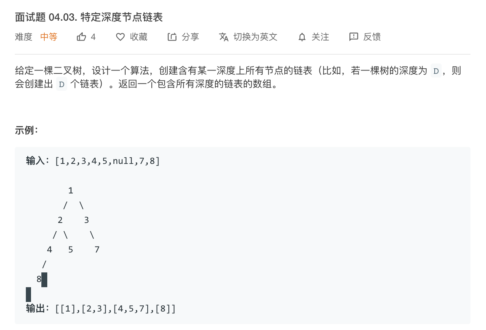

# [面试题 04.03. 特定深度节点链表](https://leetcode-cn.com/problems/list-of-depth-lcci/)



### 解题思路
1. `二叉树`按层级转换成`数组套数组`的形式。
2. 在 go 语言题目里是 `链表切片` 
3. 准备好一个 `链表切片`，准备好层级。
4. 前序遍历 `二叉树`，层级下一层就 `append` 一个数据，直到遇到二叉树叶子结点为 `nil` 的时候 `return` 即可

### 代码

```go
/**
 * Definition for a binary tree node.
 * type TreeNode struct {
 *     Val int
 *     Left *TreeNode
 *     Right *TreeNode
 * }
 */
/**
 * Definition for singly-linked list.
 * type ListNode struct {
 *     Val int
 *     Next *ListNode
 * }
 */
func listOfDepth(tree *TreeNode) []*ListNode {
    l := []*ListNode{}
    preOrder(tree,0,&l)
    return l
}


func preOrder(tree *TreeNode, depth int, result *[]*ListNode) {
    if tree == nil {
        return 
    }

    // fmt.Printf("%v; \n",tree.Val) // 辅助代码：打印当前节点的值
    if depth >= len(*result) {
        // fmt.Printf("%v\n", *result) // 辅助代码：打印遍历的链表切片
        *result = append(*result, &ListNode{Val: tree.Val})
    }else {
        current := (*result)[depth] // 按深度索引到当前深度的链表
        for current.Next != nil {
          current =  current.Next // 链表指针向下移动一个
        }
        // 给链表新增节点
        current.Next = &ListNode{Val:tree.Val}
    }
    preOrder(tree.Left,depth + 1, result)
    preOrder(tree.Right, depth + 1, result)
}
```

