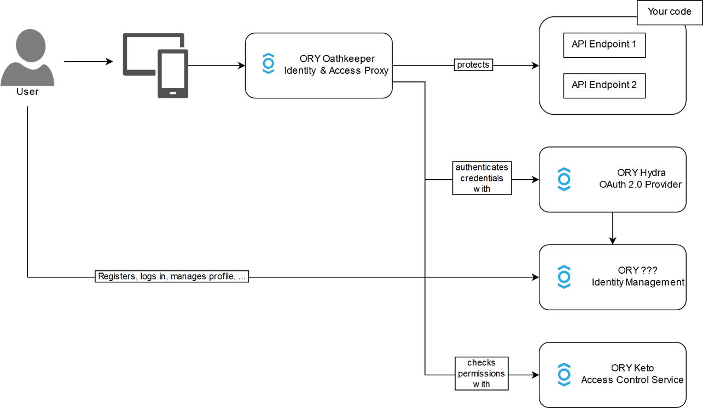
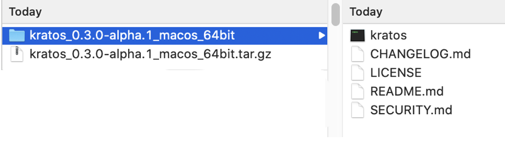
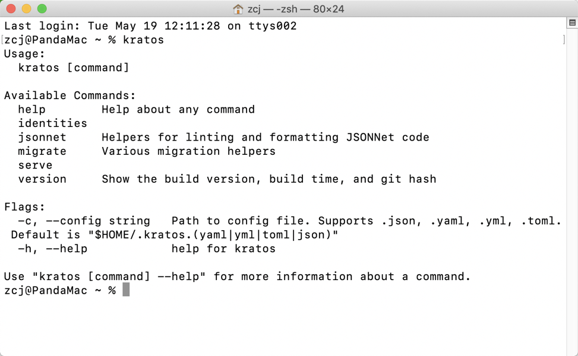

# ory/kratos-01-简介和安装

>  优雅处理用户登录注册和管理

工程师的角度来说，将一个互联网产品从零到一构建出来。每一次都要处理有关用户管理的问题，主要包括登录、注册、权限管理、认证管理、用户信息等。每一个产品都要建立这么一套东西，且每一次都要做重复的事情，写近乎相同的代码。能不能把用户管理的相关功能做成可以复用的组件呢？不仅能提高稳定性，提高产品质量，还能加快产品构建速度。

今天！ 他来了。

今天就给大家带来由 **ORY** 打造的完整 用户管理 生态系统最重要的一个组件 **kratos**。

## [ory/kratos](https://www.ory.sh/kratos/) 介绍 

Never build user login, user registration, 2fa, profile management ever again! 

Works on any operating system, cloud, with any programming language, user interface, and user experience! 

**Written in Go.**

**OPEN SOURCE** (https://github.com/ory/kratos)

**Apache License 2.0**

## ORY ecosystem ： 生态系统 

- ORY Hydra is an OAuth 2.0 and OpenID Connect provider.
- ORY Oathkeeper is an Identity and Access Proxy.
- ORY Keto is an access control server.
- ORY Kratos is an identity management server.

## 聚焦 [ory/kratos](https://www.ory.sh/kratos/)： 官网 

ORY Kratos: Cloud Native Identity and User Management System

## 聚焦 [ory/kratos](https://www.ory.sh/kratos/)： 安装 

### 方法一：跟随这个安装指引：

[[Installation | ORY Kratos](https://www.ory.sh/kratos/docs/install)](https://www.ory.sh/kratos/docs/install)

### 方法二：

Download from

[GitHub Realease](https://github.com/ory/kratos/releases)

## 聚焦 [ory/kratos](https://www.ory.sh/kratos/)： 验证安装 

在终端输入命令: `kratos`
