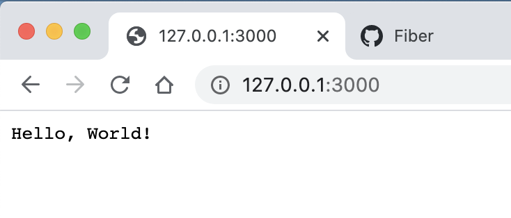
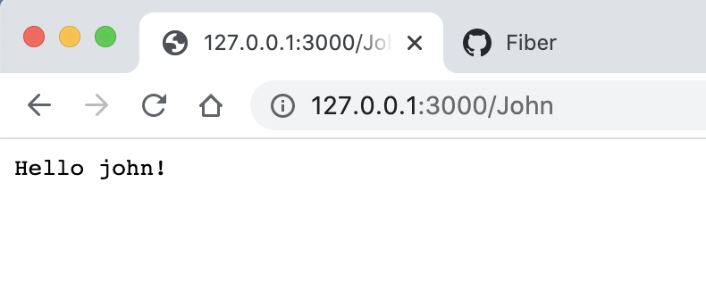
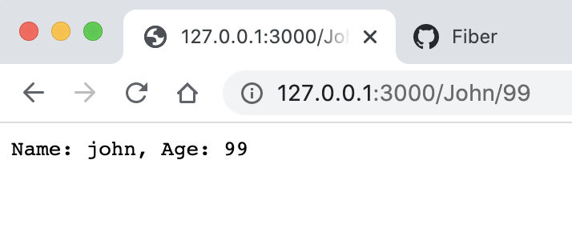
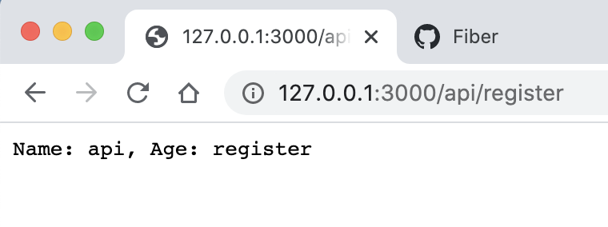
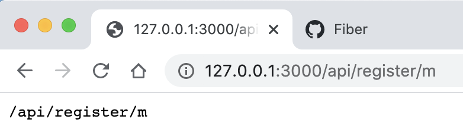
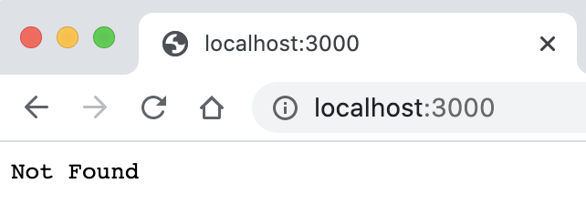
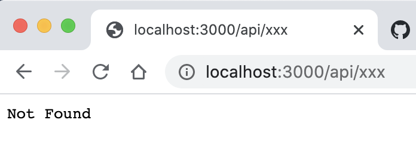
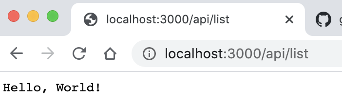

# TimeBook-01-项目初始化


> 🚗 行动才是硬道理。
>
> 学习 Go 语言第55天了。
>
> 今天（2020-05-25）开启一个新的实践项目： 用Fiber构建一个网络笔记本。
>
> 初期设想是 fiber+ mysql + gorm+ jwt  + swagger + docker  + ReactJS 
>
> 如果中间件不行的话就自己写。
>
> 如果前端视图有问题的话就先写 API 的自动化测试程序。
>
> 本项目自开启持续不间断直至完成✅。


## 开始项目和Fiber探索

#### 新建项目文件夹


```bash
mkdir timebook
cd timebook
go mod init github.com/panda8z/time-book
go get -u github.com/gofiber/fiber
touch main.go
```
#### ⚡️ Quickstart-快速开始

```go

package main

import "github.com/gofiber/fiber"

func main() {
  app := fiber.New()

  app.Get("/", func(c *fiber.Ctx) {
    c.Send("Hello, World!")
  })

  app.Listen(3000)
}

```





#### Routing-路由的简单示例


官方文档：📖 [Routing](https://docs.gofiber.io/#basic-routing)

这里列了四个示例：

- 简单路由
- 参数路由
- 可省略参数路由
- 通配符路由

代码如下：

```go 

func main() {
  app := fiber.New()
  // Respond with "Hello, World!" on root path, "/"
  app.Get("/", func(c *fiber.Ctx) {
    c.Send("Hello, World!")
  })
  
  // GET /john
  app.Get("/:name", func(c *fiber.Ctx) {
    fmt.Printf("Hello %s!", c.Params("name"))
    // => Hello john!
  })

  // GET /john
  app.Get("/:name/:age?", func(c *fiber.Ctx) {
    fmt.Printf("Name: %s, Age: %s", c.Params("name"), c.Params("age"))
    // => Name: john, Age:
  })

  // GET /api/register
  app.Get("/api/*", func(c *fiber.Ctx) {
    fmt.Printf("/api/%s", c.Params("*"))
    // => /api/register
  })

  app.Listen(3000)
}
```

<p align="center">code 1-1</p>


**路由：`/name` 正常解析**

****




**路由：`/:name/:age?` 正常解析**



⚠️：

**路由：`/api/*`解析不符合预期。⚠️这里应该是官方示例给错误了，我去提了个[issue-411](https://github.com/gofiber/fiber/issues/411)**



**这才是正确的输出：**

**看来`/api/*`*通配符（Wildcards）*的解析被上面👆的 `/:name`解析影响了。以后使用这种*参数解析（Parameters）*要注意了。**




#### Static files - 静态文件

官方文档：📖 [Static](https://docs.gofiber.io/application#static)

> ❌官方给的示例代码里面的 `/public` 改成相对路径 `./public` 就能按照正常逻辑在 项目根目录的 public 文件夹内放静态文件了。


> ⚠️注意： public文件夹和 js、css 文件夹和文件你要自己新建 文件里写什么内容随意，仅测试看看能不能正常访问。

```go
func main() 
  app := fiber.New()

  app.Static("/", "./public")
  // => http://localhost:3000/js/script.js //这里索引到 【项目根目录】/public/js/script.js 
  // => http://localhost:3000/css/style.css //这里索引到 【项目根目录】/public/css/style.css

  app.Static("/prefix", "./public")
  // => http://localhost:3000/prefix/js/script.js
  // => http://localhost:3000/prefix/css/style.css

  app.Static("*", "./public/index.html")
  // => http://localhost:3000/any/path/shows/index/html

  app.Listen(3000)
}
```


### Middleware & Next - 中间件和 `next()` 方法

官方文档：📖 [Middleware](https://docs.gofiber.io/routing#middleware)
官方文档：📖 [Next](https://docs.gofiber.io/context#next)

```go
	func main() {
  app := fiber.New()

  // Match any route // 匹配所有路由
  app.Use(func(c *fiber.Ctx) {
    fmt.Println("First middleware")
    c.Next()
  })
  
  // Match all routes starting with /api //仅匹配所有 api开头的路由
  app.Use("/api", func(c *fiber.Ctx) {
    fmt.Println("Second middleware")
    c.Next()
  })

  // GET /api/list //这是一个确定的路由
  app.Get("/api/list", func(c *fiber.Ctx) {
    fmt.Println("Last middleware")
    c.Send("Hello, World!")
  })

  app.Listen(3000)
}
```


###### 访问：http://localhost:3000




控制台打印：

```
First middleware
```


###### 访问：http://localhost:3000/api/xxx



控制台打印：

```
First middleware
Second middleware
```


###### 访问：http://localhost:3000/api/list



控制台打印：

```bash
First middleware
Second middleware
Last middleware
```

###### 总结：

从这个示例可以看出，中间件和路由处理方法都被统一当作 Handler来处理。

他们的匹配顺序和书写顺序于书写内容有关联的。

 

