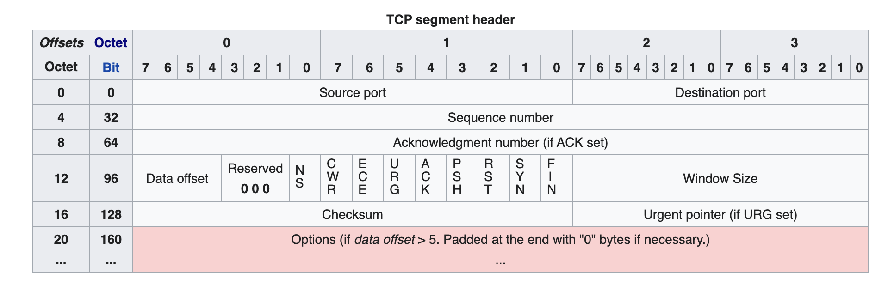
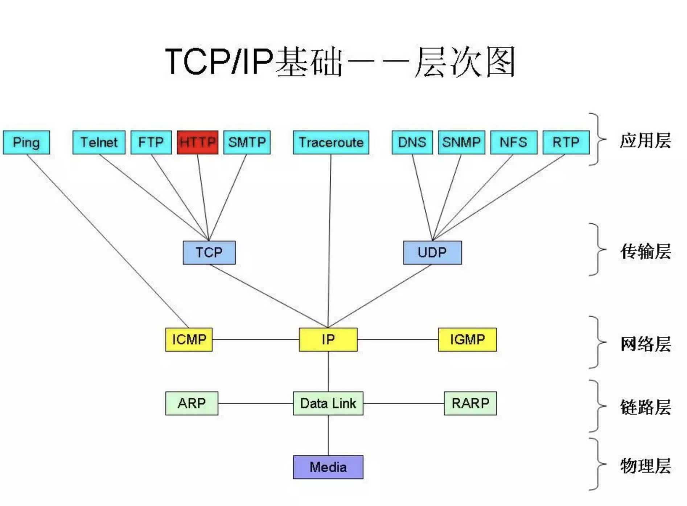

### 一、资料搜集

野生资料拼凑**：

1. 
2. [UDP协议的详细解析_Rad的博客-CSDN博客_udp协议](https://blog.csdn.net/aa1928992772/article/details/85240358?ops_request_misc=%257B%2522request%255Fid%2522%253A%2522159411238219724846428383%2522%252C%2522scm%2522%253A%252220140713.130102334..%2522%257D&request_id=159411238219724846428383&biz_id=0&utm_medium=distribute.pc_search_result.none-task-blog-2~all~top_click~default-1-85240358.first_rank_ecpm_v3_pc_rank_v4&utm_term=udp)
3. 1.[TCP 详解_如故的博客-CSDN博客_tcp](https://blog.csdn.net/sinat_36629696/article/details/80740678)

**三篇系列**

1. [计算机网络概述_柒年-CSDN博客_计算机网络概论2018答案](https://blog.csdn.net/qq_37884273/article/details/82120154)
2. [IP协议详解_柒年-CSDN博客_ip协议详解](https://blog.csdn.net/qq_37884273/article/details/82186943)
3. [TCP协议详解_柒年-CSDN博客_tcp协议](https://blog.csdn.net/qq_37884273/article/details/82188586)

**比较系列：**

1. [HTTP、TCP、UDP，Socket，HTTPS](https://blog.csdn.net/WHB20081815/article/details/67640804)

### 二、计算机网络概览

计算机网络就是多个计算机或集群连成的网络。

网络通信服务端-客户端模型：

简单了解应用程序互连模型：

简单了解常用的网络模型：

OSI七层模型和TCP/IP四层模型：

TCP/IP的数据封装：

TCP/IP协议的层次分布结构：

TCP/IP数据包分发（接受到数据后层层上传，这个过程叫做：**分用**）：

### 三、IP协议

IP协议头：

IP地址分类：

### UDP协议

UDP 和 TCP 的特点

- 用户数据报协议 UDP（User Datagram Protocol）是无连接的，尽最大可能交付，没有拥塞控制，面向报文（对于应用程序传下来的报文不合并也不拆分，只是添加 UDP 首部），支持一对一、一对多、多对一和多对多的交互通信。
- 传输控制协议 TCP（Transmission Control Protocol）是面向连接的，提供可靠交付，有流量控制，拥塞控制，提供全双工通信，面向字节流（把应用层传下来的报文看成字节流，把字节流组织成大小不等的数据块），每一条 TCP 连接只能是点对点的（一对一）。

UDP 首部格式：

首部字段只有 8 个字节，包括源端口、目的端口、长度、检验和。12 字节的伪首部是为了计算检验和临时添加的。

### 四、TCP协议

TCP报文头：

##### TCP首部来自维基百科：

- Source port (16 bits)

  Identifies the sending port.

- Destination port (16 bits)

  Identifies the receiving port.

- Sequence number (32 bits)

  Has a dual role:If the SYN flag is set (1), then this is the initial sequence number. The sequence number of the actual first data byte and the acknowledged number in the corresponding ACK are then this sequence number plus 1.If the SYN flag is clear (0), then this is the accumulated sequence number of the first data byte of this segment for the current session.

- Acknowledgment number (32 bits)

  If the ACK flag is set then the value of this field is the next sequence number that the sender of the ACK is expecting. This acknowledges receipt of all prior bytes (if any). The first ACK sent by each end acknowledges the other end's initial sequence number itself, but no data.

- Data offset (4 bits)

  Specifies the size of the TCP header in 32-bit [words](https://en.wikipedia.org/wiki/Word_(computer_architecture)). The minimum size header is 5 words and the maximum is 15 words thus giving the minimum size of 20 bytes and maximum of 60 bytes, allowing for up to 40 bytes of options in the header. This field gets its name from the fact that it is also the offset from the start of the TCP segment to the actual data.

- Reserved (3 bits)

  For future use and should be set to zero.

- Flags (9 bits)

  Contains 9 1-bit flags (control bits) as follows:

  - NS (1 bit): 

  - ECN-nonce - concealment protection[[a\]](https://en.wikipedia.org/wiki/Transmission_Control_Protocol#cite_note-10)

  - CWR (1 bit): Congestion window reduced (CWR) flag is set by the sending host to indicate that it received a TCP segment with the ECE flag set and had responded in congestion control mechanism.[[b\]](https://en.wikipedia.org/wiki/Transmission_Control_Protocol#cite_note-added3168-11)ECE (1 bit): 

  - ECN-Echo has a dual role, depending on the value of the SYN flag. It indicates:If the SYN flag is set (1), that the TCP peer is [ECN](https://en.wikipedia.org/wiki/Explicit_Congestion_Notification) capable.If the SYN flag is clear (0), that a packet with Congestion Experienced flag set (ECN=11) in the IP header was received during normal transmission.[[b\]](https://en.wikipedia.org/wiki/Transmission_Control_Protocol#cite_note-added3168-11) This serves as an indication of network congestion (or impending congestion) to the TCP sender.

  - URG (1 bit): Indicates that the Urgent pointer field is significantACK (1 bit): Indicates that the Acknowledgment field is significant. All packets after the initial SYN packet sent by the client should have this flag set.

  - PSH (1 bit): Push function. Asks to push the buffered data to the receiving application.

  - RST (1 bit): Reset the connection

  - SYN (1 bit): Synchronize sequence numbers. Only the first packet sent from each end should have this flag set. Some other flags and fields change meaning based on this flag, and some are only valid when it is set, and others when it is clear.

  - FIN (1 bit): Last packet from sender

- Window size (16 bits)

  The size of the *receive window*, which specifies the number of window size units[[c\]](https://en.wikipedia.org/wiki/Transmission_Control_Protocol#cite_note-12) that the sender of this segment is currently willing to receive.[[d\]](https://en.wikipedia.org/wiki/Transmission_Control_Protocol#cite_note-13) (See [§ Flow control](https://en.wikipedia.org/wiki/Transmission_Control_Protocol#Flow_control) and [§ Window scaling](https://en.wikipedia.org/wiki/Transmission_Control_Protocol#Window_scaling).)

- Checksum (16 bits)

  The 16-bit [checksum](https://en.wikipedia.org/wiki/Checksum) field is used for error-checking of the TCP header, the payload and an IP pseudo-header. The pseudo-header consists of the [source IP address](https://en.wikipedia.org/wiki/IPv4#Source_address), the [destination IP address](https://en.wikipedia.org/wiki/IPv4#Destination_address), the [protocol number](https://en.wikipedia.org/wiki/List_of_IP_protocol_numbers) for the TCP protocol (6) and the length of the TCP headers and payload (in bytes).

- Urgent pointer (16 bits)

  If the URG flag is set, then this 16-bit field is an offset from the sequence number indicating the last urgent data byte.

- Options (Variable 0–320 bits, in units of 32 bits)

  The length of this field is determined by the *data offset* field. Options have up to three fields: Option-Kind (1 byte), Option-Length (1 byte), Option-Data (variable). The Option-Kind field indicates the type of option, and is the only field that is not optional. Depending on Option-Kind value, the next two fields may be set. Option-Length indicates the total length of the option, and Option-Data contains data associated with the option, if applicable. For example, an Option-Kind byte of 0x01 indicates that this is a No-Op option used only for padding, and does not have an Option-Length or Option-Data fields following it. An Option-Kind byte of 0 indicates End Of Options, and is also only one byte. An Option-Kind byte of 0x02 is used to indicate Maximum Segment Size option, and will be followed by an Option-Length byte specifying the length of the MSS field. Option-Length is the total length of the given options field, including Option-Kind and Option-Length fields. So while the MSS value is typically expressed in two bytes, Option-Length will be 4. As an example, an MSS option field with a value of 0x05B4 will show up as (0x02 0x04 0x05B4) in the TCP options section.

  Some options may only be sent when SYN is set; they are indicated below as `[SYN]`. Option-Kind and standard lengths given as (Option-Kind, Option-Length).0 (8 bits): End of options list1 (8 bits): No operation (NOP, Padding) This may be used to align option fields on 32-bit boundaries for better performance.2,4,*SS* (16 bits): Maximum segment size (*see [maximum segment size](https://en.wikipedia.org/wiki/Transmission_Control_Protocol#Maximum_segment_size)*) `[SYN]`3,3,*S* (24 bits): Window scale (*see [window scaling](https://en.wikipedia.org/wiki/Transmission_Control_Protocol#Window_scaling) for details*) `[SYN]`[[10\]](https://en.wikipedia.org/wiki/Transmission_Control_Protocol#cite_note-14)4,2 (16 bits): Selective Acknowledgement permitted. `[SYN]` (*See [selective acknowledgments](https://en.wikipedia.org/wiki/Transmission_Control_Protocol#Selective_acknowledgments) for details*)[[11\]](https://en.wikipedia.org/wiki/Transmission_Control_Protocol#cite_note-15)5,*N,BBBB,EEEE,...* (variable bits, *N* is either 10, 18, 26, or 34)- Selective ACKnowledgement (SACK)[[12\]](https://en.wikipedia.org/wiki/Transmission_Control_Protocol#cite_note-16) These first two bytes are followed by a list of 1–4 blocks being selectively acknowledged, specified as 32-bit begin/end pointers.8,10,*TTTT,EEEE* (80 bits)- Timestamp and echo of previous timestamp (*see [TCP timestamps](https://en.wikipedia.org/wiki/Transmission_Control_Protocol#TCP_timestamps) for details*)[[13\]](https://en.wikipedia.org/wiki/Transmission_Control_Protocol#cite_note-17)

  The remaining options are historical, obsolete, experimental, not yet standardized, or unassigned. Option number assignments are maintained by the IANA.[[14\]](https://en.wikipedia.org/wiki/Transmission_Control_Protocol#cite_note-18)

- Padding

  The TCP header padding is used to ensure that the TCP header ends, and data begins, on a 32 bit boundary. The padding is composed of zeros.[[15\]](https://en.wikipedia.org/wiki/Transmission_Control_Protocol#cite_note-19)

  

TCP数据封装：

TCP协议的报头：

TCP协议连接时三次握手：

三次握手非动态完整版：

另一张图说明三次握手：

TCP协议结束连接时四次挥手：

四次挥手非动态完整版：

**为什么最后客户端还要等待 2*MSL的时间呢?**

MSL（Maximum Segment Lifetime），TCP允许不同的实现可以设置不同的MSL值。

第一，保证客户端发送的最后一个ACK报文能够到达服务器，因为这个ACK报文可能丢失，站在服务器的角度看来，我已经发送了FIN+ACK报文请求断开了，客户端还没有给我回应，应该是我发送的请求断开报文它没有收到，于是服务器又会重新发送一次，而客户端就能在这个2MSL时间段内收到这个重传的报文，接着给出回应报文，并且会重启2MSL计时器。

第二，防止类似与“三次握手”中提到了的“已经失效的连接请求报文段”出现在本连接中。客户端发送完最后一个确认报文后，在这个2MSL时间中，就可以使本连接持续的时间内所产生的所有报文段都从网络中消失。这样新的连接中不会出现旧连接的请求报文。

**为什么建立连接是三次握手，关闭连接确是四次挥手呢？**

建立连接的时候， 服务器在LISTEN状态下，收到建立连接请求的SYN报文后，把ACK和SYN放在一个报文里发送给客户端。
而关闭连接时，服务器收到对方的FIN报文时，仅仅表示对方不再发送数据了但是还能接收数据，而自己也未必全部数据都发送给对方了，所以己方可以立即关闭，也可以发送一些数据给对方后，再发送FIN报文给对方来表示同意现在关闭连接，因此，己方ACK和FIN一般都会分开发送，从而导致多了一次。

**如果已经建立了连接, 但是客户端突发故障了怎么办?**

TCP设有一个保活计时器，显然，客户端如果出现故障，服务器不能一直等下去，白白浪费资源。服务器每收到一次客户端的请求后都会重新复位这个计时器，时间通常是设置为2小时，若两小时还没有收到客户端的任何数据，服务器就会发送一个探测报文段，以后每隔75分钟发送一次。若一连发送10个探测报文仍然没反应，服务器就认为客户端出了故障，接着就关闭连接。

### 五、HTTP协议

HTTP在五层模型中的位置：

TCP/IP协议簇工作原理：

HTTP在网络结构中的位置：

TCP协议头以及封装：

六种标志位就代表着TCP连接的状态：

1. URG：

   紧急数据（urgent data）—-这是一条紧急信息

2. ACK：

   确认已收到

3. PSH：

   提示接收端应用程序应该立即从tcp接收缓冲区中读走数据

4. RST：

   表示要求对方重新建立连接

5. SYN：

   表示请求建立一个连接

6. FIN：

   表示通知对方本端要关闭连接了

HTTP请求报文结构：

一个HTTP请求报文的例子：

1. ①是请求方法，HTTP/1.1 定义的请求方法有8种：

   GET、POST、PUT、DELETE、PATCH、HEAD、OPTIONS、TRACE,最常的两种GET和POST，如果是RESTful接口的话一般会用到GET、POST、DELETE、PUT

2. ②为请求对应的URL地址，它和报文头的Host属性组成完整的请求URL

3. ③是协议名称及版本号

4. ④是HTTP的报文头，报文头包含若干个属性，格式为“属性名:属性值”，服务端据此获取客户端的信息

5. ⑤是报文体，它将一个页面表单中的组件值通过param1=value1&param2=value2的键值对形式编码成一个格式化串，它承载多个请求参数的数据。

   不但报文体可以传递请求参数，请求URL也可以通过类似于“/chapter15/user.html? param1=value1&param2=value2”的方式传递请求参数。

请求头参数非常多，这里就不一一说明，只说明两个低级的反扒参数：

1. User-Agent：

   客户端使用的操作系统和浏览器的名称和版本，有些网站会限制请求浏览器

2. Referer：

   先前网页的地址，表示此请求来自哪里，有些网站会限制请求来源

HTTP响应报文结构：

HTTP响应实例

响应状态码：

### 六、详解http状态码

不论后端开发和还是前端开发，我们都会用到http的不同状态，一些常见的状态码如：

- 200 – 服务器成功返回网页 
- 404 – 请求的网页不存在 
- 503 – 服务不可用

##### **1xx（临时响应）**

表示临时响应并需要请求者继续执行操作的状态代码。

- 100（继续）请求者应当继续提出请求。服务器返回此代码表示已收到请求的第一部分，正在等待其余部分。 
- 101（切换协议）请求者已要求服务器切换协议，服务器已确认并准备切换。

##### **2xx （成功）**

表示成功处理了请求的状态代码。

- 200（成功）服务器已成功处理了请求。通常，这表示服务器提供了请求的网页。
- 201（已创建）请求成功并且服务器创建了新的资源。
- 202（已接受） 服务器已接受请求，但尚未处理。
- 203（非授权信息）服务器已成功处理了请求，但返回的信息可能来自另一来源。
- 204（无内容）服务器成功处理了请求，但没有返回任何内容。
- 205（重置内容）服务器成功处理了请求，但没有返回任何内容。
- 206（部分内容）服务器成功处理了部分 GET 请求。

[「程序猿DD」星球活动第一期进行中！点击了解详情！](http://mp.weixin.qq.com/s?__biz=MzAxODcyNjEzNQ==&mid=2247495399&idx=4&sn=4fc487861901c8f3fd630eab7477582e&chksm=9bd3437faca4ca692b2a15bd85d6b2e62beeab32011c6018898b614b9037c581e6ec4225ee5d&scene=21#wechat_redirect)

##### **3xx （重定向）**

表示要完成请求，需要进一步操作。通常，这些状态代码用来重定向。**

- 300（多种选择）针对请求，服务器可执行多种操作。服务器可根据请求者 (user agent) 选择一项操作，或提供操作列表供请求者选择。
- 301（永久移动）请求的网页已永久移动到新位置。服务器返回此响应（对 GET 或 HEAD 请求的响应）时，会自动将请求者转到新位置。
- 302（临时移动）服务器目前从不同位置的网页响应请求，但请求者应继续使用原有位置来进行以后的请求。
- 303（查看其他位置）请求者应当对不同的位置使用单独的 GET 请求来检索响应时，服务器返回此代码。
- 304（未修改）自从上次请求后，请求的网页未修改过。服务器返回此响应时，不会返回网页内容。
- 305（使用代理）请求者只能使用代理访问请求的网页。如果服务器返回此响应，还表示请求者应使用代理。
- 307（临时重定向）服务器目前从不同位置的网页响应请求，但请求者应继续使用原有位置来进行以后的请求。

##### **4xx（请求错误）**

这些状态代码表示请求可能出错，妨碍了服务器的处理。

- 400（错误请求）服务器不理解请求的语法。
- 401（未授权）请求要求身份验证。对于需要登录的网页，服务器可能返回此响应。
- 403（禁止）服务器拒绝请求。
- 404（未找到）服务器找不到请求的网页。
- 405（方法禁用）禁用请求中指定的方法。
- 406（不接受）无法使用请求的内容特性响应请求的网页。
- 407（需要代理授权）此状态代码与 401（未授权）类似，但指定请求者应当授权使用代理。
- 408（请求超时）服务器等候请求时发生超时。
- 409（冲突）服务器在完成请求时发生冲突。服务器必须在响应中包含有关冲突的信息。
- 410（已删除）如果请求的资源已永久删除，服务器就会返回此响应。
- 411（需要有效长度）服务器不接受不含有效内容长度标头字段的请求。
- 412（未满足前提条件）服务器未满足请求者在请求中设置的其中一个前提条件。
- 413（请求实体过大）服务器无法处理请求，因为请求实体过大，超出服务器的处理能力。
- 414（请求的 URI 过长）请求的 URI（通常为网址）过长，服务器无法处理。
- 415（不支持的媒体类型）请求的格式不受请求页面的支持。
- 416（请求范围不符合要求）如果页面无法提供请求的范围，则服务器会返回此状态代码。
- 417（未满足期望值）服务器未满足”期望”请求标头字段的要求。

##### **5xx（服务器错误）**

这些状态代码表示服务器在尝试处理请求时发生内部错误。这些错误可能是服务器本身的错误，而不是请求出错。

- 500（服务器内部错误）服务器遇到错误，无法完成请求。
- 501（尚未实施）服务器不具备完成请求的功能。例如，服务器无法识别请求方法时可能会返回此代码。
- 502（错误网关）服务器作为网关或代理，从上游服务器收到无效响应。
- 503（服务不可用）服务器目前无法使用（由于超载或停机维护）。通常，这只是暂时状态。
- 504（网关超时）服务器作为网关或代理，但是没有及时从上游服务器收到请求。
- 505（HTTP 版本不受支持）服务器不支持请求中所用的 HTTP 协议版本。

##### RFC 6585 发布文档描述了 4 个新的 HTTP 状态码。

HTTP 协议还在变化？是的，HTTP 协议一直在演变，新的状态码对于开发 REST 服务或者说是基于 HTTP 的服务非常有用，下面我们为你详细介绍这四个新的状态码以及是否应该使用。

##### **428 Precondition Required (要求先决条件)**

先决条件是客户端发送 HTTP 请求时，如果想要请求能成功必须满足一些预设的条件。

一个好的例子就是 If-None-Match 头，经常在 GET 请求中使用，如果指定了 If-None-Match ，那么客户端只在响应中的 ETag 改变后才会重新接收回应。

先决条件的另外一个例子就是 If-Match 头，这个一般用在 PUT 请求上用于指示只更新没被改变的资源，这在多个客户端使用 HTTP 服务时用来防止彼此间不会覆盖相同内容。

当服务器端使用 428 Precondition Required 状态码时，表示客户端必须发送上述的请求头才能执行请求，这个方法为服务器提供一种有效的方法来阻止 'lost update' 问题。

**429 Too Many Requests (太多请求)**
当你需要限制客户端请求某个服务数量时，该状态码就很有用，也就是请求速度限制。

在此之前，有一些类似的状态码，例如 '509 Bandwidth Limit Exceeded'. Twitter 使用 420 （这不是HTTP定义的状态码）

如果你希望限制客户端对服务的请求数，可使用 429 状态码，同时包含一个 Retry-After 响应头用于告诉客户端多长时间后可以再次请求服务。

##### **431 Request Header Fields Too Large (请求头字段太大)**

某些情况下，客户端发送 HTTP 请求头会变得很大，那么服务器可发送 431 Request Header Fields Too Large 来指明该问题。

##### **511 Network Authentication Required (要求网络认证)**

对我来说这个状态码很有趣，如果你在开发一个 HTTP 服务器，你不一定需要处理该状态码，但如果你在编写 HTTP 客户端，那这个状态码就非常重要。

如果你频繁使用笔记本和智能手机，你可能会注意到大量的公用 WIFI 服务要求你必须接受一些协议或者必须登录后才能使用。这是通过拦截HTTP流量，当用户试图访问网络返回一个重定向和登录，这很讨厌，但是实际情况就是这样的。使用这些“拦截”客户端，会有一些讨厌的副作用。在 RFC 中有提到这两个的例子：

> - 如果你在登录WIFI前访问某个网站，网络设备将会拦截首个请求，这些设备往往也有自己的网站图标 ‘favicon.ico'。登录后您会发现，有一段时间内你访问的网站图标一直是WIFI登录网站的图标。
> - 如果客户端使用HTTP请求来查找文档（可能是JSON），网络将会响应一个登录页，这样你的客户端就会解析错误并导致客户端运行异常，在现实中这种问题非常常见。

因此 511 状态码的提出就是为了解决这个问题。

如果你正在编写 HTTP 的客户端，你最好还是检查 511 状态码以确认是否需要认证后才能访问。

### 七、HTTPS协议

[面试官求你了，别再问我HTTPS](https://mp.weixin.qq.com/s?src=11&timestamp=1594175355&ver=2447&signature=VqlF01Rnp7Gj4OOlfkg3*POttXZZnBNwSDA17sfEtIzft02eNCBuNDGAPFwUVqmmI9jHCM--f7hRhYo1rASNtJoXXU8ldx*LEbZSCawv5N1TjSawY9Ar9xrkEJ602pB4&new=1)

HTTPS 其实就是将 HTTP 的数据包再通过 SSL/TLS 加密后传输，那么 SSL/TLS 又是什么呢？

SSL（Secure Sockets Layer）安全套接层和 TLS（Transport Layer Security）传输层安全协议

#####  HTTPS 的加解密流程：

HTTPS 加解密流程如下：

1. 用户在浏览器发起 HTTPS 请求（如 https://www.mogu.com/），默认使用服务端的 443 端口进行连接。
1. HTTPS 需要使用一套 CA 数字证书，证书内会附带一个公钥 Pub，而与之对应的私钥 Private 保留在服务端不公开。
1. 服务端收到请求，返回配置好的包含公钥 Pub 的证书给客户端。
1. 客户端收到证书，校验合法性，主要包括是否在有效期内、证书的域名与请求的域名是否匹配，上一级证书是否有效（递归判断，直到判断到系统内置或浏览器配置好的根证书），如果不通过，则显示 HTTPS 警告信息，如果通过则继续。
1. 客户端生成一个用于对称加密的随机 Key，并用证书内的公钥 Pub 进行加密，发送给服务端。
1. 服务端收到随机 Key 的密文，使用与公钥 Pub 配对的私钥 Private 进行解密，得到客户端真正想发送的随机 Key。
1. 服务端使用客户端发送过来的随机 Key 对要传输的 HTTP 数据进行对称加密，将密文返回客户端。
1. 客户端使用随机 Key 对称解密密文，得到 HTTP 数据明文。
1. 后续 HTTPS 请求使用之前交换好的随机 Key 进行对称加解密。

##### **对称加密与非对称加密**

又是对称加密又是非对称加密，一会公钥一会私钥一会随机 Key，为什么要这么复杂呢，一套搞到底不好么？

对称加密是指有一个密钥，用它可以对一段明文加密，加密之后也只能用这个密钥来解密得到明文。

如果通信双方都持有密钥，且天知地知你知我知，绝对不会有别的人知道，那么通信安全自然是可以得到保证的（在密钥足够强的情况下）。

然而，在 HTTPS 的传输场景下，服务端事先并不知道客户端是谁，你也不可能在事先不通过互联网和每一个网站的管理员都悄悄商量好一个通信密钥出来。

那么必然存在一个密钥在互联网上传输的过程，如果在传输过程中被别人监听到了，那么后续的所有加密都是无用功。

这时，我们就需要另一种神奇的加密类型，非对称加密。

非对称加密有两个密钥，一个是公钥，另一个是私钥。一般来说，公钥用来加密，这时密文只能用私钥才能解开。

那么，当客户端发起连接请求，服务端将公钥传输过去，客户端利用公钥加密好信息，再将密文发送给服务端，服务端里有私钥可以解密。

但是，当服务端要返回数据，如果用公钥加密，那么客户端并没有私钥用来解密，而如果用私钥加密，客户端虽然有公钥可以解密。

但这个公钥之前就在互联网上传输过，很有可能已经有人拿到，并不安全，所以这一过程只用非对称加密是不能满足的。

注意，严格来讲，私钥并不能用来加密，只能用作签名使用，这是由于密码学中生成公钥私钥时对不同变量的数学要求是不同的。

因此公钥私钥抵抗攻击的能力也不同，在实际使用中不可互换。签名的功能在 HTTPS 里也有用到，下文中会说明。

只有一组公钥私钥只能保证单程的加解密，那么如果我们准备两组公钥私钥呢，是不是可以解决这个问题？