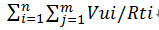

一、QPS/TPS

QPS：Queries Per Second意思是“每秒查询率”，是一台服务器每秒能够相应的查询次数，是对一个特定的查询服务器在规定时间内所处理流量多少的衡量标准。

TPS：是TransactionsPerSecond的缩写，也就是事务数/秒。它是软件测试结果的测量单位。一个事务是指一个客户机向服务器发送请求然后服务器做出反应的过程。客户机在发送请求时开始计时，收到服务器响应后结束计时，以此来[计算](https://www.aliyun.com/)使用的时间和完成的事务个数。

**Tps即每秒处理事务数，包括了**

1）用户请求服务器

2）服务器自己的内部处理

3）服务器返回给用户

这三个过程，每秒能够完成N个这三个过程，Tps也就是N；

Qps基本类似于Tps，但是不同的是，对于一个页面的一次访问，形成一个Tps；但一次页面请求，可能产生多次对服务器的请求，服务器对这些请求，就可计入“Qps”之中。

例如：访问一个页面会请求服务器3次，一次放，产生一个“T”，产生3个“Q” 

一、TPS：Transactions Per Second（每秒传输的事物处理个数），即服务器每秒处理的事务数。TPS包括一条消息入和一条消息出，加上一次用户数据库访问。（业务TPS = CAPS × 每个呼叫平均TPS）

TPS是软件测试结果的测量单位。一个事务是指一个客户机向服务器发送请求然后服务器做出反应的过程。客户机在发送请求时开始计时，收到服务器响应后结束计时，以此来计算使用的时间和完成的事务个数。

一般的，评价系统性能均以每秒钟完成的技术交易的数量来衡量。系统整体处理能力取决于处理能力最低模块的TPS值。

 

二、QPS：每秒查询率QPS是对一个特定的查询服务器在规定时间内所处理流量多少的衡量标准，在因特网上，作为域名系统服务器的机器的性能经常用每秒查询率来衡量。

对应fetches/sec，即每秒的响应请求数，也即是最大吞吐能力。

**PS：下面是性能测试的主要概念和计算公式，记录下：**

**一．系统吞度量要素：**

一个系统的吞度量（承压能力）与request对CPU的消耗、外部接口、IO等等紧密关联。

单个reqeust 对CPU消耗越高，外部系统接口、IO影响速度越慢，系统吞吐能力越低，反之越高。

系统吞吐量几个重要参数：QPS（TPS）、并发数、响应时间

**QPS（TPS）：**每秒钟request/事务 数量

**并发数：** 系统同时处理的request/事务数

**响应时间：** 一般取平均响应时间

（很多人经常会把并发数和TPS理解混淆）

理解了上面三个要素的意义之后，就能推算出它们之间的关系：

QPS（TPS）= 并发数/平均响应时间

一个系统吞吐量通常由QPS（TPS）、并发数两个因素决定，每套系统这两个值都有一个相对极限值，在应用场景访问压力下，只要某一项达到系统最高值，系统的吞吐量就上不去了，如果压力继续增大，系统的吞吐量反而会下降，原因是系统超负荷工作，上下文切换、内存等等其它消耗导致系统性能下降。

决定系统响应时间要素

我们做项目要排计划，可以多人同时并发做多项任务，也可以一个人或者多个人串行工作，始终会有一条关键路径，这条路径就是项目的工期。

系统一次调用的响应时间跟项目计划一样，也有一条关键路径，这个关键路径是就是系统影响时间；

关键路径是有CPU运算、IO、外部系统响应等等组成。

**二．系统吞吐量评估：**

我们在做系统设计的时候就需要考虑CPU运算、IO、外部系统响应因素造成的影响以及对系统性能的初步预估。

而通常境况下，我们面对需求，我们评估出来的出来QPS、并发数之外，还有另外一个维度：日PV。

通过观察系统的访问日志发现，在用户量很大的情况下，各个时间周期内的同一时间段的访问流量几乎一样。比如工作日的每天早上。只要能拿到日流量图和QPS我们就可以推算日流量。

通常的技术方法：

\1. 找出系统的最高TPS和日PV，这两个要素有相对比较稳定的关系（除了放假、季节性因素影响之外）

\2. 通过压力测试或者经验预估，得出最高TPS，然后跟进1的关系，计算出系统最高的日吞吐量。B2B中文和淘宝面对的客户群不一样，这两个客户群的网络行为不应用，他们之间的TPS和PV关系比例也不一样。

**A)淘宝**

淘宝流量图：

淘宝的TPS和PV之间的关系通常为 最高TPS：PV大约为 1 : 11*3600 （相当于按最高TPS访问11个小时，这个是商品详情的场景，不同的应用场景会有一些不同）

**B) B2B中文站**

B2B的TPS和PV之间的关系不同的系统不同的应用场景比例变化比较大，粗略估计在1 : 8个小时左右的关系（09年对offerdetail的流量分析数据）。旺铺和offerdetail这两个比例相差很大，可能是因为爬虫暂的比例较高的原因导致。

在淘宝环境下，假设我们压力测试出的TPS为100，那么这个系统的日吞吐量=100*11*3600=396万

这个是在简单（单一url）的情况下，有些页面，一个页面有多个request，系统的实际吞吐量还要小。

无论有无思考时间（T_think），测试所得的TPS值和并发虚拟用户数(U_concurrent)、Loadrunner读取的交易响应时间（T_response）之间有以下关系（稳定运行情况下）：
TPS=U_concurrent / (T_response+T_think)。

并发数、QPS、平均响应时间三者之间关系

来源：http://www.cnblogs.com/jackei/

### 软件性能测试的基本概念和计算公式

**一、软件性能的关注点**

对一个软件做性能测试时需要关注那些性能呢？

我们想想在软件设计、部署、使用、维护中一共有哪些角色的参与，然后再考虑这些角色各自关注的性能点是什么，作为一个软件性能测试工程师，我们又该关注什么？

**首先，开发软件的目的是为了让用户使用，我们先站在用户的角度分析一下，用户需要关注哪些性能。**

对于用户来说，当点击一个按钮、链接或发出一条指令开始，到系统把结果已用户感知的形式展现出来为止，这个过程所消耗的时间是用户对这个软件性能的直观印象。也就是我们所说的响应时间，当相应时间较小时，用户体验是很好的，当然用户体验的响应时间包括个人主观因素和客观响应时间，在设计软件时，我们就需要考虑到如何更好地结合这两部分达到用户最佳的体验。如：用户在大数据量查询时，我们可以将先提取出来的数据展示给用户，在用户看的过程中继续进行数据检索，这时用户并不知道我们后台在做什么。

用户关注的是用户操作的相应时间。

**其次，我们站在管理员的角度考虑需要关注的性能点。**

1、 相应时间
2、 服务器资源使用情况是否合理
3、 应用服务器和数据库资源使用是否合理
4、 系统能否实现扩展
5、 系统最多支持多少用户访问、系统最大业务处理量是多少
6、 系统性能可能存在的瓶颈在哪里
7、 更换那些设备可以提高性能
8、 系统能否支持7×24小时的业务访问

**再次，站在开发（设计）人员角度去考虑。**

1、 架构设计是否合理
2、 数据库设计是否合理
3、 代码是否存在性能方面的问题
4、 系统中是否有不合理的内存使用方式
5、 系统中是否存在不合理的线程同步方式
6、 系统中是否存在不合理的资源竞争

那么站在性能测试工程师的角度，我们要关注什么呢？

一句话，我们要关注以上所有的性能点。

**二、软件性能的几个主要术语**

1、响应时间：对请求作出响应所需要的时间

网络传输时间：N1+N2+N3+N4

应用服务器处理时间：A1+A3

数据库服务器处理时间：A2

响应时间=N1+N2+N3+N4+A1+A3+A2

2、并发用户数的计算公式

系统用户数：系统额定的用户数量，如一个OA系统，可能使用该系统的用户总数是5000个，那么这个数量，就是系统用户数。

同时在线用户数：在一定的时间范围内，最大的同时在线用户数量。
同时在线用户数=每秒请求数RPS（吞吐量）+并发连接数+平均用户思考时间

平均并发用户数的计算：C=nL / T

其中C是平均的并发用户数，n是平均每天访问用户数（login session），L是一天内用户从登录到退出的平均时间（login session的平均时间），T是考察时间长度（一天内多长时间有用户使用系统）

并发用户数峰值计算：C^约等于C + 3*根号C

其中C^是并发用户峰值，C是平均并发用户数，该公式遵循泊松分布理论。

3、吞吐量的计算公式

指单位时间内系统处理用户的请求数

从业务角度看，吞吐量可以用：请求数/秒、页面数/秒、人数/天或处理业务数/小时等单位来衡量

从网络角度看，吞吐量可以用：字节/秒来衡量

对于交互式应用来说，吞吐量指标反映的是服务器承受的压力，他能够说明系统的负载能力

以不同方式表达的吞吐量可以说明不同层次的问题，例如，以字节数/秒方式可以表示数要受网络基础设施、服务器架构、应用服务器制约等方面的瓶颈；已请求数/秒的方式表示主要是受应用服务器和应用代码的制约体现出的瓶颈。

当没有遇到性能瓶颈的时候，吞吐量与虚拟用户数之间存在一定的联系，可以采用以下公式计算：F=VU * R /

其中F为吞吐量，VU表示虚拟用户个数，R表示每个虚拟用户发出的请求数，T表示性能测试所用的时间

4、性能计数器

是描述服务器或操作系统性能的一些数据指标，如使用内存数、进程时间，在性能测试中发挥着“监控和分析”的作用，尤其是在分析统统可扩展性、进行新能瓶颈定位时有着非常关键的作用。

资源利用率：指系统各种资源的使用情况，如cpu占用率为68%，内存占用率为55%，一般使用“资源实际使用/总的资源可用量”形成资源利用率。

5、思考时间的计算公式

Think Time，从业务角度来看，这个时间指用户进行操作时每个请求之间的时间间隔，而在做新能测试时，为了模拟这样的时间间隔，引入了思考时间这个概念，来更加真实的模拟用户的操作。

在吞吐量这个公式中F=VU * R / T说明吞吐量F是VU数量、每个用户发出的请求数R和时间T的函数，而其中的R又可以用时间T和用户思考时间TS来计算：R = T / TS

下面给出一个计算思考时间的一般步骤：

A、首先计算出系统的并发用户数

C=nL / T F=R×C

B、统计出系统平均的吞吐量

F=VU * R / T R×C = VU * R / T

C、统计出平均每个用户发出的请求数量

R=u*C*T/VU

D、根据公式计算出思考时间

TS=T/R

# [吞吐量（TPS）、QPS、并发数、响应时间（RT）概念](https://www.cnblogs.com/longxiaojiangi/p/9259745.html)

QPS

原理：每天80%的访问集中在20%的时间里，这20%时间叫做峰值时间。

公式：( 总PV数 * 80% ) / ( 每天秒数 * 20% ) = 峰值时间每秒请求数(QPS) 。

机器：峰值时间每秒QPS / 单台机器的QPS = 需要的机器 。

每天300w PV 的在单台机器上，这台机器需要多少QPS？

( 3000000 * 0.8 ) / (86400 * 0.2 ) = 139 (QPS)。

一般需要达到139QPS，因为是峰值。

 

QPS 

每秒查询率QPS是对一个特定的查询服务器在规定时间内所处理流量多少的衡量标准。

每秒查询率

因特网上，经常用每秒查询率来衡量域名系统服务器的机器的性能，其即为QPS。

对应fetches/sec，即每秒的响应请求数，也即是最大吞吐能力。

计算机语言

一种计算机编程语言。用于数据分析和报表产出。运作的平台是MRDCL。支持的数据文件包括ASC格式和CSI格式。

其中CSI格式为QPS独有数据格式。是极其专业的用于数据分析、数据清理和报表产出的语言，目前应用最广的是市场调研行业。中国国内运用的相对比较少。

开发的原因，需要对吞吐量（TPS）、QPS、并发数、响应时间（RT）几个概念做下了解，查自百度百科，记录如下：
\1. 响应时间(RT)
　　响应时间是指系统对请求作出响应的时间。直观上看，这个指标与人对软件性能的主观感受是非常一致的，因为它完整地记录了整个计算机系统处理请求的时间。由于一个系统通常会提供许多功能，而不同功能的处理逻辑也千差万别，因而不同功能的响应时间也不尽相同，甚至同一功能在不同输入数据的情况下响应时间也不相同。所以，在讨论一个系统的响应时间时，人们通常是指该系统所有功能的平均时间或者所有功能的最大响应时间。当然，往往也需要对每个或每组功能讨论其平均响应时间和最大响应时间。
　　对于单机的没有并发操作的应用系统而言，人们普遍认为响应时间是一个合理且准确的性能指标。需要指出的是，响应时间的绝对值并不能直接反映软件的性能的高低，软件性能的高低实际上取决于用户对该响应时间的接受程度。对于一个游戏软件来说，响应时间小于100毫秒应该是不错的，响应时间在1秒左右可能属于勉强可以接受，如果响应时间达到3秒就完全难以接受了。而对于编译系统来说，完整编译一个较大规模软件的源代码可能需要几十分钟甚至更长时间，但这些响应时间对于用户来说都是可以接受的。

\2. 吞吐量(Throughput)
吞吐量是指系统在单位时间内处理请求的数量。对于无并发的应用系统而言，吞吐量与响应时间成严格的反比关系，实际上此时吞吐量就是响应时间的倒数。前面已经说过，对于单用户的系统，响应时间（或者系统响应时间和应用延迟时间）可以很好地度量系统的性能，但对于并发系统，通常需要用吞吐量作为性能指标。
　　对于一个多用户的系统，如果只有一个用户使用时系统的平均响应时间是t，当有你n个用户使用时，每个用户看到的响应时间通常并不是n×t，而往往比n×t小很多（当然，在某些特殊情况下也可能比n×t大，甚至大很多）。这是因为处理每个请求需要用到很多资源，由于每个请求的处理过程中有许多不走难以并发执行，这导致在具体的一个时间点，所占资源往往并不多。也就是说在处理单个请求时，在每个时间点都可能有许多资源被闲置，当处理多个请求时，如果资源配置合理，每个用户看到的平均响应时间并不随用户数的增加而线性增加。实际上，不同系统的平均响应时间随用户数增加而增长的速度也不大相同，这也是采用吞吐量来度量并发系统的性能的主要原因。一般而言，吞吐量是一个比较通用的指标，两个具有不同用户数和用户使用模式的系统，如果其最大吞吐量基本一致，则可以判断两个系统的处理能力基本一致。

\3. 并发用户数
　　并发用户数是指系统可以同时承载的正常使用系统功能的用户的数量。与吞吐量相比，并发用户数是一个更直观但也更笼统的性能指标。实际上，并发用户数是一个非常不准确的指标，因为用户不同的使用模式会导致不同用户在单位时间发出不同数量的请求。一网站系统为例，假设用户只有注册后才能使用，但注册用户并不是每时每刻都在使用该网站，因此具体一个时刻只有部分注册用户同时在线，在线用户就在浏览网站时会花很多时间阅读网站上的信息，因而具体一个时刻只有部分在线用户同时向系统发出请求。这样，对于网站系统我们会有三个关于用户数的统计数字：注册用户数、在线用户数和同时发请求用户数。由于注册用户可能长时间不登陆网站，使用注册用户数作为性能指标会造成很大的误差。而在线用户数和同事发请求用户数都可以作为性能指标。相比而言，以在线用户作为性能指标更直观些，而以同时发请求用户数作为性能指标更准确些。
\4. QPS每秒查询率(Query Per Second)
　　每秒查询率QPS是对一个特定的查询服务器在规定时间内所处理流量多少的衡量标准，在因特网上，作为域名系统服务器的机器的性能经常用每秒查询率来衡量。对应fetches/sec，即每秒的响应请求数，也即是最大吞吐能力。 （看来是类似于TPS，只是应用于特定场景的吞吐量）

 

# 并发虚拟用户、RPS、TPS的解读

## 背景

在做性能测试的时候，传统方式都是用并发虚拟用户数来衡量系统的性能（站在客户端视角），一般适用于一些网页站点例如首页、H5的压测；而RPS（Requests per second）模式主要是为了方便直接衡量系统的吞吐能力TPS（Transaction Per Second，每秒事务数）而设计的（站在服务端视角），按照被压测端需要达到TPS等量设置相应的RPS，应用场景主要是一些动态的接口API，例如登录、提交订单等等。

VU（虚拟用户）和TPS之间也有其逻辑关系，具体请参见本文下方的说明。

## 术语定义

- 并发用户数：简称VU，指的是现实系统中操作业务的用户，在性能测试工具中，一般称为虚拟用户数（Virutal User），注意并发用户数跟注册用户数、在线用户数有很大差别的，并发用户数一定会对服务器产生压力的，而在线用户数只是 ”挂” 在系统上，对服务器不产生压力，注册用户数一般指的是数据库中存在的用户数。
- 处理能力：简称TPS，每秒事务数，是衡量系统性能的一个非常重要的指标。
- 响应时间：简称RT，指的是业务从客户端发起到客户端接受的时间。

## VU和TPS换算

- 简单例子：在术语中解释了TPS是每秒事务数，但是事务是要靠虚拟用户做出来的，假如1个虚拟用户在1秒内完成1笔事务，那么TPS明显就是1；如果某笔业务响应时间是1ms，那么1个用户在1秒内能完成1000笔事务，TPS就是1000了；如果某笔业务响应时间是1s，那么1个用户在1秒内只能完成1笔事务，要想达到1000TPS，至少需要1000个用户；因此可以说1个用户可以产生1000TPS，1000个用户也可以产生1000TPS，无非是看响应时间快慢。

- 复杂公式： 试想一下复杂场景，多个脚本，每个脚本里面定义了多个事务（例如一个脚本里面有100个请求，我们把这100个连续请求叫做Action，只有第10个请求，第20个请求分别定义了事务10和事务20）具体公式如下：

  符号代表意义：

  Vui表示的是第i个脚本使用的并发用户数

  Rtj表示的是第i个脚本第j个事务花费的时间，此时间会影响整个Action时间

  Rti表示的是第i个脚本一次完成所有操作的时间，即Action时间

  n表示的是第n个脚本

  m表示的是每个脚本中m个事务

  那么第j个事务的TPS = Vui/Rti

  总的TPS=

## 如何获取VU和TPS

- VU获取方式：

  已有系统：可选取高峰时刻，在一定时间内使用系统的人数，这些人数可认为是在线用户数，并发用户数可以取10%，例如在半个小时内，使用系统的用户数为10万，那么取10%（即1万）作为并发用户数基本就够了。

  新系统：没有历史数据作参考，建议通过业务部门进行评估。

- TPS获取方式：

  已有系统：可选取高峰时刻，在一定时间内（如3分钟~10分钟），获取系统总业务量，计算单位时间（秒）内完成的笔数，乘以2-5倍作为峰值的TPS，例如峰值3分钟内处理订单18万笔，平均TPS是1000，峰值TPS可以是2000~5000。

  新系统：没有历史数据作参考，建议通过业务部门进行评估。

## 如何评价系统的性能

针对服务器端的性能，以TPS为主来衡量系统的性能，并发用户数为辅来衡量系统的性能，如果必须要用并发用户数来衡量的话，需要一个前提，那就是交易在多长时间内完成，因为在系统负载不高的情况下，将思考时间（思考时间的值等于交易响应时间）加到串联链路中，并发用户数基本可以增加一倍，因此用并发用户数来衡量系统的性能没太大的意义。同样的，如果系统间的吞吐能力差别很大，那么同样的并发下TPS差距也会很大。

## 性能测试策略

做性能测试需要一套标准化流程及测试策略。在做负载测试的时候，传统方式一般都是按照梯度施压的方式去加用户数，避免在没有预估的情况下，一次加几万个用户，导致交易失败率非常高，响应时间非常长，已经超过了使用者忍受范围内；较为适合互联网分布式架构的方式，也是阿里的最佳实践是用TPS模式（吞吐量模式）+设置起始和目标最大量级，然后根据系统表现灵活的手工实时调速，效率更高，服务端吞吐能力的衡量一步到位，请参见[如何设置目标并发或目标RPS](https://help.aliyun.com/document_detail/39049.html#concept-2087078)。

## 总结

- 系统的性能由TPS决定，跟并发用户数没有多大关系。
- 系统的最大TPS是一定的（在一个范围内），但并发用户数不一定，可以调整。
- 建议性能测试的时候，不要设置过长的思考时间，以最坏的情况下对服务器施压。
- 一般情况下，大型系统（业务量大、机器多）做压力测试，10000~50000个用户并发，中小型系统做压力测试，5000个用户并发比较常见。