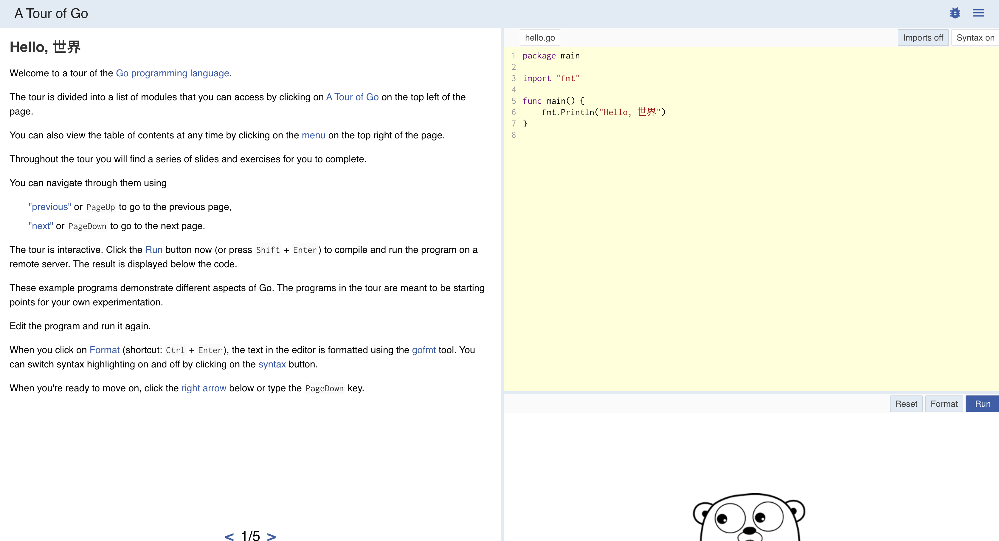
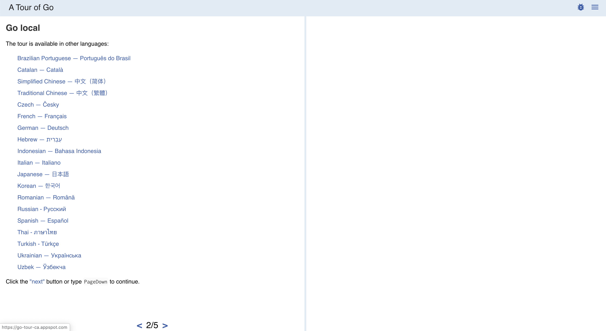
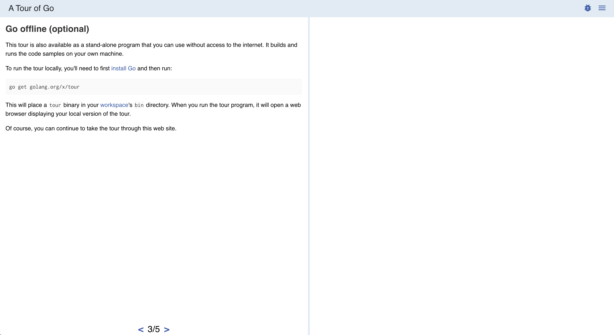
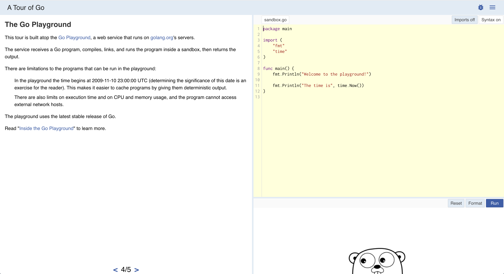
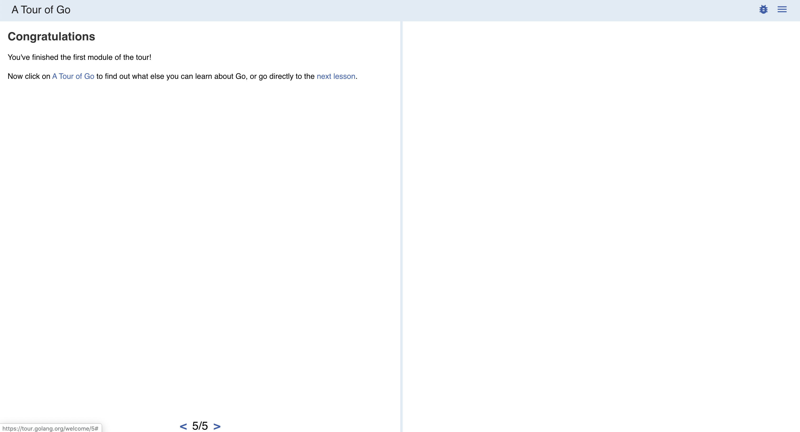
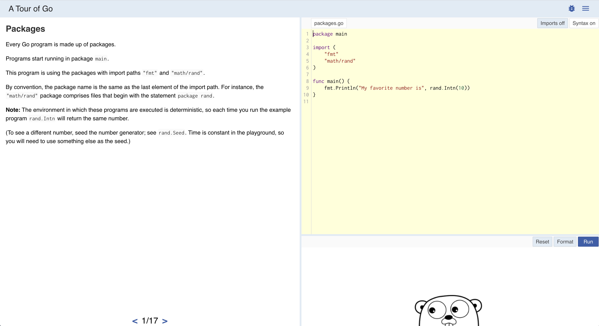
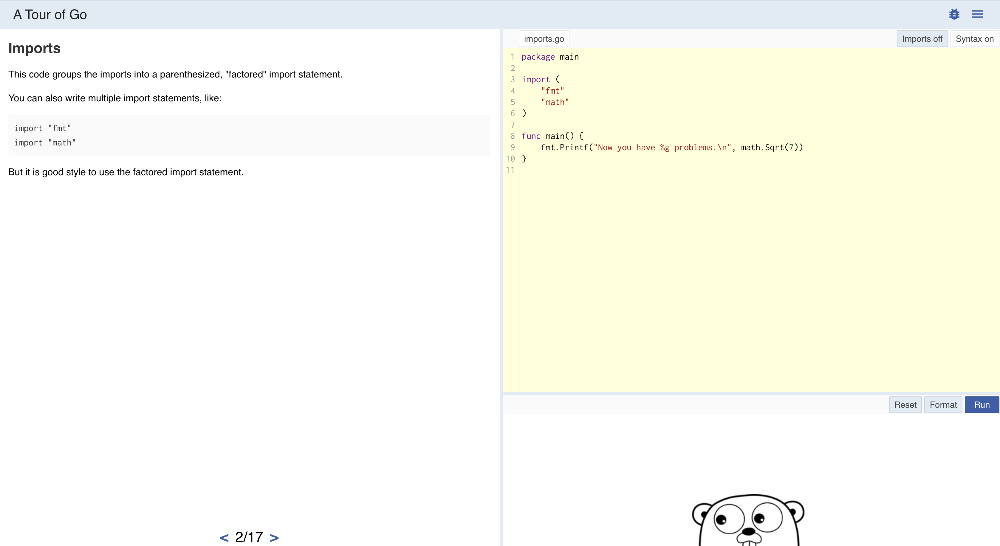
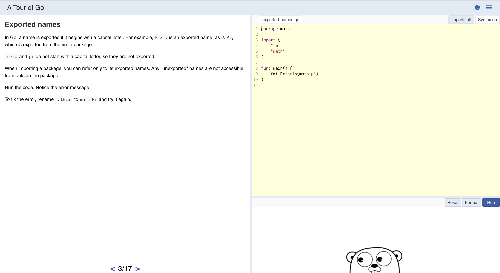
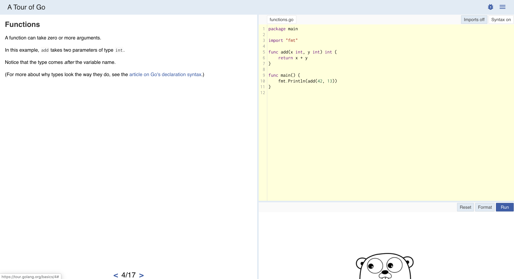

# Go-基础-上-Day03-开始 Go 语言的旅行


> 这篇文章仅做 tour 的完成记录，不包含在不同平台上安装 tour 程序的内容。
>
> 零基础同学需要看一下 B 站的视频：
>
> 1. 程序猿要懂得电脑操作：
> 2. Windows按装Go：
> 3. Mac安装Go：
> 4. Mac设置Go的环境变量：
> 5. Mac安装VScode：
> 6. Mac使用VScode写Go程序（简单）：

## 1. 英文原版 ：[A Tour of Go](https://tour.golang.org/list)

#### Using the tour

Welcome to a tour of the [Go programming language](https://golang.org/). The tour covers the most important features of the language, mainly:

> [Welcome!](https://tour.golang.org/welcome)
>
> Learn how to use this tour: including how to navigate the different lessons and how to run code.

#### Basics

The starting point, learn all the basics of the language.

Declaring variables, calling functions, and all the things you need to know before moving to the next lessons.


> [Packages, variables, and functions.](https://tour.golang.org/basics)
>
> Learn the basic components of any Go program.


> [Flow control statements: for, if, else, switch and defer](https://tour.golang.org/flowcontrol)
>
> Learn how to control the flow of your code with conditionals, loops, switches and defers


> [More types: structs, slices, and maps.](https://tour.golang.org/moretypes)
> 
> Learn how to define types based on existing ones: this lesson covers structs, arrays, slices, and maps.

#### Methods and interfaces

Learn how to define methods on types, how to declare interfaces, and how to put everything together.

> [Methods and interfaces](https://tour.golang.org/methods)
> 
> This lesson covers methods and interfaces, the constructs that define objects and their behavior.

#### Concurrency

Go provides concurrency features as part of the core language.

This module goes over goroutines and channels, and how they are used to implement different concurrency patterns.

> [Concurrency](https://tour.golang.org/concurrency)
> 
> Go provides concurrency constructions as part of the core language. This lesson presents them and gives some examples on how they can be used.


#### 英文版阅读总结

1. 怎么使用 **tour** ( tour 是个程序，帮助你一开始认识并学习 **Go 语言**)
   1. **tour** 包含了 **Go 语言**最重要的功能和核心概念。
   2. 可以在线使用，也可以安装 Go 后拉取到本地使用。
   3. 提供了一个 链接来帮助你使用 [Welcome!](https://tour.golang.org/welcome)

2. 基础
   1. 学习 **Go 语言**最基础的内容。
      1. 变量声明
      2. 方法调用
      3. 等
   2. 包，变量，函数
   3. 控制语句（ `if switch for else` ）和 `defer`
   4. 更多的类型： `slices` `structs` `maps`
3. 方法和接口
   1. 学习怎么给 *类型* 定义方法。
   2. 学习怎么声明 *接口*。
   3. 学习怎么把 **定义类型**，**给类型定义方法**，**声明接口**结合使用。

4. 并发
   1. **Go 语言**将 并发 功能作为语言核心功能之一。
   2. 这部分包含 `goroutine` 和 `channel` 的核心内容。
   3. 这部分同时 介绍了怎么使用 `goroutine` 和 `channel` 实现不同的 `并发模式`

## 2. 第一课 Welcome


前面的总结也说了，这部分主要教会你怎么使用 tour 程序，怎么在网页端直接选择合适自己的语言开始学习。

#### 2.1. 给你个 Hello Word



👆这张图主要说 这个页面怎么用。

	1. 左边看字，右边写代码。
 	2. 点击左边下方的 箭头能切换小节页面。
 	3. 这是个交互式页面，点击 右边的 Run 按钮就能运行框框里的程序了。
 	4. 讲解一下右边按钮的意思：
      	1. Syntax On ：开启语法高亮显示，开启后代码显示的五颜六色好看。
      	2. Imports Off/On： 关闭开启程序导入。
      	3. Reset： 写了一堆不想写了重置掉。
      	4. Format：写的时候不注意格式，但这个按钮可以格式化文本，更好看易读。
      	5. Run： 运行黄色框里写的代码。

#### 2.2. 选择一下适合你的语言吧，




**我们继续使用英语（因为默认是英文，不用选直接下一步），选择中文也是一样，英文更容易懂一点儿。**


#### 2.3. 可以选择使用本地版本

其实是将 tour 程序拉取到自己电脑上来执行，速度杠杠的。再也不愁那个墙，它又厚又高。



#### 2.4. tour 程序是基于 Go Playground 开发的




总结几点：

1. tour 基于 Go Playground 开发，Go Playground 是一个运行在 Go 官方网站（golang.org）的网络服务程序.
2. Go Playground 可以实现网页端写代码在沙盒里编译、链接、运行 Go 程序。
3. 基于 Go Playground 的实现方式，运行的 Go 程序还是有一些限制，但是不影响这个课程学习使用。
4. 就是不要把这个黄色框框当成你写 Go 程序的主战场，VScode、Goland 它不香吗？

#### 2.5. 第一节课完成✅




#### 6. 整理第一节中从现的程序

```go
// hello.go
package main

import "fmt"

func main() {
	fmt.Println("Hello, 世界")
}

```


```go
// sanbox.go
package main

import (
	"fmt"
	"time"
)

func main() {
	fmt.Println("Welcome to the playground!")

	fmt.Println("The time is", time.Now())
}

```

## 3. 第二节 package、variable、function


#### 3.1 Go 程序源码是按 package 组织起来的




总结几点：

1. 每个 Go 程序都是用 package 组织起来的。
2. 程序开始运行的包是 main。
3. 导入的包使用 import 语句，包名一般是小写字母。
4. 右边的程序 导入了 fmt 和 math/rand 包。
5. fmt 主要功能提供格式化输出的方法和实现。
6. math/rand 主要提供随机数的方法和实现。
7. 你可以将右边 黄框里面的 rand.Intn(10) 改成 rand.seed(10) 后点击运行看看结果有什么不同。
8. 关于 这俩方法有何异同这里就不说了。

#### 

#### 3.2 导入包使用 import 关键字

 

总结几点： 

1. 导入语句可以有两种格式，一个一个导入和批量导入，实际应用一般是批量导入，就是因为省事儿，没啥本质区别不用纠结。
2. 导入的包名要用双引号包裹。

#### 3.3 包内导出的变量和方法





总结几点：

1. 在 Go 程序源码中如果想让 其他的包也能访问到自己包里的 **成员**（变量，常量或方法等）就要把这个成员的名字第一个字母大写。

2. 上图👆右边的黄框里 math.pi 是错的，因为小写的 pi 根本不能在 main 包中被访问到，编译不会通过。

3. 改成 math.Pi 就行了，因为 math 包里的 Pi 这个首字母大写的常量才能在 main 包被访问到。

   

#### 3.4 定义方法





总结：

1. 方法定义 使用 func 关键字 
2. 格式 `func  方法名(参数列表) 返回值列表 { 方法体 }`
3. 这里第一次出现了 return 语句，表示一个函数的返回值。