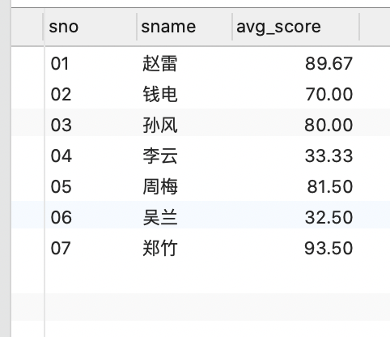
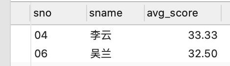

# Mysql经典练习题全记录

> 最近遇到了 **Mysql** 数据库复杂业务查询的技能不足的问题，
> 然后在网上找到了Mysql练习题50道。
>
> 参考资料：
>
> - [mysql语句练习50题 ](https://www.cnblogs.com/zsty/p/10109125.html)
>
> - [sql语句练习50题(Mysql版)](https://blog.csdn.net/fashion2014/article/details/78826299)
> - [精选36道SQL练习题解析 （原50道SQL练习题）](https://blog.csdn.net/Artificial_idiots/article/details/106420397?utm_medium=distribute.pc_relevant.none-task-blog-BlogCommendFromMachineLearnPai2-5.nonecase&depth_1-utm_source=distribute.pc_relevant.none-task-blog-BlogCommendFromMachineLearnPai2-5.nonecase)
>
> 下面就是根据网上的资料实践练习的记录。


## 一、Docker运行Mysql

### 1.1 运行mysql

```bash
docker run -n mysql -it -p 3306:3306 -e
```

### 1.2 连接mysql

### 1.3 使用NavCat连接Mysql

## 二、数据库和测试数据

### 2.1 数据库设计

```bash
mysql -u root -p
```

```sql
SHOW DATABASES;
CREATE DATABASE school;
```

### 2.2 建数据库和数据表的sql语句

```sql
USE `school`;

DROP TABLE IF EXISTS `Student`;
CREATE TABLE `Student` (
	`sno` VARCHAR ( 20 ) COMMENT '学生编号',
	`sname` VARCHAR ( 20 ) NOT NULL DEFAULT 'xx' COMMENT '学生姓名',
	`sage` VARCHAR ( 20 ) NOT NULL DEFAULT '1970-01-01' COMMENT '生日年月日',
	`ssex` VARCHAR ( 20 ) NOT NULL DEFAULT '女' COMMENT '性别',
PRIMARY KEY ( `sno` )) ENGINE = INNODB DEFAULT CHARSET = utf8 COMMENT = '学生表';

DROP TABLE IF EXISTS `Teacher`;
CREATE TABLE `Teacher` (
	`tno` VARCHAR ( 20 ) COMMENT '教师编号',
	`tname` VARCHAR ( 20 ) NOT NULL DEFAULT '' COMMENT '教师姓名',
PRIMARY KEY ( `tno` )) ENGINE = INNODB DEFAULT CHARSET = utf8 COMMENT = '教师表';

DROP TABLE IF EXISTS `Course`;
CREATE TABLE `Course` (
	`cno` VARCHAR ( 20 ) COMMENT '课程编号',
	`cname` VARCHAR ( 20 ) NOT NULL DEFAULT '' COMMENT '课程名称',
	`tno` VARCHAR ( 20 ) NOT NULL DEFAULT '' COMMENT '教师编号',
PRIMARY KEY ( `cno` )) ENGINE = INNODB DEFAULT CHARSET = utf8 COMMENT = '课程表';

DROP TABLE IF EXISTS `Score`;
CREATE TABLE `Score` (
	`sno` VARCHAR ( 20 ) COMMENT '学生编号',
	`cno` VARCHAR ( 20 ) COMMENT '课程编号',
	`sscore` INT ( 3 ) COMMENT '所得分数',
PRIMARY KEY ( `sno`, `cno` )) ENGINE = INNODB DEFAULT CHARSET = utf8 COMMENT = '成绩表';

```

### 2.3 造测试数据


## 三、查询练习


1. 查询"01"课程比"02"课程成绩高的学生的信息及课程分数
2. 查询"01"课程比"02"课程成绩低的学生的信息及课程分数
3. 查询平均成绩大于等于60分的同学的学生编号和学生姓名和平均成绩
4. 查询平均成绩小于60分的同学的学生编号和学生姓名和平均成绩 (包括有成绩的和无成绩的)
5. 查询所有同学的学生编号、学生姓名、选课总数、所有课程的总成绩
6. 查询"李"姓老师的数量 
7. 查询学过"张三"老师授课的同学的信息 
8. 查询没学过"张三"老师授课的同学的信息
9. 查询学过编号为"01"并且也学过编号为"02"的课程的同学的信息
10. 查询学过编号为"01"但是没有学过编号为"02"的课程的同学的信息
11. 查询没有学全所有课程的同学的信息 
12. 查询至少有一门课与学号为"01"的同学所学相同的同学的信息 
13. 查询和"01"号的同学学习的课程完全相同的其他同学的信息 
14. 查询没学过"张三"老师讲授的任一门课程的学生姓名 
15. 查询两门及其以上不及格课程的同学的学号，姓名及其平均成绩 
16. 检索"01"课程分数小于60，按分数降序排列的学生信息
17. 按平均成绩从高到低显示所有学生的所有课程的成绩以及平均成绩
18. 查询各科成绩最高分、最低分和平均分：以如下形式显示：课程ID，课程name，最高分，最低分，平均分，及格率，中等率，优良率，优秀率 注： 及格为 >= 60 ， 中等为 ： 70 -80 ， 优良为 ： 80 -90 ， 优秀为 ： >= 90
19. 按各科成绩进行排序，并显示排名
20. 查询学生的总成绩并进行排名


### 3.1 查询"01"课程比"02"课程成绩高的学生的信息及课程分数

```mysql
-- 1、查询"01"课程比"02"课程成绩高的学生的信息及课程分数	

-- solution-1
SELECT a.*, b.sscore AS 01_Score,  c.sscore AS 02_score 
FROM Student a JOIN Score b ON a.sno=b.sno AND b.cno='01'
LEFT JOIN Score c ON a.sno=c.sno AND c.cno='02' OR c.cno=NULL
WHERE b.sscore>c.sscore

-- :output
-- 02	钱电	1990-12-21	男	70	60
-- 04	李云	1990-08-06	男	50	30

-- solution-2

SELECT a.*, b.sscore AS 01_score, c.sscore AS 02_score 
FROM Student a, Score b, Score c
WHERE a.sno = b.sno 
AND a.sno = c.sno
AND b.cno = '01'
AND c.cno = '02' 
AND b.sscore > c.sscore
```


### 3.2 查询"01"课程比"02"课程成绩低的学生的信息及课程分数

```mysql
-- solution-2-1

SELECT
	a.*,
	b.sscore AS 01_score,
	c.sscore AS 02_score 
FROM
	Student a
	LEFT JOIN Score b ON a.sno = b.sno 
	AND b.cno = '01'
	JOIN Score c ON a.sno = c.sno 
	AND c.cno = '02' 
WHERE
	b.sscore < c.sscore;
	
	
-- 	solution-2-2

SELECT
	a.*,
	b.sscore AS 01_score,
	c.sscore AS 02_score 
FROM
	Student a,
	Score b,
	Score c
WHERE
  a.sno = b.sno
	AND a.sno = c.sno
	AND b.cno = '01'
	AND c.cno = '02'
	AND b.sscore < c.sscore;
```


### 3.3 查询平均成绩大于等于60分的同学的学生编号和学生姓名和平均成绩

> 参考资料：
> [SQL ROUND() 函数 | 菜鸟教程](https://www.runoob.com/sql/sql-func-round.html)
> [SQL AVG() 函数 | 菜鸟教程](https://www.runoob.com/sql/sql-func-avg.html)

```mysql
SELECT a.sno, a.sname, ROUND(AVG(b.sscore),2) AS avg_score 
FROM Student a
JOIN Score b 
ON b.sno = a.sno
GROUP BY a.sno,a.sname 
HAVING avg_score >= 60;
```


##### 测试 仅仅分数查询

```mysql
-- 测试 仅仅分数查询
SELECT a.sno, a.sname, b.sscore 
FROM Student a 
JOIN Score b
ON b.sno = a.sno
```


##### 测试 仅仅平均分查询

```mysql
-- 测试 仅仅平均分查询
SELECT a.sno, a.sname, ROUND(AVG(b.sscore),2) AS avg_score 
FROM Student a 
JOIN Score b
ON b.sno = a.sno
GROUP BY a.sno, a.sname;
```




### 3.4 查询平均成绩小于60分的同学的学生编号和学生姓名和平均成绩 (包括有成绩的和无成绩的)


策略：

1. 先查出分数小于60但不包含 没有成绩的人。
2. 再查出没有成绩的人。先找到Score表里的不同的sno有哪些，再看看学生编号里面有哪些不包含在这个sno列表里。然后那些个学生就是我们要找的。
3. 最后把两个结果合并。

```mysql
  -- solution-4-1
	SELECT a.sno, a.sname, ROUND(AVG(b.sscore), 2)  AS avg_score 
	FROM Student a 
	LEFT JOIN Score b 
	ON a.sno = b.sno
	GROUP BY a.sname, a.sno 
	HAVING avg_score < 60
	UNION
	SELECT a.sno, a.sname, 0 AS avg_score
	FROM Student a 
	WHERE a.sno NOT IN (SELECT DISTINCT sno from Score);
```


```mysql
	-- 测试4-1 仅查出小于60分的，不包含没有成绩的人	
	SELECT a.sno, a.sname, ROUND(AVG(b.sscore), 2) AS avg_score 
	FROM Student a 
	LEFT JOIN Score b 
	ON a.sno = b.sno 
	GROUP BY a.sname, a.sno 
	HAVING avg_score < 60;
```



```mysql
	-- 测试4-2 从Score表里查出不同的sno
	SELECT DISTINCT sno from Score;
```


### 3.5 查询所有同学的学生编号、学生姓名、选课总数、所有课程的总成绩

```mysql
SELECT
	a.sno,
	a.sname,
	COUNT( b.cno ) AS sum_course,
	SUM( b.sscore ) AS sum_score 
FROM
	Student a
	LEFT JOIN Score b ON a.sno = b.sno 
GROUP BY
	a.sno,
	a.sname;
```


### 3.6 查询"李"姓老师的数量 

```mysql
SELECT COUNT(tno) FROM Teacher WHERE tname LIKE '李%';
```


