# Golang精编100题4：程序输出

### 1、写出下面代码输出内容

```go
package main

import "fmt"

func main() {
	defer_call()
}

func defer_call() {
	defer func() { fmt.Println("打印前") }()
	defer func() { fmt.Println("打印中") }()
	defer func() { fmt.Println("打印后") }()

	//效果等同于return
	panic("触发异常")
}

```

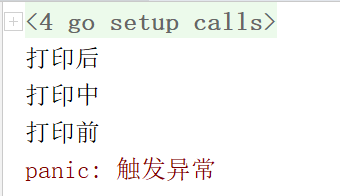

解析：3个defer的顺序是倒序执行的，由于没有捕获异常，最终在函数返回时触发了异常

### 2、以下代码有什么问题，说明原因


```go
package main

import "fmt"

type student struct {
	Name string
	Age  int
}

func main() {
	m := make(map[string]*student)

	stus := []student{
		{Name: "zhou", Age: 24},
		{Name: "li", Age: 23},
		{Name: "wang", Age: 22},
	}

	for _, stu := range stus {
		//fmt.Println(stu)
		m[stu.Name] = &stu
	}

	fmt.Println(m)
}

```

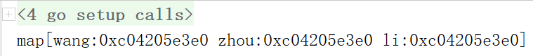


解析：stu作为一个变量只声明了一次，因此其地址是始终不会发生变化的，最终其内部的值为最后一个Student对象的值；


### 3 下面的代码会输出什么，并说明原因


```go

package main

import (
	"fmt"
	"runtime"
	"sync"
)

func main() {
	runtime.GOMAXPROCS(1)
	wg := sync.WaitGroup{}

	wg.Add(10)

	for i := 0; i < 5; i++ {
		go func() {
			fmt.Println("A: ", i)
			wg.Done()
		}()
	}

	for i := 0; i < 5; i++ {
		go func(i int) {
			fmt.Println("B: ", i)
			wg.Done()
		}(i)
	}

	wg.Wait()
}

```

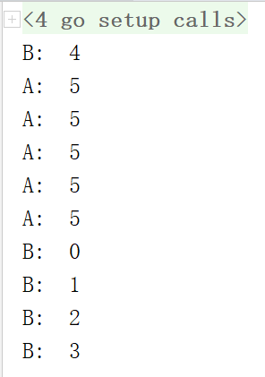

解析：对于第一个循环，当goroutine中的代码得以执行时，主协程中的i早已完成整个循环，因此其值为5；第二个循环由于将01234分别传入了匿名函数func()的闭包中，因此即使go func是延时执行的，对于第一时间传入和锁死的局部变量i是没有影响的；

### 4 下面代码会输出什么？

```go
package main

import "fmt"

type People struct{}
func (p *People) ShowA() {
	fmt.Println("showA")
	p.ShowB()
}
func (p *People) ShowB() {
	fmt.Println("showB")
}

type Teacher struct {
	People
}
func (t *Teacher) ShowB() {
	fmt.Println("teachershowB")
}

func main() {
	t := Teacher{}
	t.ShowA()
}

```

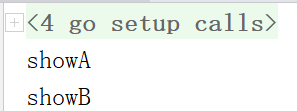

解析：showA方法内的p对象是一个People对象，它是t内置匿名成员People的指针，因此它调用的showB方法也是People的showB方法；


### 5 下面代码会触发异常吗？请详细说明

```go

package main

import (
	"fmt"
	"runtime"
)

func main() {
	runtime.GOMAXPROCS(1)

	int_chan := make(chan int, 1)
	string_chan := make(chan string, 1)

	int_chan <- 1
	string_chan <- "hello"

	select {
	case value := <-int_chan:
		fmt.Println(value)
	case value := <-string_chan:
		panic(value)
	}
}

```

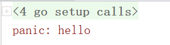

OR

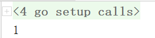

解析：考虑到select的两个case都不是IO阻塞的，因此两种情形随机发生；


### 6 下面代码输出什么？


```go
package main

import "fmt"

func calc(index string, a, b int) int {
	ret := a + b
	fmt.Println(index, a, b, ret)
	return ret
}

func main061() {
	a := 1
	b := 2

	defer calc("1", a, calc("10", a, b))

	a = 0
	defer calc("2", a, calc("20", a, b))

	b = 1
}

func main062() {
	a := 1
	b := 2

	defer func() {
		calc("1", a, calc("10", a, b))
	}()

	a = 0

	defer func() {
		calc("2", a, calc("20", a, b))
	}()

	b = 1
}

func main() {
  //第一步执行：main061()
  //第二步执行： mian062()
}

```

**061执行结果：**

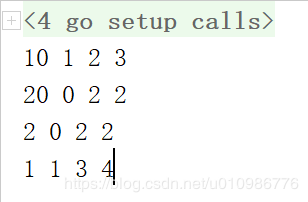

**062执行结果：**

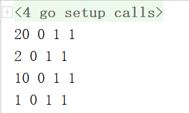

解析：注意defer所引导的如果不是匿名函数而是一个API调用，那么它会事先准备好所有参数（此时a,b的值还没有发生改变），并等待延时执行；

而如果defer引导的是一个匿名函数时，那么函数体内部的代码则不会事先“预做准备”，而是到执行时才去读取a,b的具体值；

### 7 请写出以下输出内容


```go

package main

import "fmt"

func main() {
	s := make([]int, 5)

	s = append(s, 1, 2, 3)
	fmt.Println(s)
}

```

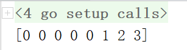

解析：s被初始化为一个5长度5容量的切片，其值是[0,0,0,0,0]，当append时发生了扩容，新的元素被追加到了尾部；

8 下面的代码有什么问题?

```go
package main

import (
	"fmt"
	"sync"
)

type UserAges struct {
	ages map[string]int
	sync.Mutex
}

func (ua *UserAges) Add(name string, age int) {
	ua.Lock()
	defer ua.Unlock()
	ua.ages[name] = age
}

func (ua *UserAges) Get(name string) int {
	if age, ok := ua.ages[name]; ok {
		return age
	}
	return -1
}

```

解析：Get在读取键值时由于没有加锁，因此同一时间做并发读取的话，有的协程会读到Add前的age零值-1，有的则会读到Add后的实际值，这是一个并发安全问题，如果要保证数据不会形成脏读幻读，应该给Get加同步锁；


### 9.下面的迭代会有什么问题？


```go

package main

import (
	"fmt"
	"sync"
	"time"
)

type threadSafeSet struct {
	sync.RWMutex
	s []interface{}
}

func (set *threadSafeSet) Iter() <-chan interface{} {
	ch := make(chan interface{})
	go func() {
		set.RLock()
		for _,value := range set.s {
			ch <- value
		}
		close(ch)
		set.RUnlock()
	}()

	return ch
}

```

解析：既然要保证线程安全/并发安全，那么对数据集s的写入操作应该同步，题干没有给出写入的实现，单独看迭代读取似乎问题不大；

### 10 以下代码能编译过去吗？为什么？

```go

 package main

import (
	"fmt"
)

type People interface {
	Speak(string) string
}
type Stduent struct{}

func (stu *Stduent) Speak(think string) (talk string) {
	if think == "bitch" {
		talk = "You are a good boy"
	} else {
		talk = "hi"
	}
	return
}

func main() {
	var peo People = Stduent{}
	think := "bitch"
	fmt.Println(peo.Speak(think))
}

```

解析：不能，Student的指针实现的People，因此不能用值为接口对象赋值，只能用指针去赋值；

### 11 以下代码打印出来什么内容，说出为什么。


```go

package main

import (
	"fmt"
)

type People3 interface {
	Show()
}

type Student struct{}
func (stu *Student) Show() {}

func live() People3 {
	var stu *Student
	fmt.Println(stu)
	return stu
}

func main() {
	people3 := live()

	if people3 == nil {
		fmt.Println("AAAAAAA")
	} else {
		fmt.Println("BBBBBBB")
	}
}

```

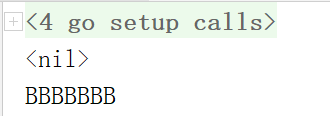


解析：使用接口作为函数入参/返回值时，如果实际传递/返回的是nil子类对象，那么这一入参/返回值接口对象依然是不为nil的，接口对象的内在结构必须令其能够支持潜在的类型断言或抽象方法调用，一个完全为nil的接口对象是无法做到这一点的；

### 12 是否可以编译通过？如果通过，输出什么？


```go

package main

func GetValue() int {
	return 1
}

func main() {
	i := GetValue()
	switch i.(type) {
	case int:
		println("int")
	case string:
		println("string")
	case interface{}:
		println("interface")
	default:
		println("unknown")
	}
}

```

解析：无法通过编译，i为整型而不是接口，因此无法做类型断言，编译通不过；

### 13 下面函数有什么问题？

```go
package main

func funcMui(x,y int)(sum int,error){
	return x+y,nil
}
```

解析：返回值要么都不预定义，要么全部预定义，本题编译通不过；

### 14 是否可以编译通过？如果通过，输出什么

```go
package main

func main() {
	println(DeferFunc1(1))
	println(DeferFunc2(1))
	println(DeferFunc3(1))
}

func DeferFunc1(i int) (t int) {
	t = i

	defer func() {
		t += 3
	}()

	return t
}

func DeferFunc2(i int) int {
	t := i

	defer func() {
		t += 3
	}()

	return t
}

func DeferFunc3(i int) (t int) {

	defer func() {
		t += i
	}()

	return 2
}

```


解析：defer在真正的return之前执行，如果预定义了返回值t，则defer对t的对t的修改会对t起作用，返回的也是t本身；而如果预定义返回值，t是完全局部变量，则预备return的是其值的拷贝，后面对这个局部变量的任何修改都在函数结束时作为局部变量被销毁了，事实上返回的是defer之前准备好的值拷贝；

### 15 是否可以编译通过？如果通过，输出什么？

```go

package main

import "fmt"

func main() {
	list := new([]int)
	list = append(list, 1)
	fmt.Println(list)
}

```


解析：编译通不过，list的类型是*[]int，而append的第一个参数必须是切片类型而非指针类型，类型不匹配；

### 16 是否可以编译通过？如果通过，输出什么？


```go
package main

import "fmt"

func main() {
	s1 := []int{1, 2, 3}
	s2 := []int{4, 5}
	s1 = append(s1, s2)
	fmt.Println(s1)
}

```

解析：编译通不过，append的第二个参数是不定长参数而非切片，要写作`s1=append(s1,s2...)`；

### 17 是否可以编译通过？如果通过，输出什么？


```go
package main

import (
	"fmt"
	"reflect"
)

func main171() {
	sn1 := struct {
		age  int
		name string
	}{age: 11, name: "qq"}

	sn2 := struct {
		age  int
		name string
	}{age: 11, name: "qq"}

	/*
	比较结构体的相等，比较属性列表的顺序与值
	调换了属性列表的顺序后，就不再视为相同的Type，就不能再比较了
	*/
	if sn1 == sn2 {
		fmt.Println("sn1== sn2")
	}

	sm1 := struct {
		age int
		m   map[string]string
	}{age: 11, m: map[string]string{"a": "1"}}

	sm2 := struct {
		age int
		m   map[string]string
	}{age: 11, m: map[string]string{"a": "1"}}

	/*属性中包含不能做==运算的类型时，结构体也无法进行==运算*/
	if sm1 == sm2 {
		fmt.Println("sm1== sm2")
	}	
}

func main172()  {
	var m1 = map[string]string{"a": "1"}
	var m2 = map[string]string{"a": "1"}

	//Invalid operation: m1==m2 (operator == not defined on map[string]string)
	//map没有定义==运算符
	fmt.Println(m1==m2)

	fmt.Println(reflect.DeepEqual(m1,m2))
}

```

解析：两个属性列表顺序和值都相同的结构体= =的结果为真，对于没有定义= =操作符的类型（例如map），==运算通不过编译，可以使用reflect.DeepEqual(v1,v2)来判断其值是否相等；如果两个结构体的属性列表顺序相同，具体属性要么相等，要么DeeqEqual的话，那么这两个结构体也是DeepEqual的；

### 18 是否可以编译通过？如果通过，输出什么？

```go

package main

import "fmt"

/*
接口做返回值或参数类型时，如果入参或者返回值的实际类型为为子类对象时
父类接口对象不会因为子类为nil而为nil
原因：一无所有的结果（没有内存结构，彻底为nil），就无法支持类型断言和方法多态
*/

func Foo(x interface{}) {
	fmt.Println(x)
	if x == nil {
		fmt.Println("emptyinterface")
		return
	}
	fmt.Println("non-emptyinterface")
}

func main() {
	var x *int = nil
	Foo(x)
}

```

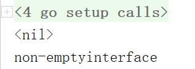

解析：使用接口作为函数入参/返回值时，如果实际传递/返回的是nil子类对象，那么这一入参/返回值接口对象依然是不为nil的，接口对象的内在结构必须令其能够支持潜在的类型断言或抽象方法调用，一个完全为nil的接口对象是无法做到这一点的；


### 19 是否可以编译通过？如果通过，输出什么？


```go
package main

import "fmt"

func GetValue19(m map[int]string, id int) (string, bool) {
	if _, exist := m[id]; exist {
		return "存在数据", true
	}
	return nil, false
}

func main() {
	intmap := map[int]string{
		1: "a",
		2: "bb",
		3: "ccc",
	}
	v, err := GetValue19(intmap, 3)
	fmt.Println(v, err)
}

```

解析：通不过编译，GetValue19函数中返回值string不是引用类型，无法使用nil为其赋值；

### 20 是否可以编译通过？如果通过，输出什么？


```go

package main

import "fmt"

const (
	x = iota //0
	y        //=iota=1
	z = "zz" //iota=2
	k        //=zz,iota=3
	p = iota //iota=4
)

func main() {
	fmt.Println(x, y, z, k, p)
}

```

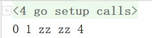


解析：k延用z的算法，因此其值为zz，iota无论用与不用，在常量组中iota的值都是持续递增的，因此p的iota值为4；

### 21 编译执行下面代码会出现什么?


```go

package main

var (
	size := 1024
	max_size = size * 2
)

func main() {
	println(size, max_size)
}

```

解析：函数外无法使用冒等结构，编译通不过；

### 22 下面函数有什么问题？


```go

package main

const cl = 100
var bl = 123

func main() {
	println(&bl, bl)

	//不能对常量取地址
	println(&cl, cl)
}

```


解析：常量是无法取地址的，为了禁止修改保证安全，语法编译通不过；

### 23 编译执行下面代码会出现什么?

```go

package main

func main() {
	for i := 0; i < 10; i++ {
		loop:
		println(i)
	}

	goto loop
}

```

解析：goto只能跳转同级或外层标签，无法跳转内层标签，语法编译不识别；

### 24 编译执行下面代码会出现什么?


```go

package main

import "fmt"

func main() {
	type MyInt1 int
	type MyInt2 = int

	var i int = 9
	var i1 MyInt1 = i
	var i2 MyInt2 = i

	fmt.Println(i1, i2)
}

```

解析：无坑点

### 26 编译执行下面代码会出现什么?


```go

package main

import "fmt"

type T1 struct {
}
func (t T1) m1() {
	fmt.Println("T1.m1")
}

type T2 = T1

type MyStruct struct {
	T1
	T2
}

func main() {
	my := MyStruct{}
	my.m1()
}

```

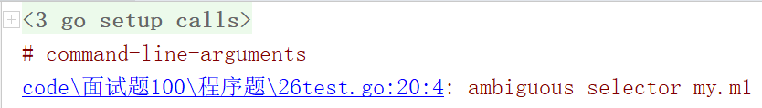

解析：编译器无法确认m1是哪个父类的方法；

### 27 编译执行下面代码会出现什么?


```go

package main

import (
	"errors"
	"fmt"
)

var ErrDidNotWork = errors.New("did not work")

func DoTheThing(reallyDoIt bool) (err error) {
	if reallyDoIt {
		result, err := tryTheThing()
		if err != nil || result != "it worked" {
			err = ErrDidNotWork
		}
	}
	return err
}

func tryTheThing() (string, error) {
	return "", ErrDidNotWork
}

func main() {
	fmt.Println(DoTheThing(true))
	fmt.Println(DoTheThing(false))
}

```

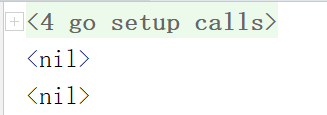

解析：DoTheThing函数中，当if条件为真时修改的err并不是预定的返回值err，而是一个同名的局部变量，因此返回值err始终为默认的零值nil，如图：

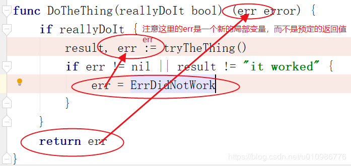

### 28 编译执行下面代码会出现什么?


```go

package main

func test() []func() {
	var funs []func()
	for i := 0; i < 2; i++ {
		funs = append(funs, func() {
			println(&i, i)
		})
	}
	return funs
}

func main() {
	funs := test()
	for _, f :=range funs{
		f()
	}
}

```

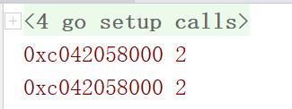

解析：当f函数被调用时，它所引用的x早已变成了2，而x只声明了一次，它的地址是永远不会发生改变的，直到程序结束被销毁；

### 29 编译执行下面代码会出现什么?


```go

package main

func test29(x int) (func(), func()) {
	return func() {
		println(x)
		x += 10
	}, func() {
		println(x)
	}
}

func main() {
	a, b := test29(100)
	a()
	b()
}

```

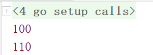

解析：当a函数被调用时，x的值为100，打印完毕后修改为110，因此b函数调用时x的值为110；

### 30 编译执行下面代码会出现什么?


```go

package main

import (
	"fmt"
	"reflect"
)

func main() {
	defer func() {
		if err := recover(); err != nil {
			fmt.Println(err)//
		} else {
			fmt.Println("fatal")
		}
	}()

	/*一个函数内多次panic以后发的为准*/
	defer func() {
		panic("defer panic")
	}()

	panic("你妹")
}

func main302() {
	defer func() {
		if err := recover(); err != nil {
			fmt.Println("++++")
			f := err.(func() string)

			fmt.Println(err, f(), reflect.TypeOf(err),reflect.TypeOf(err).Kind().String())//地址，defer panic，func()string,func
		} else {
			fmt.Println("fatal")
		}
	}()

	defer func() {
		panic(func() string {
			return "defer panic"
		})
	}()

	panic("你妹")
}

```

301输出：defer panic
302输出：函数地址，defer panic，func()string,func
解析：注意一个函数内部多次panic时，以最后一次为准