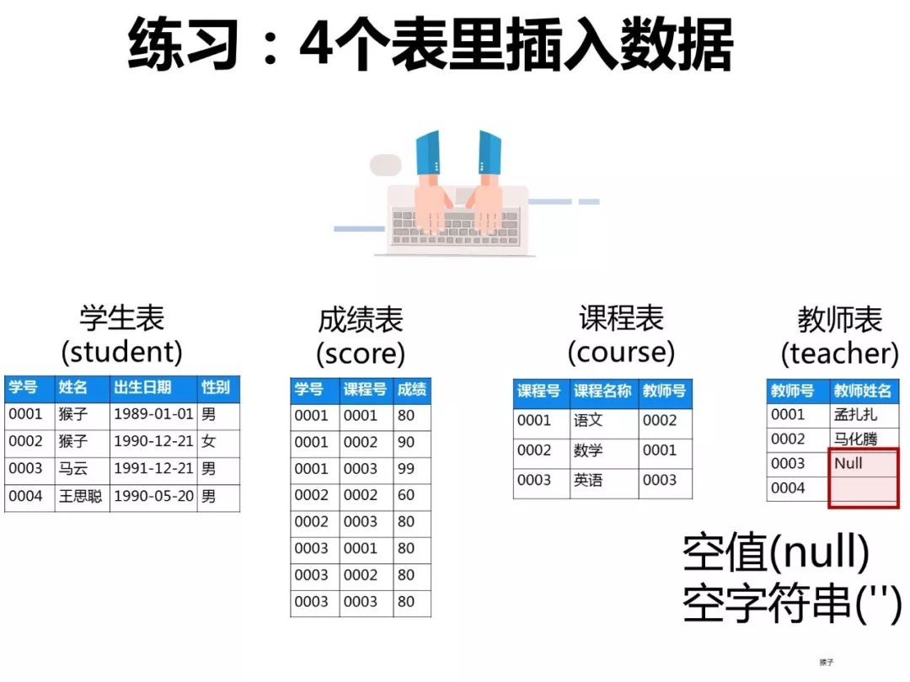
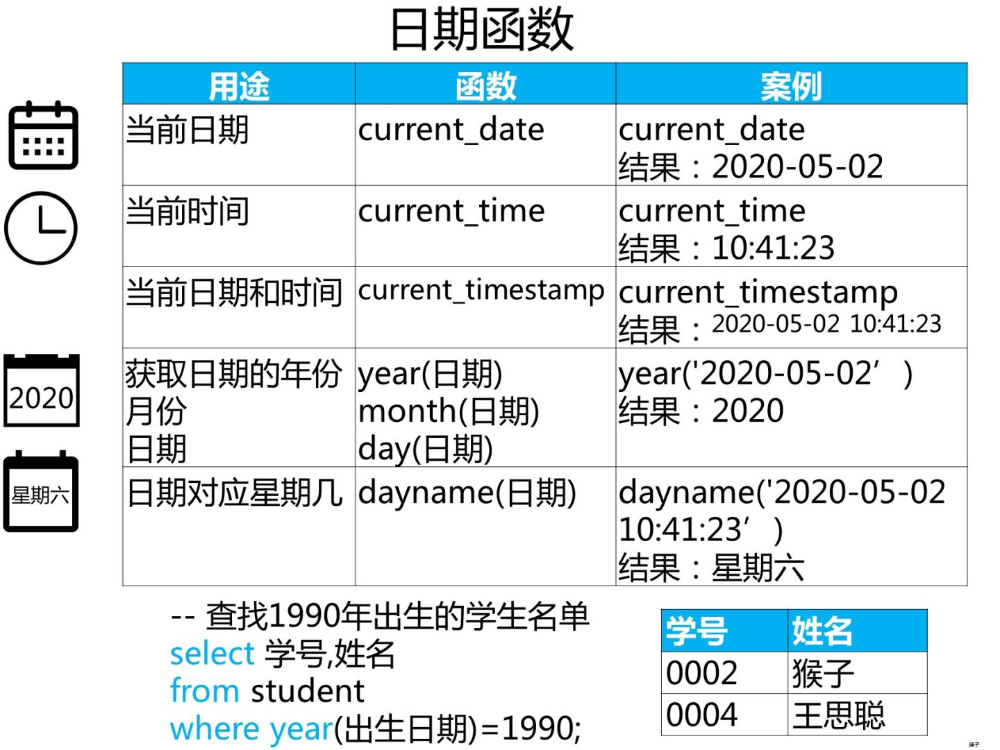

# MySQL经典50题

> [图解SQL面试题：经典50题 - 知乎](https://zhuanlan.zhihu.com/p/38354000?utm_source=wechat_session&utm_medium=social&utm_oi=61176616583168)

本文所有 sql 语句均是 utf8 编码。数据库编码是 utf8mb4。

## 建库和建表


### 练习： 创建数据库表

已知有如下4张表：

学生表：student(学号,学生姓名,出生年月,性别)

成绩表：score(学号,课程号,成绩)

课程表：course(课程号,课程名称,教师号)

教师表：teacher(教师号,教师姓名)

#### 创建学校数据库

```mysql
CREATE DATABASE IF NOT EXISTS myschool DEFAULT CHARACTER SET  'utf8mb4' COLLATE 'utf8mb4_bin';
```

> 延伸阅读：[mysql的collation - 轩脉刃 - 博客园](https://www.cnblogs.com/yjf512/p/4233601.html)

#### 创建学生表

```mysql
CREATE TABLE IF NOT EXISTS `student` (
  `sid` INT UNSIGNED AUTO_INCREMENT,
  `snum` VARCHAR ( 20 ) NOT NULL,
  `sname` VARCHAR ( 20 ) NOT NULL,
  `sbirth` DATE,
  `ssex` VARCHAR ( 20 ) NOT NULL,
 PRIMARY KEY ( `sid` )
) ENGINE = INNODB DEFAULT CHARSET 'utf8mb4';
```

#### 创建教师表

```mysql
CREATE TABLE IF NOT EXISTS `teacher` (
 `tnum` varchar(20) NOT NULL,
 `tname` varchar(20) ,
 PRIMARY KEY (`tnum`)
)ENGINE = INNODB DEFAULT CHARSET 'utf8mb4';
```

#### 创建课程表

```mysql
CREATE TABLE IF NOT EXISTS `course` (
`snum` VARCHAR(20) NOT NULL,
`cnum` VARCHAR(20) NOT NULL,
`cname` VARCHAR(20) NOT NULL,
PRIMARY KEY(`cnum`)
)ENGINE = INNODB DEFAULT CHARSET 'utf8mb4'; 
```

#### 创建成绩表

```mysql
CREATE TABLE IF NOT EXISTS `score`  (
  `snum` varchar(20) NOT NULL,
  `cnum` varchar(20) NOT NULL,
  `score` float(3, 0) NOT NULL,
  PRIMARY KEY (`snum`, `cnum`)
)ENGINE = INNODB ROW_FORMAT DYNAMIC DEFAULT CHARSET 'utf8mb4' ;
```

#### 修正mysql 5.6.x的索引限制问题

```mysql
show variables like '%innodb_file_format%';
set global innodb_file_format=Barracuda;
set global innodb_file_format_check=ON;
set global innodb_file_format_max=Barracuda;
```


### 练习： 4个表里插入数据



#### 学生表插入数据

```mysql
INSERT INTO student ( snum, sname, sbirth, ssex )
VALUES
	( '0001', '猴子', '1989-01-01', '男' );
INSERT INTO student ( snum, sname, sbirth, ssex )
VALUES
	( '0002', '猴子', '1990-12-21', '女' );
INSERT INTO student ( snum, sname, sbirth, ssex )
VALUES
	( '0003', '马云', '1991-12-21', '男' );
INSERT INTO student ( snum, sname, sbirth, ssex )
VALUES
	( '0004', '王思聪', '1990-05-20', '男' );
```

#### 教师表插入数据

```mysql
-- 教师表：添加数据
INSERT INTO teacher ( tnum, tname )
VALUES
	( '0001', '孟扎扎' );
INSERT INTO teacher ( tnum, tname )
VALUES
	( '0002', '马化腾' );
	
-- 这里的教师姓名是空值（null）
INSERT INTO teacher ( tnum, tname )
VALUES
	( '0003', NULL );

-- 这里的教师姓名是空字符串（''）
INSERT INTO teacher ( tnum, tname )
VALUES
	( '0004', '' );
```

#### 课程表插入数据

```mysql
-- 课程数据
INSERT INTO course ( cnum, cname, tnum )
VALUES
	( '0001', '语文', '0002' );
INSERT INTO course ( cnum, cname, tnum )
VALUES
	( '0002', '数学', '0001' );
INSERT INTO course ( cnum, cname, tnum )
VALUES
	( '0003', '英语', '0003' );
```

#### 成绩表插入数据

```mysql
-- 成绩数据
INSERT INTO score ( snum, cnum, score )
VALUES
	( '0001', '0001', 80 );
INSERT INTO score ( snum, cnum, score )
VALUES
	( '0001', '0002', 90 );
INSERT INTO score ( snum, cnum, score )
VALUES
	( '0001', '0003', 99 );
INSERT INTO score ( snum, cnum, score )
VALUES
	( '0002', '0002', 60 );
INSERT INTO score ( snum, cnum, score )
VALUES
	( '0002', '0003', 80 );
INSERT INTO score ( snum, cnum, score )
VALUES
	( '0003', '0001', 80 );
INSERT INTO score ( snum, cnum, score )
VALUES
	( '0003', '0002', 80 );
INSERT INTO score ( snum, cnum, score )
VALUES
	( '0003', '0003', 80 );
```

### 汇总后的SQL

```mysql
CREATE DATABASE IF NOT EXISTS myschool DEFAULT CHARACTER SET  'utf8mb4' COLLATE 'utf8mb4_bin';


DROP TABLE IF EXISTS `student`;
CREATE TABLE IF NOT EXISTS `student` (
 `sid` INT UNSIGNED AUTO_INCREMENT,
 `snum` VARCHAR ( 20 ) NOT NULL,
 `sname` VARCHAR ( 20 ) NOT NULL,
 `sbirth` DATE,
 `ssex` VARCHAR ( 20 ) NOT NULL,
 PRIMARY KEY ( `sid` )
) ENGINE = INNODB DEFAULT CHARSET 'utf8mb4';

DROP TABLE IF EXISTS `teacher`;
CREATE TABLE IF NOT EXISTS `teacher` (
 `tnum` varchar(20) NOT NULL,
 `tname` varchar(20) ,
 PRIMARY KEY (`tnum`)
)ENGINE = INNODB DEFAULT CHARSET 'utf8mb4';

DROP TABLE IF EXISTS `course`;
CREATE TABLE IF NOT EXISTS `course` (
`snum` VARCHAR(20) NOT NULL,
`cnum` VARCHAR(20) NOT NULL,
`cname` VARCHAR(20) NOT NULL,
PRIMARY KEY(`cnum`)
)ENGINE = INNODB DEFAULT CHARSET 'utf8mb4'; 

DROP TABLE IF EXISTS `score`;
CREATE TABLE IF NOT EXISTS `score`  (
  `snum` varchar(20) NOT NULL,
  `cnum` varchar(20) NOT NULL,
  `score` float(3, 0) NOT NULL,
  PRIMARY KEY (`snum`, `cnum`)
)ENGINE = INNODB ROW_FORMAT DYNAMIC DEFAULT CHARSET 'utf8mb4' ;

-- 学生数据
INSERT INTO student ( snum, sname, sbirth, ssex )
VALUES
	( '0001', '猴子', '1989-01-01', '男' );
INSERT INTO student ( snum, sname, sbirth, ssex )
VALUES
	( '0002', '猴子', '1990-12-21', '女' );
INSERT INTO student ( snum, sname, sbirth, ssex )
VALUES
	( '0003', '马云', '1991-12-21', '男' );
INSERT INTO student ( snum, sname, sbirth, ssex )
VALUES
	( '0004', '王思聪', '1990-05-20', '男' );

-- 教师表：添加数据
INSERT INTO teacher ( tnum, tname )
VALUES
	( '0001', '孟扎扎' );
INSERT INTO teacher ( tnum, tname )
VALUES
	( '0002', '马化腾' );
-- 这里的教师姓名是空值（null）
INSERT INTO teacher ( tnum, tname )
VALUES
	( '0003', NULL );
-- 这里的教师姓名是空字符串（''）
INSERT INTO teacher ( tnum, tname )
VALUES
	( '0004', '' );
	
-- 课程数据
INSERT INTO course ( cnum, cname, tnum )
VALUES
	( '0001', '语文', '0002' );
INSERT INTO course ( cnum, cname, tnum )
VALUES
	( '0002', '数学', '0001' );
INSERT INTO course ( cnum, cname, tnum )
VALUES
	( '0003', '英语', '0003' );
	
-- 成绩数据
INSERT INTO score ( snum, cnum, score )
VALUES
	( '0001', '0001', 80 );
INSERT INTO score ( snum, cnum, score )
VALUES
	( '0001', '0002', 90 );
INSERT INTO score ( snum, cnum, score )
VALUES
	( '0001', '0003', 99 );
INSERT INTO score ( snum, cnum, score )
VALUES
	( '0002', '0002', 60 );
INSERT INTO score ( snum, cnum, score )
VALUES
	( '0002', '0003', 80 );
INSERT INTO score ( snum, cnum, score )
VALUES
	( '0003', '0001', 80 );
INSERT INTO score ( snum, cnum, score )
VALUES
	( '0003', '0002', 80 );
INSERT INTO score ( snum, cnum, score )
VALUES
	( '0003', '0003', 80 );

```


## 简单查询

### 练习：查找学生


#### 面试题：查询姓“猴”的学生名单

```mysql
select *
from student
where sname like '猴%';
```


#### 面试题：查询姓名中最后一个字是 “猴”的学生名单

```mysql
select *
from student
where sname like '%猴';
```


#### 面试题：查询姓名中带 “猴”的学生名单

```mysql
select * 
from student
where sname like '%猴%';
```

#### 通配符： `%` 表示任意字符串


#### 面试题：查询姓“孟”老师的个数

```mysql
select count(tname)
from teacher
where tname like '猴%';
```


## 汇总分析

### 练习：汇总分析


### 面试题：查询课程编号为“0002”的总成绩

```mysql
/*
分析思路
select 查询结果 [总成绩:汇总函数sum]
from 从哪张表中查找数据[成绩表score]
where 查询条件 [课程号是0002]
*/
SELECT
	sum( score ) 
FROM
	score 
WHERE
	cnum = '0002';
```

#### 面试题：查询选了课程的学生人数

```mysql
/*
这个题目翻译成大白话就是：查询有多少人选了课程
select 学号，成绩表里学号有重复值需要去掉
from 从课程表查找score;
*/
select count(distinct snum) as 学生人数 
from score;
```


### 练习：分组


### 练习：分组结果的条件


### 汇总分析的两个重点


## 复杂查询

### 子查询


>**【知识点】子查询**
>
>1.翻译成大白话
>1）查询结果：学生学号，姓名
>2）查询条件：所有课程成绩 < 60 的学生，需要从成绩表里查找，用到子查询
>
>第1步，写子查询（所有课程成绩 < 60 的学生）
>select 查询结果[学号]
>from 从哪张表中查找数据[成绩表：score]
>where 查询条件[成绩 < 60]
>group by 分组[没有]
>having 对分组结果指定条件[没有]
>order by 对查询结果排序[没有]
>limit 从查询结果中取出指定行[没有];
>
>```sql
>select 学号 
>from student
>where 成绩 < 60;
>```
>
>
>
>第2步，查询结果：学生学号，姓名，条件是前面1步查到的学号
>
>select 查询结果[学号,姓名]
>from 从哪张表中查找数据[学生表:student]
>where 查询条件[用到运算符in]
>group by 分组[没有]
>having 对分组结果指定条件[没有]
>order by 对查询结果排序[没有]
>limit 从查询结果中取出指定行[没有];
>*/
>
>```mysql
>select 学号,姓名
>from student
>where  学号 in (
>select 学号 
>from student
>where 成绩 < 60
>);
>```
>
>

#### 查询所有课程成绩小于60分学生的学号、姓名

#### 查询没有学全所有课的学生的学号、姓名

#### 查询出只选修了两门课程的全部学生的学号和姓名


### 日期函数



#### 

#### 1990年出生的学生名单

#### 查询各科成绩前两名的记录

#### 查询各学生的年龄（精确到月份）

#### 查询本月过生日的学生


## 多表查询

### 练习：联结


面试题：查询所有学生的学号、姓名、选课数、总成绩
面试题：查询平均成绩大于85的所有学生的学号、姓名和平均成绩
面试题：查询学生的选课情况：学号，姓名，课程号，课程名称
面试题：查询出每门课程的及格人数和不及格人数
面试题：使用分段[100-85],[85-70],[70-60],[<60]来统计各科成绩，分别统计：各分数段人数，课程号和课程名称
面试题：查询课程编号为0003且课程成绩在80分以上的学生的学号和姓名

### 练习： 多表连接


检索"0001"课程分数小于60，按分数降序排列的学生信息

查询不同老师所教不同课程平均分从高到低显示

查询课程名称为"数学"，且分数低于60的学生姓名和分数

查询任何一门课程成绩在70分以上的姓名、课程名称和分数（与上题类似）

查询两门及其以上不及格课程的同学的学号，姓名及其平均成绩

查询不同课程成绩相同的学生的学生编号、课程编号、学生成绩

查询课程编号为“0001”的课程比“0002”的课程成绩高的所有学生的学号

查询学过编号为“0001”的课程并且也学过编号为“0002”的课程的学生的学号、姓名

查询学过“孟扎扎”老师所教的所有课的同学的学号、姓名

查询没学过"孟扎扎"老师讲授的任一门课程的学生姓名（与上题类似，"没学过"用not in来实现)

查询没学过“孟扎扎”老师课的学生的学号、姓名（与上题类似）

查询选修“孟扎扎”老师所授课程的学生中成绩最高的学生姓名及其成绩（与上题类似,用成绩排名，用 limit 1得出最高一个）

查询至少有一门课与学号为“0001”的学生所学课程相同的学生的学号和姓名

按平均成绩从高到低显示所有学生的所有课程的成绩以及平均成绩

## SQL高级功能：窗口函数


### 练习：专用窗口函数


查询学生平均成绩及其名次

按各科成绩进行排序，并显示排名

查询每门功成绩最好的前两名学生姓名

查询所有课程的成绩第2名到第3名的学生信息及该课程成绩（与上一题相似）

查询各科成绩前三名的记录（不考虑成绩并列情况）（与上一题相似）