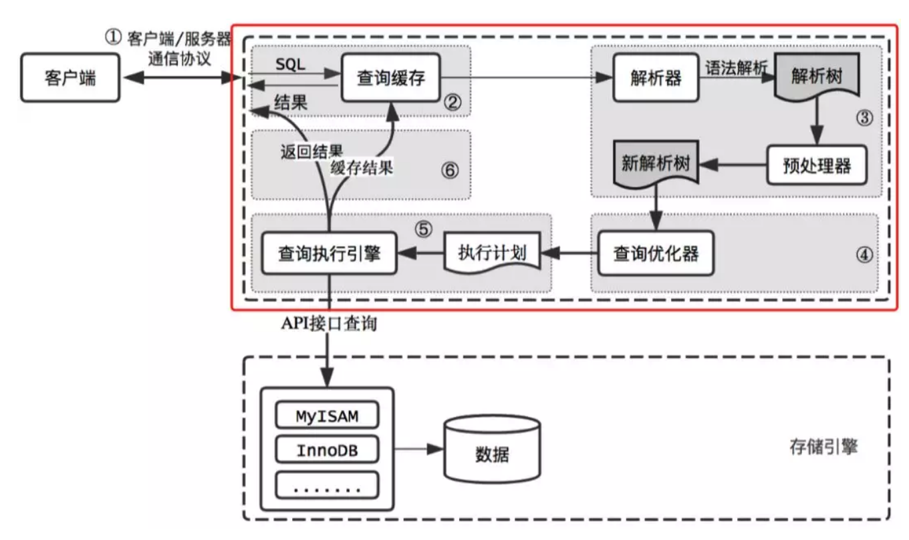
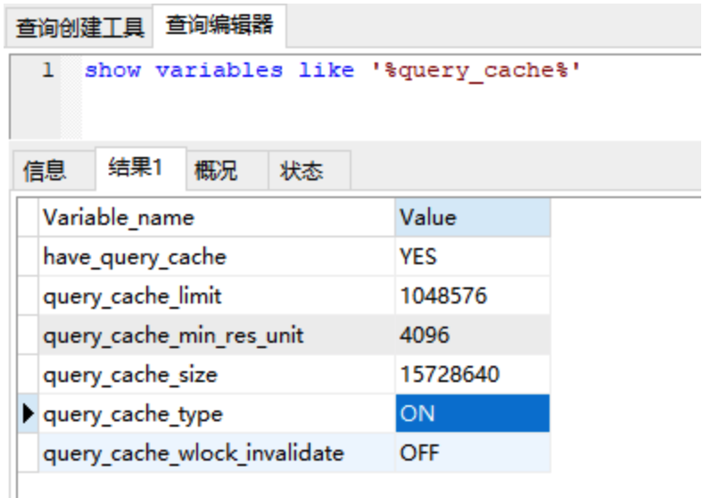
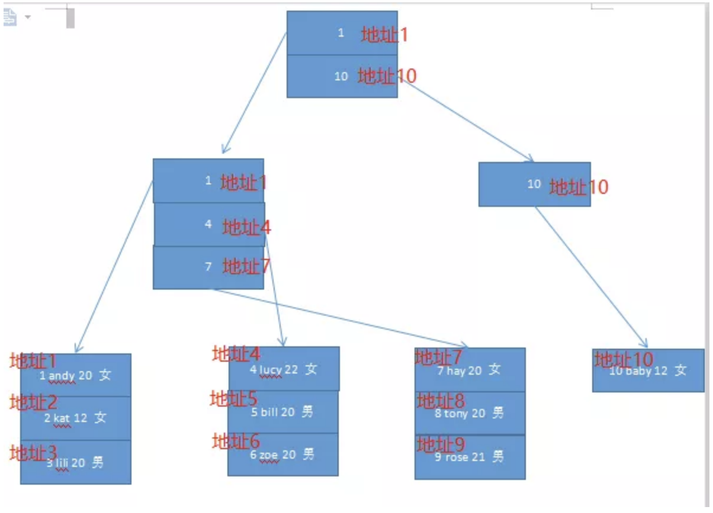
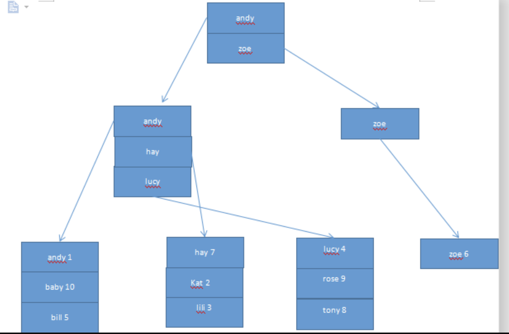

# mysql


## 概览:一条 SQL 语句过来的流程是什么样的？



- ①当客户端连接到 MySQL 服务器时，服务器对其进行**认证**。可以通过用户名与密码认证，也可以通过 SSL 证书进行认证。登录认证后，服务器还会验证客户端是否有执行某个查询的操作**权限**。 **(服务器认证 + 权限认证)**
- ②在正式查询之前，服务器会检查查询缓存，如果能找到对应的查询，则不必进行查询解析，优化，执行等过程，直接返回缓存中的结果集。**(检查缓存)**
- ③MySQL 的解析器会根据查询语句，构造出一个解析树，主要用于根据语法规则来验证语句是否正确，比如 SQL 的关键字是否正确，关键字的顺序是否正确。而预处理器主要是进一步校验，比如表名，字段名是否正确等。**(生成解析树+内容校验)**
- ④查询优化器将解析树转化为查询计划，一般情况下，一条查询可以有很多种执行方式，最终返回相同的结果，优化器就是根据成本找到这其中最优的执行计划。**(生成查询计划)**
- ⑤执行计划调用查询执行引擎，而查询引擎通过一系列 API 接口查询到数据。**(执行查询计划)**
- ⑥得到数据之后，在返回给客户端的同时，会将数据存在查询缓存中。**(数据返回)**

## 查询缓存: 弊大于利的东西一般设置关闭


我们先通过 show variables like '%query_cache%' 来看一下默认的数据库配置，此为本地数据库的配置。



### **概念**

**①have_query_cache：**当前的 MySQL 版本是否支持“查询缓存”功能。

**②query_cache_limit：**MySQL 能够缓存的最大查询结果，查询结果大于该值时不会被缓存。默认值是 1048576(1MB)。

**③query_cache_min_res_unit：**查询缓存分配的最小块（字节）。默认值是 4096（4KB）。

当查询进行时，MySQL 把查询结果保存在 query cache，但是如果保存的结果比较大，超过了 query_cache_min_res_unit 的值，这时候 MySQL 将一边检索结果，一边进行保存结果。

他保存结果也是按默认大小先分配一块空间，如果不够，又要申请新的空间给他。

如果查询结果比较小，默认的 query_cache_min_res_unit 可能造成大量的内存碎片，如果查询结果比较大，默认的 query_cache_min_res_unit 又不够，导致一直分配块空间。

所以可以根据实际需求，调节 query_cache_min_res_unit 的大小。

**注：**如果上面说的内容有点弯弯绕，那举个现实生活中的例子，比如咱现在要给运动员送水，默认的是 500ml 的瓶子，如果过来的是少年运动员，可能 500ml 太大了，他们喝不完，造成了浪费。

那我们就可以选择 300ml 的瓶子，如果过来的是成年运动员，可能 500ml 不够，那他们一瓶喝完了，又开一瓶，直接不渴为止。那么那样开瓶子也要时间，我们就可以选择 1000ml 的瓶子。

**④query_cache_size：**为缓存查询结果分配的总内存。

**⑤query_cache_type：**默认为 on，可以缓存除了以 select sql_no_cache 开头的所有查询结果。

**⑥query_cache_wlock_invalidate：**如果该表被锁住，是否返回缓存中的数据，默认是关闭的。

### **原理**

MySQL 的查询缓存实质上是缓存 **SQL 的 Hash 值**和该 **SQL 的查询结果**，如果运行相同的 SQL，服务器直接从缓存中去掉结果，而不再去解析，优化，寻找最低成本的执行计划等一系列操作，大大提升了查询速度。


**但是万事有利也有弊：**

**第一个弊端**就是如果表的数据有一条发生变化，那么缓存好的结果将全部不再有效。这对于频繁更新的表，查询缓存是不适合的。

比如一张表里面只有两个字段，分别是 id 和 name，数据有一条为 1，张三。

我使用 select * from 表名 where name=“张三”来进行查询，MySQL 发现查询缓存中没有此数据，会进行一系列的解析，优化等操作进行数据的查询。

查询结束之后将该 SQL 的 Hash 和查询结果缓存起来，并将查询结果返回给客户端。

但是这个时候我又新增了一条数据 2，张三。如果我还用相同的 SQL 来执行，他会根据该 SQL 的 Hash 值去查询缓存中，那么结果就错了。

所以 MySQL 对于数据有变化的表来说，会直接清空关于该表的所有缓存。这样其实效率是很差的。

**第二个弊端**就是缓存机制是通过对 SQL 的 Hash，得出的值为 Key，查询结果为 Value 来存放的，那么就意味着 SQL 必须完完全全一模一样，否则就命不中缓存。

我们都知道 Hash 值的规则，就算很小的查询，哈希出来的结果差距是很多的，所以 select * from 表名 where name=“张三”和SELECT * FROM 表名 WHERE NAME=“张三”和select * from 表名 where name = “张三”，三个SQL 哈希出来的值是不一样的。

大小写和空格影响了他们，所以并不能命中缓存，但其实他们搜索结果是完全一样的。

### **生产如何设置 MySQL Query Cache**

我们发现将 **query_cache_type 设置为 OFF**，其实网上资料和各大云厂商提供的云服务器都是将这个功能关闭的，从上面的原理来看，在一般情况下，他的弊端大于优点。


## 索引

例子：创建一个名为 user 的表，其包括 id，name，age，sex 等字段信息。此外，id 为主键聚簇索引，idx_name 为非聚簇索引。

```sql
CREATE TABLE `user` (
  `id` varchar(10) NOT NULL DEFAULT '',
  `name` varchar(10) DEFAULT NULL,
  `age` int(11) DEFAULT NULL,
  `sex` varchar(10) DEFAULT NULL,
  PRIMARY KEY (`id`),
  KEY `idx_name` (`name`) USING BTREE
) ENGINE=InnoDB DEFAULT CHARSET=utf8;
```


我们将其设置 10 条数据，便于下面的索引的理解：

```sql
INSERT INTO `user` VALUES ('1', 'andy', '20', '女');
INSERT INTO `user` VALUES ('10', 'baby', '12', '女');
INSERT INTO `user` VALUES ('2', 'kat', '12', '女');
INSERT INTO `user` VALUES ('3', 'lili', '20', '男');
INSERT INTO `user` VALUES ('4', 'lucy', '22', '女');
INSERT INTO `user` VALUES ('5', 'bill', '20', '男');
INSERT INTO `user` VALUES ('6', 'zoe', '20', '男');
INSERT INTO `user` VALUES ('7', 'hay', '20', '女');
INSERT INTO `user` VALUES ('8', 'tony', '20', '男');
INSERT INTO `user` VALUES ('9', 'rose', '21', '男');
```

### **聚簇索引（主键索引）**

先来一张图镇楼，接下来就是看图说话：



他包含两个特点：

- 使用记录主键值的大小来进行记录和页的排序。页内的记录是按照主键的大小顺序排成一个单向链表。各个存放用户记录的页也是根据页中用户记录的主键大小顺序排成一个双向链表。
- 叶子节点存储的是完整的用户记录。

###  

**注：聚簇索引不需要我们显示的创建，他是由 InnoDB 存储引擎自动为我们创建的。如果没有主键，其也会默认创建一个。**


### **非聚簇索引（二级索引）**


上面的**聚簇索引只能在搜索条件是主键时才能发挥作用**，因为**聚簇索引可以根据主键进行排序**的。

如果搜索条件是 name，在刚才的聚簇索引上，我们可能遍历，挨个找到符合条件的记录，但是，这样真的是太蠢了，MySQL 不会这样做的。

如果我们想让搜索条件是 name 的时候，也能使用索引，那可以多创建一个基于 name 的二叉树，如下图：



**他与聚簇索引的不同：**

- 叶子节点内部使用 name 字段排序，叶子节点之间也是使用 name 字段排序。
- 叶子节点不再是完整的数据记录，而是 name 和主键值。

MySQL 只让聚簇索引的叶子节点存放完整的记录信息，因为如果有好几个非聚簇索引，他们的叶子节点也存放完整的记录，那就不浪费空间啦。

如果我搜索条件是基于 name，需要查询所有字段的信息，那查询过程是啥？

- 根据查询条件，采用 name 的非聚簇索引，先定位到该非聚簇索引某些记录行。
- 根据记录行找到相应的 id，再根据 id 到聚簇索引中找到相关记录。这个过程叫做回表。


### **联合索引**

图就不画了，简单来说，如果 name 和 age 组成一个联合索引，那么先按 name 排序，如果 name 一样，就按 age 排序。

**一些原则**

**①最左前缀原则。**一个联合索引（a,b,c）,如果有一个查询条件有 a，有 b，那么他则走索引，如果有一个查询条件没有 a，那么他则不走索引。

**②使用唯一索引。**具有多个重复值的列，其索引效果最差。例如，存放姓名的列具有不同值，很容易区分每行。

而用来记录性别的列，只含有“男”，“女”，不管搜索哪个值，都会得出大约一半的行，这样的索引对性能的提升不够高。

**③不要过度索引。**每个额外的索引都要占用额外的磁盘空间，并降低写操作的性能。

在修改表的内容时，索引必须进行更新，有时可能需要重构，因此，索引越多，所花的时间越长。

**④索引列不能参与计算，保持列“干净”，**比如 from_unixtime(create_time) = ’2014-05-29’就不能使用到索引。

原因很简单，B+ 树中存的都是数据表中的字段值，但进行检索时，需要把所有元素都应用函数才能比较，显然成本太大。

所以语句应该写成：

```
create_time = unix_timestamp(’2014-05-29’);
```

**⑤一定要设置一个主键。**前面聚簇索引说到如果不指定主键，InnoDB 会自动为其指定主键，这个我们是看不见的。

反正都要生成一个主键的，还不如我们设置，以后在某些搜索条件时还能用到主键的聚簇索引。

**⑥主键推荐用自增 id，而不是 uuid。**上面的聚簇索引说到每页数据都是排序的，并且页之间也是排序的，如果是 uuid，那么其肯定是随机的，其可能从中间插入，导致页的分裂，产生很多表碎片。

如果是自增的，那么其有从小到大自增的，有顺序，那么在插入的时候就添加到当前索引的后续位置。当一页写满，就会自动开辟一个新的页。

**注：如果自增 id 用完了，那将字段类型改为 bigint，就算每秒 1 万条数据，跑 100 年，也没达到 bigint 的最大值。**


### **万年面试题（为什么索引用 B+ 树）**


**①B+ 树的磁盘读写代价更低：**B+ 树的内部节点并没有指向关键字具体信息的指针，因此其内部节点相对 B 树更小。

如果把所有同一内部节点的关键字存放在同一盘块中，那么盘块所能容纳的关键字数量也越多，一次性读入内存的需要查找的关键字也就越多，相对 IO 读写次数就降低了。

**②由于 B+ 树的数据都存储在叶子结点中，分支结点均为索引，方便扫库，只需要扫一遍叶子结点即可。**

但是 B 树因为其分支结点同样存储着数据，我们要找到具体的数据，需要进行一次中序遍历按序来扫，所以 B+ 树更加适合在区间查询的情况，所以通常 B+ 树用于数据库索引。